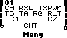
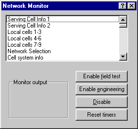
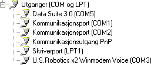

Datakabel
---------

Mange av operasjonene beskrevet på denne siden krever at du har en kobling mellom PC og mobiltelefon. Gjennom denne koblingen kan egne logoer og ringetoner lastes opp til telefonen, samt enkelte innstillinger i minnelageret endres. Noen telefoner kan motta infrarøde signaler, men vanligvis benyttes en kabel som tilsluttes PC-ens serialport (COM-port) og mobiltelefonens eksterne tilkoblingsport. Mangler telefonen en slik dedisert port, som er tilfellet med bl.a. Nokia 3210, har kabelen vanligvis en spesielt utformet adapter som kobles til en del av kretskortet som synliggjøres når en fjerner bakdekselet.

Datakabelen, som den kalles, understøtter enten en eller begge av to *protokoller* (sett med regler for overføring av data og signaler mellom to enheter). Disse kalles *FBUS* og *MBUS*. Fordi de to protokollene benyttes til noe forskjellige formål, er det vanlig å kjøpe en multikabel som støtter begge. FBUS (Fast serial Bus) er en nyere protokoll som kommuniserer med en hastighet på 115 200 bps (biter per sekund), og benyttes stort sett til å sende ringetoner, logoer m.m. til telefonen. Den noe eldre MBUS-protokollen (også kalt *M2BUS*) kommuniserer bare på 9600 bps, men kan bl.a. på eldre telefoner brukes til å heve operatørsperren (SIM-låsen). Alt dette krever programvare som kan kommunisere med mobiltelefonen.

#### Hvor kan jeg kjøpe en datakabel?

Datakabel kan kjøpes på postordre fra flere butikker, bl.a. [Leins Telecom](http://www.leins.no) og [Hammar Elektronikk](http://www.hammar.no). Prisen ligger på rundt 200--300 kr. På noen nettsteder finner en detaljerte instruksjoner om hvordan en setter sammen sin egen kabel, skjønt om dette lønner seg på lengre sikt, er vel heller tvilsomt. Dataene i EEPROM-en (Electrically Erasable and Programmable Read-Only Memory), som er det minnelageret hvor alle telefonens innstillinger ligger, kan skades eller ugyldiggjøres dersom ukorrekte signaler sendes til telefonen. Fordi det i slike tilfeller er vanlig at telefonen låser seg selv, anbefales det på det sterkeste at du kjøper en trygg og stabil fabrikkprodusert kabel.

### Flashekabel

En flashekabel er en annen type kabel som tilsluttes parallellporten (LPT-/skriverporten) på datamaskinen, og som benyttes for å overskrive flashlageret i telefonen. En slik kabel har hverken FBUS- eller MBUS-protokoll, og kan ikke brukes til å laste opp ringetoner eller logoer til telefonen. Flashekabelen brukes ofte til å heve operatørsperren på telefonen (hvilket innenfor en viss tidsperiode etter kjøpsdatoen kan være ulovlig).

Som tidligere nevnt er alle telefonens innstillinger lagret i et minnelager som kalles EEPROM-en, inkludert SIM-låsenes oppsett. Ved å overskrive dataene i EEPROM-en med data fra en binærfil hvor SIM-låsene er åpne, kan en heve operatørsperren. De nyeste Nokia-telefonene lanseres med en beskyttelse som hindrer brukere å heve denne med en MBUS-kabel, hvorledes en må bruke flashekabel i stedet. Flashekabler kan også i noen tilfeller brukes til å kopiere språkdataene fra en telefon til en annen, slik at hvis du f.eks. kjøpte en mobiltelefon i utlandet, kan du legge inn norsk ved å kopiere disse fra en norsk modell med samme fastvare-revisjon. Flashekabler kan imidlertid *ikke* brukes til å oppgradere fastvaren i telefonen, slik mange tror. Selve fastvaren er temmelig stor og opptar ca. 8 MB i binærformat, mens de «flashe-pakkene» en kan laste ned fra nettet kun inneholder EEPROM-data, som ikke fyller mer enn 32--64 kB. For å oppgradere fastvaren må en ta med telefonen til et autorisert Nokia-verksted.

Alt dette høres fint og flott ut, men flashing har en temmelig stor risikofaktor. Dersom en flasher på gal måte, oppstår det ugyldige data i EEPROM-en, og telefonen kan nekte å koble seg til nettverket (`CONTACT SERVICE` vises på displayet), eller i verste fall aktivere alle fire SIM-låser. Derfor gis det vanligvis ingen support på disse kablene fra butikken du kjøper dem fra. Noen ganger kan alle disse problemene fjernes ved å flashe på «riktig» måte og overskrive de ugyldige EEPROM-dataene med korrekte data, men man kan også risikere å skade EEPROM-brikken slik at den ikke reagerer på signalene som sendes gjennom flashekabelen. Og fordi alle datamaskiner leveres med forskjellige CPU-enheter og innstillinger (som er avgjørende for flashingen), oppstår det fort kompabilitetsproblemer i oppsettet.

#### Hvor kan jeg kjøpe en flashekabel?

Du kan kjøpe flashe-utstyr fra [Hammar Elektronikk](http://www.hammar.no), hvor kablene leveres i komplette flashe-sett til 400--500 kr. Settene selges uten programvare, som lastes ned separat fra nettet. Besøk [NokiaWarez.com](http://www.nokiawarez.com) og [mobile.box.sk](http://mobile.box.sk) for slik programvare.

Skjulte funksjoner
------------------

Funksjonene beskrevet på denne siden aktiveres ved hjelp av en [datakabel](#datakabel). For andre funksjoner som ikke krever en slik kobling, se [koder](#koder). Webmaster tar intet ansvar for eventuelle skader på din mobiltelefon som måtte oppstå som følge av instruksjonene på denne siden.

### To ekstra spill på Nokia 3210

På alle Nokia 3210-modeller med [fastvare-revisjon](#fastvare) fra V 5.36 og oppover eksisterer to ekstra spill: React og Logikk. Til forskjell fra den europeiske 3210-modellen (NSE-8) er spillene på den japanske modellen (NSE-9) fra før aktive, og denne har innebygget vibrator. Men fordi fastvaren i begge modellene er den samme (sjekk av [fastvare-revisjonen](#fastvare) gir NSE-8/9 på tredje og nederste linje), kan disse funksjonene aktiveres på de europeiske modellene ved å bruke en datakabel og programvare som endrer de avgjørende innstillingene i telefonens EEPROM-minne. Selvsagt kan vibrerende varsling-funksjonen i telefonens fastvare aktiveres på samme måte, men for at telefonen skal vibrere må du også åpne telefonen og installere en vibrator som kan kjøpes fra bl.a. [Hammar Elektronikk](http://www.hammar.no).

#### Nokia Profile

Programmet som brukes heter [Nokia Profile Configuration Utility](http://www.ajax.ic24.net/3210/index.htm) (forkortet *Nokia Profile*), og kan lastes ned her. Jeg henviser til dette og ikke andre programmer beskrevet på andre GSM-sider (Wintesla, PC-Locals, etc.) fordi dette er lettere å bruke, og også gir brukere med en FBUS-kabel muligheten til å aktivere funksjonene beskrevet på denne siden.

NB: For at Nokia Profile skal finne COM-porten hvor telefonen er tilkoblet, må du i tillegg installere et program som heter [LogoManager](http://www.logomanager.co.uk). Du trenger *ikke* fullversjonen av LogoManager for å benytte deg av funksjonene i Nokia Profile.

#### Aktivere spillene

1.  Last ned Nokia Profile.
2.  Koble telefonen til den COM-porten som er konfigurert i [LogoManager](http://www.logomanager.co.uk), og slå den på.
3.  Start Nokia Profile (avslutt LogoManager dersom det er aktivt!), og vent mens tilkoblingen fullføres. Nokia Profile vil lese av dataene som ligger lagret i telefonen, bl.a. telefonmodell, fastvare-revisjon, IMEI-kode og sikkerhetskode, i tillegg til de andre EEPROM-verdiene programmet kjenner til.
4.  Kryss av for «Enable all games». Ønsker du også å aktivere vibrerende varsling-funksjonen i telefonens fastvare (ikke hensiktsmessig med mindre du har installert en vibrator i telefonen), krysser du av for «Vibration menu». *For mer informasjon om programmets andre funksjoner, se [Ajax' Official Download Page For Nokia Profile](http://www.ajax.ic24.net/3210/index.htm).*
5.  Trykk nå på **Restart phone**. Telefonen vil starte på nytt, med de nye funksjonene aktivert. *Dersom du ikke gjør dette, vil endringene tre i kraft neste gang du slår telefonen av og på.* De to ekstra spillene finnes forøvrig på meny 6-4 og meny 6-5.

{width=437}

### Net monitor

{width=54}

Net monitor (også kalt *Network monitor*) er en egen skjult meny, som -- når aktivert -- viser forskjellig informasjon om nettverket, telefonen, SIM-kortet etc. De forskjellige dataene er inndelt i egne skjermer eller «tester», som velges ved å taste inn et tall fra 1 til ± 100 (antall tester varierer fra telefon til telefon, og valgt Net monitor-versjon). På Nokia 3210 har Net monitor-menyen snarveinummeret 11 (meny 10 er ikke aktiv på alle telefoner, fordi denne er regulert av SIM-kortet). Net monitor-menyen kan aktiveres på flere måter, men det vanligste er å benytte en datakabel og tilpasset programvare, slik beskrevet lengre nede på denne siden.

Det finnes to utgaver av Net monitor-funksjonen, i [LogoManager](http://www.logomanager.co.uk) og [Nokia Profile Configuration Utility](http://www.ajax.ic24.net/3210/index.htm) refereres disse til som «Field test» og «Engineering». På norsk kan vi kalle disse for henholdsvis standard- og fullversjon. Standardversjonen gir kun adgang til de 19 første testene, mens fullversjonen, derimot, gir adgang til alle tilgjengelige tester i telefonens fastvare. Med sistnevnte aktivert finner dessuten brukeren informasjon om bl.a. mer interne funksjoner som SIM-kortet, telefonen osv.

Net monitor-funksjonen skiller seg fra telefones andre funksjoner på følgende punkter:

-   Net monitor-funksjonen eksisterer bare på ett språk, engelsk
-   Net monitor-menyens menyikon er ikke animert
-   Net monitor-menyen er ikke aktivert når du kjøper telefonen fra butikken
-   Net monitor-funksjonen er ikke dokumentert i telefonens brukerhåndbok

#### Starte, tilpasse og avslutte Net monitor-modus

For å komme til Net monitor-menyen, trykk på  (**Meny**). Bruk så  eller  for å bla til menyen, eller trykk raskt to ganger på . Du skriver deretter inn ønsket testnummer i Test-feltet (standardverdi 00), og bekrefter med  (**OK**).

Telefonen vil så gå tilbake til tomt display, og, hvis det finnes en test med det innskrevne testnummeret, vise parametrene til den valgte testen. Telefonen opererer nå i *Net monitor-modus*. Du kan bla fra en test til en annen ved å bruke piltastene. Testens nummer vil vises i øvre venstre hjørne av displayet, eller på linje med de andre indikatorene. Når telefonen viser en hvilken som helst test på displayet, kan du presse og holde nede  et par sekunder for å skifte til mer eller mindre forståelig informasjon om den valgte testen; denne informasjonen vil også vises for andre tester, dersom du blar fra den videre. For å bytte tilbake til testparametrene, press og hold nede  en gang til. {#n_hjelp}

De fleste av telefonens funksjoner er fortsatt tilgjengelige selv om telefonen opererer i Net monitor-modus. En kan bruke Navi-tasten () til å åpne Net monitor-menyen eller andre menyer og benytte seg av funksjonene i disse, foreta utgående anrop og motta samtaler. Men fordi  og  brukes til å bla mellom testene, er ikke listen over siste oppringte numre eller telefonboken tilgjengelige direkte fra tomt display. Disse kan hentes fra henholdsvis meny 3-3 og meny 1-1. Brukeren kan også oppleve at telefonen på visse punkter opererer tregere i Net monitor-modus.

En kan bytte fra fullversjonen til standardversjonen ved å trykke på  (**Meny**), velge Net monitor-menyen og gå til test 242. Test 243 deaktiverer Net monitor-menyen på telefonen. For å gå ut av Net monitor-modus, gå til felt 0.

{width=84} {width=84} {width=84}

**Net monitor i aksjon:** Til venstre vises Net monitor-menyens testnummersfunksjon, i midten test nr. 1 slik den fremtrer på tomt display, og til høyre hjelpeteksten for den samme testen.

#### Endre verdier i Net monitor

Noen testers verdier kan endres ved å åpne dem direkte fra Net monitor-menyen (gjelder ikke dersom [hjelpefunksjonen](#n_hjelp) er aktiv). Derfor anbefales det at en velger en konstant test (for eksempel test nr. 1) for å entre Net monitor-modus, med mindre en kjenner til funksjonene til den testen en velger. Et eksempel på en test hvor verdien kan endres er test 18, som er beskrevet lengre nede på denne siden. Når en åpner Net monitor-menyen mens telefonen opererer i Net monitor-modus, vil testnummeret til den sist valgte testen vises i Test-feltet. Det går dermed raskt å endre verdien til en valgt test fram og tilbake.

Alle testverdiene (med unntak av test nr. 17) kan settes tilbake til de opprinnelige ved å slå telefonen av og på mens Net monitor-modusen er aktiv. Risikoen for å gjøre noe galt er dermed ikke særlig stor, men det er verdt å merke seg at Net monitor-funksjonen er en uferdig og eksperimentiell funksjon, og faktisk ikke er ment å brukes av anminnelige brukere; i verste fall kan feil i denne gjøre skade på telefonen. Før du begynner å eksperimentere med en valgt test, anbefales det at du leser nøye om den i [Marcin's NetMonitor manual](#n_manual), hvor egenskaper og eventuelle defekter til hver enkelt test drøftes inngående.

Dersom telefonen ikke er i Net monitor-modus og du i Net monitor-menyen skriver inn et ugyldig testnummer (f.eks. *52*), vil telefonen vende tilbake til vanlig tomt display, men piltastene ( og ) vil ikke fungere på normalt vis (hurtig tilgang til anropsliste og telefonbok). Dette problemet kan løses ved å åpne Net monitor-menyen på nytt og taste inn et gyldig testnummer (og senere gå ut av Net monitor-modus igjen) eller 0. Dersom telefonen allerede er i Net monitor-modus, vises `NO TEST`.

#### Hvordan aktiverer jeg Net monitor-menyen?

Både [LogoManager](http://www.logomanager.co.uk) og [Nokia Profile](http://www.ajax.ic24.net/3210/index.htm) kan aktivere Net monitor-menyen, både som standard- og fullversjon. I LogoManager velger du **Network monitor** fra **Tools**-menyen, og deretter klikke på **Enable**. Du vil da få opp et dialogvindu hvor du kan velge mellom alternativene «Deactivate», «Field test» og «Engineering». Velg det alternativet du ønsker, og klikk **OK**.

{width=279}

I Nokia Profile trykker du på knappen **Network monitor**. Dialogvinduet over dukker opp, og så er det bare å trykke på den Net monitor-versjonen du ønsker å aktivere. Net monitor-menyen kan deaktiveres direkte på telefonen, men hvis du senere ønsker å aktivere den, må du igjen koble telefonen til datamaskinen og kjøre et av de to programmene beskrevet i dette avsnittet.

#### Test 18: Få lysene til å stå på hele tiden

Ved å endre standardinnstillingen i test 18, kan en få lyset i telefonen til å stå på hele tiden mens telefonen er i Net monitor-modus. Denne funksjonen kan f.eks. benyttes til å hurtig utlade batteriet dersom brukstiden er lav. (For mer reliable resultater anbefales det at du kjøper en egen lader til telefonen med utladningsfunksjon.)

1.  Åpne Net monitor-menyen (meny 11).
2.  Gå til test 1.
3.  Bruk  eller  for å bla til test 18.
4.  Dersom telefonen skriver `LIGHTS OFF`, trykk på  (**Meny**) og åpne Net monitor-menyen på nytt.
5.  18 vises i Test-feltet. Trykk på  (**OK**) for åpne testen direkte.
6.  Verdien endres til ON.

Steg 2 og 3 kan sløyfes, dvs. en kan spare tid ved å gå direkte til test 18. Disse er bare tatt med for ordens skyld, da standardinnstilligene varierer noe fra telefon til telefon.

Så lenge Net monitor-modusen er aktiv, vil lysene forbli på. Når du er ferdig med denne testen bør du sette verdien tilbake til `OFF`. Dersom test 18 har verdien `ON`, vil nemlig ikke lysene slås på når du mottar en ny melding, også når telefonen ikke er i Net monitor-modus. For å endre verdien til test 18 til `OFF` igjen, utfør steg 4 og 5 på nytt. NB! Når du slår denne testen på og av, vil lyset gå ut (dvs. ikke reagere på tastetrykk) i flere minutter, også når du går ut av Net monitor-modusen. Dette kan være bra for spill, i og med at telefonen bruker mindre strøm fra batteriet. Ønsker du å få lyset tilbake igjen med en gang, må du slå telefonen av og på.

#### Hva betyr ... {#n_manual}

For detaljert informasjon om alle testene i Net monitor, feil og tilleggsopplysninger, gå til [Marcin's page ON-LINE](http://marcin-wiacek.fkn.pl/). Du kan også laste ned GSM-sidene hans (engelsk manual til Net monitor) i kompilert HTML-format her. NB! For den nyeste og mest oppdaterte versjonen av manualen hans, gå alltid til <http://marcin-wiacek.fkn.pl/>.

Spill
-----

Nokia 3210 leveres med minst tre spill: `Rotation`, `Orm` og `Hukommelse`. I tillegg kommer alle 3210-modeller med [fastvare-revisjon](#fastvare) fra V 5.31 og oppover (V 5.31, V 5.36, V 6.00 og V 6.15) med to ekstra spill: `React` og `Logikk`. Disse spillene er bare tilgjengelige på de japanske modellene av Nokia 3210 (NSE-9), men fordi fastvaren i både de europeiske (NSE-8) og japanske modellene er den samme, kan den aktiveres på de europeiske modellene ved hjelp av en datakabel som tilsluttes PC-ens serialport. For mer informasjon om dette, se [datakabel](#datakabel) og [skjulte funksjoner](#skjulte-funksjoner).

### Orm (meny 6-2)

`Orm` er et populært spill hvor man leder en orm etter flest mulig egg, samtidig som ormen forlenges for hvert egg den spiser. Spillet har 9 vanskelighetsnivåer, og finnes på flere Nokia-telefoner. Det har også toppscore. Poengsummen avhenger av hvor mange egg ormen spiser, og hvilket vanskelighetsnivå som er satt. Ved høyere vanskelighetsnivåer beveger ormen seg fortere, men man får også flere poeng for hvert egg den spiser. Antall poeng for hvert enkelt egg er proporsjonalt med vanskelighetsnivået, dvs. fem poeng for hvert egg som blir spist på vanskelighetsnivå nummer fem, osv. Når ormen kolliderer med en av veggene langs kanten av displayet eller seg selv, er spillet slutt, og spilleren får se sin opptjente toppscore.

Ormen beveger seg rundt på et område på 20 × 11 felter, og er fra starten 9 felter lang. Den styres vanligvis med knappene  (opp),  (venstre),  (ned) og  (høyre), men man kan også benytte  (opp/høyre) og  (ned/venstre) eller  (opp/venstre) og  (ned/høyre). Det er kun ett egg tilgjengelig av gangen, og det første finner alltid sted på felt 11,6. Plasseringen av egg følger deretter et tilfeldig mønster.

#### Høyeste toppscore

Den teoretiske maksimale toppscore er 20 × 11 - 9 × 9 = 1899, men forsøk har vist at en feil i fastvaren i telefonen fører til at det er mulig å oppnå høyere poengsummer som ikke engang er delelige med antall poeng pr. egg på det høyeste vanskelighetsnivået (nr. 9). Sannsynligvis har dette noe å gjøre med hvilke plasseringer de siste eggene får i forhold til ormens lengdeforøkelse og framdrift, skjønt dette er noe usikkert. Den høyeste registrerte toppscore er 2008, en annen er 1999.

For å oppnå den maksimale toppscore må en spille på det høyeste vanskelighetsnivået (vanskelighetsnivå nr. 9), og ormen må bli så stor at den fyller hele displayet. Skal dette bli mulig må den følge et fast, repetitivt mønster. Under sees et eksempel på et mønster ormen kan følge.

{width=84}

#### «Juksing»

En kan forsinke eller pause framdriften i spillet ved å benytte en hurtig tasteteknikk som kanskje noen vil mene er «juksing». Ved hjelp av denne teknikken kan en enkelt oppnå en «uslåelig toppscore» ved å følge mønsteret vist over, inntil ormen til slutt fyller hele displayet og spillet endes med opptjent maksimal toppscore (se forrige avsnitt for mer detaljert informasjon).

1.  Start et nytt spill (meny 6-2-2).
2.  Etter at spillet har startet, trykk raskt på .
3.  Gå til `Fortsett` med , og trykk på  (**`Velg`**)**.**
4.  Dette og det neste steget bør utføres i hurtig rekkefølge: Trykk på den tasten som indikerer retningen du ønsker å styre ormen, kjapt etterfulgt av .
5.  Spillet er nå pauset (meny 6-2), men du kan raskt returnere til det ved å trykke én gang på  (**`Velg`**).

Steg 4 og 5 repeteres i rask rekkefølge når det er nødvendig, dvs. når spilleren ønsker å styre ormen i en annen retning. Dersom spilleren utfører stegene raskt nok vil det se ut som vedkommende selv styrer framdriften i spillet ved å velge hvilken retning ormen skal gå, og med kun ett felt av gangen. Den sammenlagte tastekombinasjonen blir altså (mens spillet er aktivt): ,  (**`Velg`**), *x* (hvor *x* er den tasten som angir retningen spilleren ønsker å styre ormen), eller i språkform: *Pause*, *velg*, *retning*.

`Orm` har fått en etterfølger, `Snake 2`, som er tilgjengelig på Nokia 3310 og Nokia 3330. Heller ikke her er muligheten for «juksing» fjernet, men i motsetning til `Orm` finnes det ingen tilsvarende mulighet til å oppnå «den maksimale toppscore», fordi poengsummen til en viss grad baserer seg på tilfeldigheter.

### React (meny 6-4)

*NB: `React` er ett av to spill som bare leveres med 3210-modeller med [fastvare-revisjon](#fastvare) fra V 5.31 og oppover, og som må aktiveres før det kan spilles på alle europeiske telefoner (NSE-8). For mer informasjon om hvordan dette kan gjøres, se [datakabel](#datakabel) og [skjulte funksjoner](#skjulte-funksjoner).*

Prøv å treffe bildene med tastene  til . Du har seks forsøk, og får seks nye ved å taste . Poengene avhenger av hvilke bilder du treffer. Du taper poeng for hver kaktus.

|                                |             |               |                           |
| ------------------------------ | ----------- | ------------- | ------------------------- |
| {width=14}  | Mørkt eple  | 20 poeng      | Gir seks nye sjangser     |
| {width=14}   | Lyst eple   | 15 poeng      |                           |
| {width=14}  | Lys gulrot  | 10 poeng      |                           |
| {width=14}        | Mørk ball   | 10 poeng      | Nullstiller alle sjangser |
| {width=14} | Mørk gulrot | 5 poeng       |                           |
| {width=14}  | Lys kaktus  | 25 minuspoeng | Mister ett liv            |
| {width=14} | Mørk kaktus | 25 minuspoeng | Mister ett liv            |
| {width=14}        | Dersom du treffer et tomt felt, får du 10 minuspoeng. | |

`React` har fem vanskelighetsnivåer, og går på tid. En runde tar ca. 40 sekunder.

#### «Juksing»

Også i `React` kan en «jukse» slik som i `Orm`, men tastene er noe annerledes.

1.  Start et nytt spill (meny 6-4-2).
2.  Etter at spillet har startet, trykk raskt på .
3.  Gå til Fortsett, og trykk på  (**`Velg`**).
4.  Dette og det neste steget må utføres i hurtig rekkefølge: Trykk på den tasten som indikerer det bildet du ønsker å treffe, kjapt etterfulgt av . *Hvis alle feltene er tomme, trykk på enten , , , ,  eller , kjapt etterfulgt av .*
5.  Spillet er nå pauset (meny 6-4), men du kan raskt returnere til det ved å trykke én gang på  (**`Velg`**).

På samme måte som i `Orm` gjentas steg 4 og 5 i rask rekkefølge, men grunnet spillets tilfeldige natur åpner ikke `React` for muligheten til å «vente» på samme måte som i `Orm` (å ikke avbryte spillet før en endring er nødvendig fra spillerens hånd). Den sammenlagte tastekombinasjonen blir altså (mens spillet er aktivt): ,  (**`Velg`**), *x* (hvor *x* er den tasten som angir bildet spilleren ønsker å treffe, eller, hvis nødvendig, en tast uten noen funksjon i selve spillet), eller i språkform: *Pause*, *velg*, *bildevalg/pauseavbrudd*.

#### Høyeste toppscore

Hva den maksimale poengsummen i `React` er er noe usikkert, da antall bilder varierer fra runde til runde. Det finnes likevel visse regler å forholde seg til. Viktigst er det at ingen bilder må gå tapt, dvs. spilleren må treffe hvert eneste bilde (med unntak av kaktusene). I løpet av en vanlig runde hender det ofte at ett bilde forsvinner presist samtidig som spilleren treffer et annet, og da er sjangsene for en høy toppscore forspilt. For å unngå dette må spilleren følge et spesielt prioriteringsmønster beskrevet lengre ned på denne siden. Dette er i praksis uhyre vanskelig, for ikke å si umulig, å følge uten å benytte «jukse»-teknikken beskrevet lengre oppe på denne siden.

De toppscorene som lar seg samle opp ved å følge instruksjonene på denne siden er i realiteten svært urealistiske poengsummer, og lar seg sannsynligvis vanskelig samle opp ved vanlig spill.

Under en runde må spilleren prioritere en plass fremfor en annen, dvs. treffe et bilde før et annet, etter et spesielt mønster for å unngå at noen av bildene forsvinner mens vedkommende treffer et annet. Mønsteret sees nedenfor, hvor 1 er høyeste prioritering og 6 laveste. I praksis betyr dette at dersom spilleren får en lys gulrot på plass nummer 1, et mørkt eple på plass nummer 3 og en mørk gulrot på plass nummer 4, skal vedkommende begynne med den lyse gulroten og fortsette med det mørke eplet, før den mørke gulroten treffes. De forskjellige bildenes poengverdi har *ingenting* å si i denne sammenhengen. Dersom et bilde havner på en høyere plass mens spilleren treffer et eller flere bilder på lavere plasser, skal vedkommende begynne på nytt med det bildet som da har den høyeste verdien (dvs. det laveste tallet).

{width=56}

Den første runden med `React` etter at telefonen er slått på gir maks. 1305 poeng. Senere runder kan gi enda flere bilder og dermed høyere poengsummer, høyeste registrerte toppscore er 1450. Flaks er her en avgjørende faktor.

Koder
-----

På alle Nokia-telefoner eksisterer enkelte funksjoner som ikke dokumenteres i brukerhåndboken. Spesielle koder som tastes inn når displayet er tomt, og som aktiverer eller deaktiverer spesielle funksjoner eller åpner «hemmelige» menyer, er en av disse.

Alle koder tastes inn på tomt display. Disse kodene er testet for å virke på Nokia 3210, men kan også virke på andre Nokia-telefoner. *Advarsel: Les beskrivelsene nøye før du taster inn kodene. Webmaster tar intet ansvar for innholdet på denne siden.*

`*#06#` -- viser telefonens 15-sifrede serienummer, også kjent som IMEI-kode (International Mobile Equipment Identity). Du finner også IMEI-koden på baksiden av telefonen, under batteriet. IMEI-koden er delt opp på følgende måte:

> *XXXXXX-XX-XXXXXX-X*

Siffer 1--6: TAC (Type Approval Code)\
Siffer 7--8: FAC (Final Assembly Code)\
Siffer 9--14: SNR (Serial Number)\
Siffer 15: SP (Spare)

`*#0000#` -- viser telefonens fastvare-revisjon. Fastvaren (engelsk *firmware*) kan sies å være telefonens «operativsystem», dvs. den programvaren som oppretter et brukergrensesnitt og styrer alle telefonens funksjoner. Likevel er det ikke snakk om «mykvare» i tradisjonell forstand -- operativsystemet i telefonen er lagret på en ROM-brikke i telefonen, derav navnet «fastvare». Nyere telefoner kommer helst også med nyere fastvare-revisjoner, hvor feil fra tidligere revisjoner er rettet og, hvis ønskelig, nye funksjoner implementert. Jo høyere revisjonsnummer, jo nyere revisjon. {#fastvare}

`*#746025625#` -- [`*#sim0clock#`] -- sjekker om SIM-klokken kan stoppes. Stoppes SIM-klokken forlenges batteritiden.

`*#92702689#` -- [`*#war0anty#`] -- Viser garanti-menyen, som er på engelsk. Her har du seks valg:

1.  Viser telefonens serienummer.
2.  Viser fabrikasjonsdato i følgende format: MMÅÅ.
3.  Her kan du taste inn kjøpsdatoen, men vær på vakt -- du kan bare gjøre dette én gang. Kjøpsdatoen vises i formatet MMÅÅ.
4.  Viser siste reparasjonsdato/antall reperasjoner. Er ikke dette satt, vises 0000.
5.  Lar deg overføre alle brukerdata over til en annen telefon, dersom du har utstyret som trengs (overføringskabel SCW-1 (2 stk.) og modulær T-adapter).
6.  Viser total samtaletid i formatet tttt:mm. Lar deg enkelt sjekke om telefonen din er blitt tidligere brukt, og i så fall, hvor mye.

For å komme ut av garanti-menyen må du slå telefonen av og på.

`*3370#` -- [`*EFR0#`] -- aktiverer EFR-kodek (Enhanced Full Rate codec). Telefonen vil automatisk starte på nytt. *NB: PIN-koden må tastes inn på nytt.*

`#3370#` -- [`#EFR0#`] -- deaktiverer EFR-kodek (Enhanced Full Rate codec). Telefonen vil automatisk starte på nytt. *NB: PIN-koden må tastes inn på nytt.*

`*4720#` -- [`*HRC0#`] -- aktiverer HR-kodek (Half Rate codec). Telefonen vil automatisk starte på nytt. *NB: PIN-koden må tastes inn på nytt.*

`#4720#` -- [`#HRC0#`] -- deaktiverer HR-kodek (Half Rate codec). Telefonen vil automatisk starte på nytt. *NB: PIN-koden må tastes inn på nytt.*

EFR-kodeken vil gi deg mye bedre lydkvalitet når du aktiverer den. Denne kodeken benytter seg av ASELP-komprimering (Algebraic Code Excitation Linear Predicion), som åpner for bedre stemmekvalitet på den samme overføringsbredden som den eldre FR-kodeken (Full Rate codec). Den opprinnelige kodeken bygde på en teknologi kalt LPC-RPE (Linear Prediction Coding with Regular Pulse Excitation). Begge opererer på 13 kB, men i og med at du tar opp mer plass på nettverket, kan det hende operatøren øker prisen. Samtaletiden blir redusert med omlag 5 %.

HR-kodeken vil gi deg dårligere stemmekvalitet og lavere overføringsbredde, noe som gir operatøren muligheten til å ha flere overføringer på nettet, og du kan kanskje få en lavere regning fra dem. Samtaletiden blir økt med 30 %.

`xx#` -- laster posisjon *xx* i telefonboken. Dersom du taster inn nummeret til en posisjon som ikke eksisterer, får du meldingen «ugyldig plass».

`#pw+mastercode+x#` -- Låser opp en av SIM-låsene på telefonen, hvor *mastercode* er opplåsningskoden du får fra operatøren og *x* SIM-låsens nummer (fra 1 til 4). *P* og *w* fås ved å trykke på  raskt henholdsvis tre og fire ganger. Dersom SIM-låsen er åpen, skriver telefonen `SIM was not restricted`, uansett hva slags opplåsningskode du taster inn. En «falsk» opplåsningskode, f.eks. `#pw+1234567890+x#`, kan brukes til å sjekke statusen til SIM-lås nummer *x* uten å benytte en datakabel (er SIM-låsen sperret vises `Code error` på displayet). Men vær på vakt -- du kan bare taste inn gal kode opptil fem ganger før telefonen blokkerer muligheten til å heve operatørsperren via opplåsningskoden (altså at du kan taste feil kode maks. 4 ganger og fortsatt ha en mulighet til å låse opp SIM-låsen/SIM-låsene på denne måten).

Flash, blink++
--------------

Ved å bruke passende programvare og en datakabel, kan du sende spesielle typer SMS-meldinger fra din mobiltelefon. Det tas forbehold om at disse meldingene kan virke forskjellig på forskjellige typer mobiltelefoner. Denne siden forteller hvordan en kan sende disse meldingene ved å bruke dataprogrammet PanuWorld FLASHMSG.

### Flash SMS

Flash SMS, også kalt Class 0 SMS, er det tekstmeldingsformatet som brukes for infomeldinger fra nettverket (også kalt kringkastingsbeskjeder). Tekstmeldinger skrevet i dette formatet har den egenskapen at innholdet vises på displayet med en gang de mottas. På en Nokia-telefon kan brukeren så velge å lagre beskjeden i innboksen, hente avsenders telefonnummer eller forkaste beskjeden. Enkelte eldre telefoner viser ikke avsenders telefonnummer.

#### Sende en Flash SMS i PanuWorld FLASHMSG

For å sende en Flash SMS til et annet telefonnummer i PanuWorld FLASHMSG, koble mobiltelefonen til datamaskinen og start FLASHMSG (for mer informasjon om installasjon og konfigurasjon av FLASHMSG, se [PanuWorld FLASHMSG](#panuworld-flashmsg)).

PanuWorld FLASHMSG
------------------

Denne siden beskriver installering og konfigurasjon av programmet PanuWorld FLASHMSG for Nokia 3210. All nødvendig programvare kan lastes ned fra [Nkmobile.co.uk](http://www.nkmobile.co.uk/). Den nyeste versjonen av FLASHMSG kan fås fra <http://www.iki.fi/pat/>. Webmaster tar intet ansvar for eventuelle skader eller feil som måtte oppstå på din datamaskin som følge av instruksjonene på denne siden.

#### Om FLASHMSG

PanuWorld FLASHMSG er et meldingsprogram som kan brukes til å sende spesiell SMS, som Class 0 SMS (Flash SMS), blinkende SMS, indikatormeldinger og Void-SMS. For at FLASHMSG skal kunne kommunisere med din mobiltelefon, må du installere Nokia Data Suite. Data Suite oppretter en virtuell COM-port som dette og andre programmer kan koble seg til. Dersom du bruker Nokia 3210 eller 3310, må du i tillegg patche en av driverfilene i Data Suite-mappen for at det virtuelle grensesnittet skal fungere skikkelig med disse telefonene.

Flere av FLASHMSGs funksjoner beskrives nærmere på de andre sidene. Se Flash, blink ++ og SMS-virus for mer inngående informasjon.

### Installere Nokia Data Suite

1.  Avslutt alle åpne programmer, og kjør Setup.exe.

2.  Installasjonsprogrammet pakker ut filene som kreves for å kjøre installasjonen, og velkomstskjermen vises. Trykk på **Next**.

3.  Etter å ha lest i gjennom lisensavtalen og samtykket må du velge installasjonstype. Det vanligste her er «Typical». Velg «Custom» dersom du ønsker å sette opp dette selv, og kryss av for de elementene du ønsker. Trykk på **Next**.

4.  Du skal nå koble telefonen din til en av datamaskinens serialporter med en DAU-9P-kompatibel F/MBUS-kabel, og deretter slå den på. Trykk så på **Next**.

5.  Installasjonsprogrammet vil nå søke etter COM-porten hvor telefonen er tilkoblet. Dette tar litt tid, før det neste vinduet dukker opp og søkeresultatet vises. Dersom alt har gått riktig for seg, vil programmet fortelle at det har funnet en telefon koblet til datamaskinen, og allerede ha valgt COM-porten hvor denne er tilkoblet. *Dersom dette ikke er tilfelle, må du avbryte installeringen og lese gjennom* feilsøkingsavsnittet *under.*

    

6.  Programmet vil nå installere Nokia Data Suite. Sjekk at de valgte alternativene er riktige, og trykk **Next**.

7.  Når programmet er ferdig med å kopiere Data Suite til harddisken, vil det gå i gang med installere, teste og konfigurere drivergrensesnittet på datamaskinen. Dette vil også ta litt tid, så igjen gjelder det å smøre seg med litt tålmodighet. Dersom du bruker Nokia 3210 vil test nr. 3 slå feil. Dette er normalt, så bare gå videre ved å trykke på **Next**.

    

8.  For å fullføre installasjonen må datamaskinen startes på nytt. Programmet vil spørre deg om du ønsker å gjøre dette nå eller senere. Når maskinen har startet på nytt kan du, dersom du bruker Nokia 3210 eller 3310, følge patchings-instruksjonene lengre nede på denne siden.

#### Feilsøking

På enkelte datamaskiner må flytkontrollen på serialporten hvor telefonen tilkobles konfigureres før installasjonsprogrammet til Nokia Data Suite kjøres. Dersom programmet rapporterer «Setup did not find a phone!» etter å ha søkt etter den COM-porten hvor telefonen er tilkoblet, er mest sannsynlig dette problemet. For å endre flytkontrollen åpner du **Kontrollpanel**, velger **System** og klikker på fanen **Enhetsbehandling**. Dobbelklikk deretter på **Utganger** og velg den faste kommunikasjonsutgangen du kobler mobiltelefonen til. Deretter klikker du på **Egenskaper** og velger fanen **Utgangsinnstillinger**. Et sett alternativer lignende de avbildet under vil vises.

{width=362}

Dersom flytkontrollen er satt til «Ingen» (standardinnstilling), må du endre denne til «Xon/Xoff» før du installerer Data Suite. NB! LogoManager-brukere: LogoManager kan vise seg å være inkompatibel med denne innstillingen. Dersom dette er tilfelle, kan du endre denne tilbake til «Ingen» etter at Data Suite er installert. FLASHMSG vil fortsatt fungere.

### Patche Data Suite til 3210/3310

Etter at Nokia Data Suite er installert, må du, dersom du bruker Nokia 3210 eller Nokia 3310, patche det så det kan brukes med disse telefonene. Begge disse telefonene har hver sin patch (tilgjengelig fra [Nkmobile.co.uk](http://www.nkmobile.co.uk/)), og kun en patch kan være installert av gangen.

{width=438}

Kjør patchen, velg den mappen hvor Data Suite er installert, og velg ja til å overskrive filen `Pr3SS.dll`. Programmet vil så overskrive den opprinnelige DLL-filen med en patchet versjon som understøtter den mobiltelefonen du bruker. Maskinen trenger ikke å startes på nytt etter denne operasjonen. Du kan nå kjøre PanuWorld FLASHMSG.

### Velge COM-port i FLASHMSG

{width=257}

Før du kan benytte deg av alle funksjonene i PanuWorld FLASHMSG, må du velge COM-porten programmet skal kommunisere med. Merk at denne *ikke* er porten hvor telefonen er tilkoblet, men det virtuelle grensesnittet som ble installert da du kjørte installasjonsprogrammet til Nokia Data Suite. For å finne ut hvilket nummer denne porten har, åpne **Kontrollpanel**, klikk på **System** og velg fanen **Enhetsbehandling**. Deretter dobbelklikker du på **Utganger**. Du vil nå se en liste over alle utganger konfigurert på datamaskinen, både faste såvel som virtuelle. Finn den porten som heter «Data Suite», og merk deg kommunikasjonsnummeret (etterfulgt i parentes). Som du ser, har jeg selv i tillegg til datamaskinenes to faste kommunikasjonsporter allerede en virtuell utgang installert samt en PnP-utgang, noe som fører til at Data Suite-porten havner på COM5. Din Data Suite-port kan ha et annet kommunikasjonsnummer, avhengig av hvor mange utganger som er konfigurert på systemet. Når du har valgt denne COM-porten i FLASHMSG og koblet til telefonen, kan du begynne å sende spesielle tekstmeldinger og annen fet graff.
