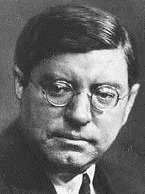
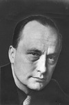
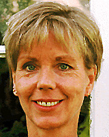

Forord
------

Dette er et litterært særemne. Problemstillingen er hvordan hovedpersonene i norsk kriminallitteratur har forandret seg de siste 100 årene.

Tre bøker er valgt: *Jernvognen* av Sven Elvestad, *Døde menn går i land* av André Bjerke og *Se deg ikke tilbake* av Karin Fossum.

Særemnet inneholder bokanalyser av de tre valgte bøkene, samt en kort oversikt over kriminallitteraturens historie for litt bakgrunnsinformasjon. Vi har også skrevet biografier om de tre forfatterne.

Helt til slutt kommer en konklusjon hvor vi sammenligner hovedpersonene som kommer fram i analysene.

<!--
*Henrik og Vegard*
-->

Kriminallitteratur
------------------

Krim, som kortord for «kriminallitteratur», betegner en litterær sjanger hvis popularitet i Norge har tiltatt sterkt de siste 150 årene. Handlingen tar typisk utgangspunkt i en opprivende innledningsvis forbrytelse -- gjerne et mord -- for så å legge hovedvekten på en heldig gjennomført oppklaring av forbrytelsen. Den uidentifiserte forbryteren kan på sin side gjøre videre forsøk på å villede etterforskningen og unndra seg straff, og hans kamp mot samfunnet og lovens representanter kan dermed gjøre problemstillingen stadig mer innfløkt. Krim er blitt betegnet som et slags intellektuelt spill på linje med matematikkproblemer og sjakkoppgaver, og det har derfor ikke vært fritt for uenigheter om hvorvidt sjangeren kan klassifiseres som litterær eller ikke.

Ettersom oppklaringen av forbrytelsen utgjør avslutningen på kriminalfortellingen, ligger det i sakens natur at hemmelighetene omkring konflikten ikke må utleveres på et for tidlig tidspunkt. I mellomtiden fremkalles kriminallitteraturens spenning ved et ytre og voldsomt konfliktstoff. Mange kriminalfortellinger er preget av litt mystikk. Noen ting kan synes uforklarlige, og er med på å villede etterforskerne og leseren i sin søken etter forbryteren. Ved å krysse uforklarlig mystikk med rasjonell tenkning, skapes en nifs ramme rundt fortellingen.

Noen kriminalfortellinger har også et budskap utover det å være spennende for leseren. Trass i avsløringen av den skyldige hender det ikke alltid at forbryteren får sin straff. Forfatteren kan peke på sosiale skjevheter i samfunnet og komme inn på politiske forhold. Det er ikke alltid at lov og rett følger det moralske bud.

### Hovedpersonene i krim

Det klassiske persongalleriet i kriminalfortellingene består av en skarpsindig detektivskikkelse, en slu forbryter, ett eller flere ofre og et utvalg mistenkte. Jeg-personen kan, med unntak av detektivskikkelsen, befinne seg innenfor en av disse kategoriene eller være en utenforstående som betrakter intrigen fra avstand, eventuelt detektivens faste følgesvenn. Vi får alltid følge oppklaringen skritt for skritt *i selskap med* detektivskikkelsen. På grunn av skillet mellom helterollen og jeg-personen og at mange av rollene er obligatoriske for kriminalfortellingens oppbygning, kan det være det vanskelig å peke ut én bestemt hovedperson. Det er mer presist å analysere hvordan persongalleriet er sammensatt i forhold til modellen beskrevet over.

Etterforskningen ledes av den sentrale detektivskikkelsen i fortellingen, men kan også assisteres av andre nysgjerrige hoved- eller bifigurer som selv ønsker å finne sin løsning på gåten. Jeg-personen kan ofte følge dette mønstret. Under etterforskningen samles det gjerne en gruppe med flere mistenkte, som alle kunne hatt gode grunner for å gjennomføre forbrytelsen. Ofte er også den minst tenkelige den skyldige.

Offeret i fortellingen kan være uskyldig, men kan også bli straffet for noe. Den skyldige har vanligvis et konkret motiv for forbrytelsen. Årsaken kan være penger, sjalusi, angst eller sosiale forhold. Andre ganger kan vedkommende også være mentalt tilbakestående, slik at motivet ikke fremstår like klart, eller uteblir. Under etterforskingen kan det hende at etterforskerne blir utsatt for trusler, gjerne i form av brev, kryptiske meldinger, varselskudd eller telefonoppringninger. Noen ganger leker forbryteren nesten «katt og mus» med etterforskerne. Truslene kan også ha til formål å skyve mistanken over på noen andre.

Klokkeslett har mye å si i en kriminalfortelling, og forbryteren kan foreta utspekulerte manøvrer for å skaffe seg alibi for visse tidspunkt. Forbryteren kan også legge igjen falske spor for å villede etterforskningen. Et annet velkjent spenningsmoment kan være at et eller flere sentrale vitner myrdes tidlig i fortellingen for å hindre at etterforskerne tilegner seg viktig informasjon.

### Kriminallitteratur i Norge

Begynnelsen på den norske kriminallitteraturen blir lagt til året 1825, da Maurits Hansen ga ut *Keadan eller Klosterruinen* under betegnelsen «kriminalhistorie». På 1800-tallet sirkulerte den i all hovedsak i et eget litterært kretsløp, som en viktig del av den såkalte folkelitteraturen. Fortellingene utkom i hefteform, trykt av forleggere som spesialiserte seg på denne typen folkelig underholdningslitteratur. Før kioskene dukket opp i 1860-årene, var det omreisende kolportører som tok seg av salget.

Først i 1890-årene utkom det en kriminalfortelling på et etablert forlag (Aschehoug). I 1920-årene kom en hel serie magasiner av hendig format og med fargetitler som «Det blå», «Det gule» og «Det røde», som -- uten smålige kvalitetshensyn -- konsentrerte seg om den billigste form for «romantikk». *Romanjournalen* var det mest utbredte bladet i denne sjangeren, mens *Detektivmagasinet* særlig ble lest av unge menn.

I en «gullalder» mellom 1941 og 1947 utkom det i alt 140 nye norske kriminal- og novellesamlinger. Gjennomsnittskvaliteten var relativt høy, om man tar i betraktning at det er snakk om underholdningslitteratur uten seriøse litterære ambisjoner fra forfatternes side. Så skjedde det plutselig et bratt fall. I 1945 kom det ut 16 krimbøker og i de to påfølgende år henholdsvis 21 og 13. I 1948 sank tallet til to, og i mange år fremover utkom det gjennomsnittlig fem bøker hvert år. Dette henger blant annet sammen med at markedet ble oversvømt av billig, oversatt krim. Først i siste halvdel av 1960-årene begynte det å spire og gro igjen.

Til høydepunktene i norsk kriminallitteratur før bølgen begynte å rulle, hører bøkene til Torolf Ester og André Bjerke (under pseudonymet Bernhard Borge). Max Mauser, Waldemar Brøgger og ekteparet Fridtjof og Lalli Knutsen hører til etterkrigstidens fremste og mest produktive dyrkere av sjangeren. Både før og etter krigen fantes det dessuten «seriøse» norske forfattere som lånte trekk fra krimsjangeren -- fra Olav Duun og Sigurd Christiansen i 30-årene til Aksel Sandemose i 40-årene og Paal Brekke i 50-årene.

Typisk for de krimforfatterne som begynte å gjøre seg gjeldende i perioden 1965--1975, er blant annet at de nøyer seg med en relativt spinkel produksjon, og dels at de ikke er «profesjonelle» forfattere, men har en annen hovedbeskjeftigelse. Det gjelder også for avismannen Bengt Calmeyer, for TV-kjendisen Kjell Arnljot Wig og for husmoren Sigrun Krokvik (pseudonym for Sigrun Karin Christiansen). Midtveis på 70-tallet endrer dette bildet seg radikalt. Nå kommer de profesjonelle forfatterne for fullt, forfattere som allerede hadde en betydelig produksjon bak seg, og som dels kom til å spesialisere seg som krimforfattere.

Sven Elvestad
-------------

{.right}

Sven Elvestad (1884--1934) regnes som en av Norges beste forfattere av kriminalromaner. Han ble født i Halden, hvor han vokste opp med harde kår. Som 17-åring avslørte han en morder i Skjeberg og ble journalist i avisen *Fredriksten*. Han debuterte innenfor kriminallitteraturen i 1908, en sjanger han behersket med en suveren fabuleringsevne. Slik tradisjonen tilsa gikk han under pseudonym, og utga bøkene sine under navnet Stein Riverton, som kommer fra den engelske oversettelsen av Elvestad, Rivertown. Elvestad var for øvrig heller ikke forfatterens opprinnelige navn, han var født Sven Svendsen.

I de følgende årene skrev han ca. 40 kriminalromaner som alle ble solgt i store opplag. I sine første romaner, *Angsten* (1910) og *De fortaptes hus* (1911), beskriver han forbryterens eller avvikerens sjeleliv og situasjon i samfunnet. Siden konsentrerte han seg mer om den moderne sivilisasjonens «løp mot døden» i sine bøker og artikler, eller «menneskets tilintetgjørelse ved mennesket». Redningen, kom han til, måtte ligge i at vi vendte tilbake til begynnelsen, til naturen og til levende verdier i vår fortid.

### Innledet gullalder

Sammen med bohemen Øvre Richter Frich innledet Elvestad en «gullalder» i norsk kriminallitteratur som varte til bortimot et par år etter andre verdenskrig -- skjønt, betegnelsen er først og fremst brukt fordi det utkom så mange bøker. Vi fikk noen norske helter som nesten kunne hamle opp med de utenlandske romanfigurene, for eksempel den realistiske, kaldblodige Asbjørn Krag, Elvestads klassiske detektivskikkelse. Elvestad var også mannen bak et utall av detektivmagasiner om den fantastiske detektiven Knut Gribb, hvor motstanderen var den forherdede forbryteren Tomas Ryer.

Elvestad overførte siden sine evner til et mer seriøst forfatterskap som en fengslende journalist, en dreven språkkunstner og en dikter med fantasi og psykologisk sans. Han drev ap og flørtet med fascismen, samtidig som han sparket til borgerskapet -- så kraftig at han selv fikk sparken. Senere ble han en høyt verdsatt skribent i avisene *Aftenposten*, *Dagbladet*, *Politiken* og *Tidens Tegn*. I sistnevnte trykksak kom stykkene til Sven Elvestad alltid på førstesiden, med Sven Elvestads navn nesten like stort som overskriften.

### En ensom journalist

Som journalist levde Elvestad ensomt, selskapelig fra en restaurant til annen, uten rotfeste til noe eget hjem. Han reiste mye utenlands og oppholdt seg lange perioder i Danmark og Italia, spesielt i småbyen Positano på Sorrento-halvøya. Flere ganger ble han arrestert da han drev reportasje og kom for nær terrorister i Paris og krigssonen i Dunquerque. Han ble mistenkt for å være banditt og spion.

Mest kjent er Elvestad (eller Stein Riverton) kanskje for krimklassikeren *Jernvognen*, hvor han er tidlig ute med å modernisere fortellermåten. Romanen er blitt betegnet som en av de mange mesterlige skildringer av fortettede psykologiske stemninger.

*Jernvognen*
------------

*Jernvognen*, som ble utgitt første gang i 1909, er en av verdens ypperste kriminalgrøssere.

Siden boken først kom ut med sine drap, sitt angivelige gjenferd av en jernvogn og sin studerende, pessimistiske livsanskuelse så tidlig som i 1909, har den blitt lest, hyllet, oversatt og bearbeidet på forskjellig vis opp gjennom årene. I 1981 ble den hørespill i NRK Radioteater, og i 2002 utkom den i tegneserieformat. Slik beskrev *Aftenpostens* anmelder *Jernvognen* i 1981: «... usedvanlig velskrevet og spennende. Det er velsignet både for sjel og ører å lytte til et hørespill der dramatikken ligger like meget i stemningen, landskapet, som i bloddryppende hendelser [...]. Det er råskummelt!»

Historien foregår på begynnelsen av 1900-tallet, og atmosfæren i romanen føles tidsriktig. Det pøses ikke på med historiske rekvisita, men de få detaljene som er med -- som folks bekledning, interiør og lommeur -- etablerer et troverdig univers. I så måte skiller ikke *Jernvognen* seg noe særlig fra andre Riverton-romaner, ettersom de aller fleste er raske og handlingsfylte spenningsromaner, ofte skjødesløst vevet sammen, men med lysende skildring av tid og miljø. Men en håndfull er mesterlige skildringer av fortettede psykologiske stemninger, noe *Jernvognen* er det beste eksemplet på. Det hevdes også at *Jernvognen* byr på en løsning som Agatha Christie siden fikk æren av å ha funnet opp.

Handlingen utspiller seg ved et pensjonat i havgapet. Et uhyggelig sagn knytter seg til den gamle gården Gjærnæs: Det sies at en tidligere eier kjørte seg i hjel i en selvkonstruert vogn laget av jern, og siden da har den samme vognen rullet spøkelsesaktig og usynlig langs veiene og varslet ond, brå død. Innledningsvis kommer en gutt løpende og varsler en heller fredelig forsamling av sommergjester om funnet av en død mann. Samme natt høres på ny den metalliske lyden av raslende kjettinger.

### Hovedpersonene i *Jernvognen*

Saken med å oppklare det mystiske dødsfallet blir tatt av Kristiania-detektiven Asbjørn Krag, en kjent figur fra mange av Elvestads andre romaner. Mistanken hans faller snart på en bestemt person, men det blir en tidkrevende og vanskelig jobb å samle beviser mot morderen. Romanen er skrevet i jeg-form, og fortelleren tilbringer mye tid sammen med detektiven. Slik blir Krag skildret tidlig i 3. kapittel, etter å ha fotografert jeg-personen sovende om morgenen:

> «Den fremmede herre smilte, et på samme tid velvillig og sarkastisk smil. Der jeg lå i sengen, kunne jeg betrakte ham meget nøye. Jeg gjettet på at hans alder var fem og tredve eller førti. Han var middels høy, bredskuldret. Hans hode syntes noe lite til den brede og sterke hals, han var litt skallet, hadde et gråsprengt overskjegg og bar lorgnetter i sort innfatning; hans øyne var besynderlige og stadig skiftende. Når han knep dem sammen, lå de som to sorte streker bak lorgnettglassene og derved fikk hele hans ansikt et preg av sarkasme og mistroiskhet, men når han så skarpt på meg, ble de unaturlig store og meget stikkende. Han virket ikke helt sympatisk.»

Fortelleren er det vanskeligere å danne seg et presist bilde av, men med sitt lommeur, en stokk med elfenbenskule til håndtak og sin usedvanlige årvåkenhet gir han inntrykk av å være en dannet og oppegående person. For eksempel er han den eneste bortsett fra medisineren som legger merke til at forstmesterens diamantring og gullurkjede er i behold når liket hans blir betraktet nærmere. Andre sentrale skikkelser er gårdseieren Carsten Gjærnæs og hans datter Hilde, som fortelleren uttrykker en viss, men knapt nevnt beundring for. Det viser seg at den upopulære forstmester Blinde, som er første offer i romanen, fridde til Gjærnæs' datter rett før han ble myrdet samme kveld.

### Tid og miljø

Alt foregår i en tid da menn virkelig er menn og damene er, i alle fall et par av dem, lette å sjokkere og meget dannede. Selv om mistankene slynges i alle retninger, begrenser persongalleriet seg til personene nevnt over, og romanen fungerer mer som en psykologisk skildring mellom kriminalitet og skrekk enn en fremadrettet oppklaring hvor person etter person gjøres fri for mistanke.

Sentralt i boka står dens klare overnaturlige paralleller, men er de realitet eller bedrag? I alt dør tre menn i forbindelse med jernvognen. Utfordringen for detektiven Krag blir å finne ut hva som er mord, hva jernvognen har med saken å gjøre og hvem som står bak det hele.

André Bjerke
------------

{.right}

André Bjerke ble født 1918 i Oslo. I 1929 begynte han 1. middel på Fagerborg skole, middelskoleeksamen ble avlagt i 1933, og i 1936 avla han examen artium på reallinja. I første gym ble han valgt til redaktør i FGS-avisen, hvor han fikk en ganske nedlatende kommentar om at han «vil være kjent som sønn av forfatteren Ejlert Bjerke, der som bekjent ikke har fått Nobelprisen». Denne jobben var nok likevel et viktig bidrag til hans senere yrke som forfatter.

André Bjerke er kjent for sin billedlige måte å skrive på. Et eksempel på dette er fra et juleballreferat, hvor han skriver: «Mine damer og herrer! Dette er det uhyggeligste øieblikk i mitt liv; en av disse situasjoner hvorom vi sier: -- de behage oss ikke! Min onde samvittighet der som regel viser sig for mitt indre i lektor Wilhelmsens skikkelse, brøler mig hvert øieblikk i øret: Din fr-r-række fant!! -- Ved nærmere eftersyn vil sannsynligvis mine damer og herrer konstatere at jeg i dette øieblikk er likblek og koldsvetter. -- Der er intet nytt under solen. -- Storsvindler er intet nytt og sjeldent begrep her på vår klode. -- Herregud, se bare i historien. [...] Men, tross alt; jeg er det første menneske i verdenshistorien som har den enestående frekkhet å skrive referat av et juleball uten selv å ha været der. [...] Og hermed begynner jeg altså under mottoet: frekkheten lenge leve!»

### Bernhard Borge

Som krimforfatter utga Bjerke i alt fem kriminalromaner under pseudonymet Bernard Borge. På førtitallet ble krimsjangeren sett på som en nedvurdert sjanger, og det passet seg ikke for en kjent lyriker å skrive «simpel» krim. Dette er ganske merkelig siden krim nok er den vanskeligste og mest krevende av alle sjangrene. Sjangeren stiller store krav til oppsett, handling og fortellermåte. Bjerkes unike måte å skrive på har preget romanene, som har blitt godt mottatt av leserne.

*Døde menn går i land*
----------------------

Kriminalfortellingen *Døde menn går i land* skrev André Bjerke sammen med Bjørn Carling (alias kriminalforfatteren Erik Vendel) og utga under pseudonymet Bernhard Borge i 1947. I denne boka gjør Bjerke en original vri ved å bruke psykoanalyse som detektivmetode, men han holder seg fortsatt like strengt til detektivfortellingens regler som Agatha Christie. *Døde menn går i land* er kanskje ikke like kjent som klassikeren *De dødes tjern*, men er sannsynligvis minst like nifs.

Et spøkelseshus, et gammelt uhyggelig sagn, djevledyrkelse, en fanatisk emissær og trusselen om en grusom hevn møter seks unge fra Oslo, som reiser ned til Sørlandet for å ta Kapergården i øyesyn. Det er den berømte og rike oljedirektøren Arne Krag-Andersen som ønsker å gjøre godset om til hotell. En forferdelig trussel knyttes imidlertid til den gamle Kapergården, som visstnok er etterlatt av den beryktede sjørøveren Korp: Ulykke og død venter den som fjerner eller rører de uvurderlige kunstskattene som pryder veggene i det forlatte huset. Og snart begynner det å skje uhyggelige og mystiske ting.

### Persongalleriet i *Døde menn går i land*

Romanen er skrevet i jeg-form, og fortelleren, Paul Rickert, er en utpreget grundig jusstudent som betrakter seg selv som Arnes beste venn. Til tross for dette innleder han gradvis et intens forhold med Monika Winterfeldt, Arnes venninne og blivende kone, hvis tilknytning til Arne imidlertid er i ferd med å avta. Detektiv- og oppklarerskikkelsen i romanen innehaves til noe grad av Tancred Cappelen-Jensen, en sjarmerende, men lat sønn av overklassen. Han ledsages av sin kone Ebba, som også har overblikk og evnen til å se kompliserte sammenhenger, til tross for at hun innledningsvis ikke beskrives noe mer inngående enn som «en oppvakt pike med et søtt og energisk lite Myrna Loy-ansikt». Siste person i fellesskapet er den unge kriminalforfatteren Karsten Jærn, som tilfører betraktningene et okkult og til dels overnaturlig perspektiv.

Bjerke skaper en nifs og fortettet stemning, og etter hvert blir det hele så uhyggelig at personene i boken bøtter ned pjoltere og konjakker til alle døgnets tider. Gruppen blir snart invitert til middag hos paret Pahle, som bor like ved. Mens fruen i huset, Lizzie Pahle, er en noe stillferdig og forknytt type, er det den karismatiske og intelligente herr Pahle som dominerer når Arne og kompani kommer på besøk. Pahle er en norskamerikaner utdannet som teolog i USA, som har slått seg ned på Heilandet for å drive kulturhistoriske studier på folkelig overtro og djevledyrkelse. Vi aner imidlertid at det ligger noe mer bak, slik Pahle selv betegner satanismen: «For så vidt er det en logisk fortsettelse av min prestelige gjerning; vil man tjene det gode, bør man først og fremst analysere det onde.» Pahle mottar til stadighet besøk av den mystiske Rein, en stum fisker med steinansikt som skremmer vettet av hesten til Arne.

### Det overnaturlige

Det er noe magisk som skjer når de unge urbane menneskene kommer ut av storbyen og får kjenne naturen, mørket og uhyggen på kroppen. Ettersom persongalleriet omfatter en psykologstudent, Ebba Cappelen-Jensen, åpnes det for et par drømmetydninger, som er mer eller mindre obligatorisk i Bjerkes kriminalromaner. Noen endelig løsning får mysteriet likevel ikke; vi blir servert både en rasjonell løsning og en overnaturlig forklaring i slutten av boken. *Døde menn går i land* blir gjerne regnet for å være blant de beste norske bøkene i sjangeren.

Karin Fossum
------------

{.right}

Karin Fossum ble født 6. november 1954 i Sandefjord. Allerede som barn skrev hun mange brev og dagbøker. 15 år gammel begynte hun på Skjeberg folkehøyskole i Østvold, hvor hun kom inn i et kreativt miljø. Men det var først etter en omvisning på Gyldendal at hun bestemte seg for å bli forfatter. På Gyldendal møtte hun forfatteren Tor Obrestad, og ble grepet av hvordan han fremførte en tekst han leste opp. Teksten var ikke spesielt bra, men han klarte allikevel å kapre publikumets oppmerksomhet.

### Mange jobber

Fossum har hatt mange jobber, blant annet som kassadame, drosjesjåfør og hjemmehjelp. Hun har også jobbet på sykehus, aldershjem og med rehabilitering av narkomane. Det var mens hun jobbet med åndssvake at hun fikk sin debut med diktsamlingen *Kanskje i morgen*, som er basert på opplevelser fra dette arbeidet.

Utgivelsen fikk Tarjei Vesaas debutpris i 1974. Etter det kom hun ut med diktsamlingen *Med ansiktet i skyggen* i 1978. Fossum bestemte seg deretter for å prioritere familien og sine to barn, Martin og Vilde.

Først etter at hun ble skilt begynte Fossum å skrive igjen, og flyttet sammen med barna til Sylling på gården Valstad. Det første produktet av denne nye skrivelysten var novellesamlingen *I et annet lys* i 1992, og senere *Søylen* i 1994.

### Den første kriminalromanen

Fossum hadde ennå ikke skrevet en bok -- alle utgivelsene hennes var tekstsamlinger, men i 1995 ga hun ut kriminalromanen *Evas øye*. Det spesielle med *Evas øye* var at det helt i begynnelsen ikke var tenkt som en krimbok; den skulle opprinnelig være en historie om venninnene Eva og Maja. Men historien fikk etter hvert så mange innspill av drap og politimenn at hele boken måtte skrives om til en krimbok, og denne operasjonen var veldig vellykket og boken ble en storsuksess.

Gjennom sin karriere har Fossum i alt hatt 13 utgivelser, med varierende suksess. Av disse har hele 5 verk fått en eller to priser. Tarjei Vesaas debutantpris i 1974 for diktsamlingen *Kanskje i morgen* var den første og viste Fossums evne til å skrive. Senere fikk hun Rivertonprisen og Glassnøkkelen for beste skandinaviske kriminalroman for *Se deg ikke tilbake* i 1997, og samme året fikk hun også Bokhandlerprisen for *Den som frykter ulven*. I 2000 var det Brageprisen i «åpen klasse» for *Elskede Poona*, og den siste var *Svarte sekunder*, som ble kåret til beste kriminalroman oversatt til svensk av Svenska Deckarakademin i 2002.

### Filmatiseringer

Men priser er ikke det eneste Fossums bøker har høstet; mange av bøkene har også blitt filmatisert. Disse er *Evas øye* som spillefilm og *Se deg ikke tilbake* som serie på NRK. *Djevelen holder lyset* og *Elskede Poona* er også blitt filmatisert som serier, og en serie basert på *Svarte sekunder* er nå under arbeid. *Den som frykter ulven* er den andre og siste boken som har blitt filmatisert som spillefilm for kino, men denne filmen kommer ikke ut før i 2004.

Fossum har hatt stor suksess også utenom Norge og også Skandinavia, for eksempel med *Evas øye*, som er oversatt til hele 9 språk. *Se deg ikke tilbake* har også blitt en suksess og er oversatt til 2 språk. *Den som frykter ulven* har blitt oversatt til tysk.

Fossum har en finurlig måte å komme på sine utrolige historier: Hun begynner med å bygge opp noen personligheter, og får fra dem ideer om hvordan historien skal utarte seg.

*Se deg ikke tilbake*
---------------------

*Se deg ikke tilbake* er den andre i rekken av krimbøker Karin Fossum har gitt ut. Den ble utgitt i 1996 av Cappelen, kort tid etter hennes første krimbok *Evas øye*. På grunn av sin popularitet har boken blitt oversatt til to språk, finsk og tysk.

Ettersom boken er en krimbok handler den naturlig nok om et drap, men det er ikke der historien begynner. Innledningsvis forsvinner den seks år gamle Ragnhild, men kommer senere helskinnet hjem.

Det hele endrer seg drastisk etter funnet av en femten år gammel jente ved navn Annie Holland, og to politibetjenter som heter Sejer og Skarre tar saken. På grunn av manglende bevis på åstedet starter de en omfattende etterforskning av saken, som fører dem til mange interessante og ikke minst merkelige mennesker.

Mange hadde muligheten til utføre drapet, men ingen har noe bestemt motiv. Annie var en glad jente i nabolaget som alle kjente og hadde et godt forhold til; det ser i hvert fall slik ut.

Vi følger Sejer og Skarre gjennom hele etterforskningen og ser hvordan de opparbeider en stor mengde informasjon om Annie og menneskene rundt henne. En person som stikker seg spesielt ut er guttevennen til Annie, Halvor Muntz. Sejer og Skarre finner nemlig bevis mot Halvor i form av sekken Annie hadde på seg da hun dro hjemmefra drapskvelden. Halvor blir varetektsfengslet, men senere løslatt da en fingeravtrykksprøve frikjenner ham.

### Blindspor

Gjennom historien følger Sejer og Skarre mange blindspor; uten klare mistenkte er saken vanskelig å avslutte. Boken er bygget opp på en ganske enkel måte -- i mesteparten av boken følger vi Sejer som har hovedansvaret i etterforskningen av drapet på Annie, som er hovedhandlingen i boka. Men vi følger stadig andre personer som har noe med den omliggende handlingen å gjøre, for eksempel Halvor, kjæresten til Annie. Også Skarre, Sejers yngre partner, følger vi når Sejer og Skarre deler seg for å ta for seg hver sin ledetråd.

Bokens handling utspiller seg i en liten bygd i bunnen av en dal, innerst i en fjord, ved foten av et fjell. Det er et typisk småsted med lite folk -- alle kjenner alle -- og det er vanskelig å ha noe privatliv. Det er ikke mye kriminalitet i den lille bygda, men narkotika har kommet inn i miljøet her også, selv om det ikke spiller en viktig rolle i denne boka.

### Et innfløkt persongalleri

Annie Holland er den personen i boken som er vanskeligst å beskrive, siden man ikke møter henne levende i historien. Allikevel får man et godt inntrykk av hvordan Annie var. Hun var ei glad jente, velbygd og trente ofte, og var også veldig likt i nabolaget siden hun ofte passet småungene i gata, noe hun likte veldig.

Annie forandrer seg ikke gjennom historien, men i historien før handlingen utspiller seg får vi vite om en hendelse som forandrer Annie resten av tiden hun levde. Eskil Johnas, en gutt i nabolaget som Annie passet, døde åtte måneder før Annie, noe som har fått stor innvirkning på livet hennes. Annie blir mer innesluttet etter dødsfallet av ungen, fra å være ei glad utadvent jente som snakket med og kjente alle til innadvent og hemmelig.

Hovedpersonen i fortellingen er Konrad Sejer, som skildres som en grå, høy eldre mann. Sejer er en veteran innen politiet, noe som kommer fram når han snakker med de forskjellige personene i boka. Han kan sitt yrke, og det fyller det meste av livet hans. Men han har også et liv utenom jobben. Dette påvirker ham også når han vurderer folk og hvordan han tenker, særlig har familien hans og bikkja Hollberg stor innvirkning. Konas dødsfall er noe som dukker opp flere ganger i historien, og har påvirket Sejers liv i stor grad.

Jacob Skarre er det yngre motstykket til Sejer. Han er en mer utadvent ung person, ny på jobben og vet ikke helt hva han har i vente. Skarre forandrer seg gradvis gjennom historien fra en nykomling til en erfaren etterforsker.

Kjæresten til Annie, Halvor Muntz, er kanskje den personen vi får vite minst om i forhold til hvor mye av handlingen han er med i. Halvor er en typisk stille, spinkel gutt som liker å sitte inne på rommet sitt og leve i sin egen verden. Grunnen til at Halvor er slik han er, kommer av opplevelsene han hadde når han var ung: Moren gjorde ikke mye, og faren drakk og mishandlet barna og kona.

### Fortellermåte

Romanen fortelles fra et objektivt synspunkt -- det er ingen spesiell person som forteller historien -- men handlingen kommer fram av miljøskildringer, personsskildringer og dialoger mellom folk. Karin Fossum har en helt egen evne til å legge blindspor; man kan ha en anelse om hvem forbryteren er, men en side senere vet man egentlig ikke hvem det er.

Det førstebetjent Konrad Sejer og hans nye partner Jacob Skarre prøver å kartlegge, er den nylig døde piken Annie Holland sitt liv. Annie, bare femten år gammel, ble funnet drept ved et lite tjern rett ved en bygd, og mistenkte og bevis er det lite av. Sejer og Skarre blir nødt til å følge de få ledetrådene de har, noe som innebærer å snakke med alle som i det hele tatt hadde noe med Annie å gjøre.

Under denne lange etterforskningen, som ikke ser ut til å ha noen ende, finner de to politibetjentene ut mye om jentas liv. Hun var ei glad jente med mye livsglede. Men noe forandret dette: Åtte måneder før hennes død skjedde det noe som forandret Annie som person, og når denne hendelsen avdekkes finner man også fram til en mulig drapsmann.

Denne romanen er til tider utrolig spennende, men med passende avbrekk for å tenke over all informasjonen. En historie som hele tiden klarer å overraske.

Konklusjon
----------

Vi har i dette særemnet satt søkelys på persongalleriets sammensetning i norsk kriminallitteratur, og utpekt hovedpersonene i tre sentrale kriminalromaner: *Jernvognen* av Sven Elvestad (Stein Riverton), *Døde menn går i land* av André Bjerke (Bernhard Borge) og *Se deg ikke tilbake* av Karin Fossum. Disse utgivelsene er jevnt fordelt over de siste 100 årene, og er et greit utgangspunkt for analysering av forandringer i kriminallitteraturen. Først må vi finne ut hvorfor personene vi har utpekt i bokanalysene er blitt som de er blitt. Deretter kan vi, ved å sammenligne skikkelser fra forskjellige romaner, sette fingeren på hva som skiller persongalleriene i de respektive bøkene. Dersom forandringene innen dette feltet dessuten kan settes i en bestemt sammenheng, kan vi også definere en klar *utvikling* i norsk kriminallitteratur.

Vi har i bokanalysene forsøkt å ikke røpe for mye av handlingen i romanene, fordi vi mener dette er unødvendig for å karakterisere hovedpersonene på en generell basis. Det sentrale i analysene er skikkelsene i bøkene og deres relasjoner med hverandre, dernest tid og miljø. Vi tar forbehold om at det er vanskelig å få et representativt inntrykk av utviklingen i norsk kriminallitteratur ut fra tre vilkårlig valgte romaner, og at betraktningene som gjøres i dette særemnet derfor kan være upresise.

### Oppbyggingen av et persongalleri

Når en kriminalforfatter setter sammen et persongalleri, tror vi dette alltid vil gjøres med et snev av *vilkårlighet*. Handlingen i kriminalromanen er ofte intrikat og gir inntrykk av være nøye planlagt, men for at fortellingen skal være troverdig må utvalget romanfigurer være *naturlig* -- og dermed favne om alle de persontypene som innvirker på eller er karakteristiske for det miljøet handlingen utspiller seg i. Vilkårligheten tjener også et annet formål, nemlig at romanen ikke blir forutsigbar fordi sentrale skikkelser som den skyldige, medvirkende eller ofre stikker seg uønsket ut, for eksempel fordi de ikke glir like naturlig inn i miljøet som deres beskjeftigelser og personlighet skulle tilsi. Fokus kan også forstyrres dersom den kontrasten sentrale figurer er tenkt å stå i til de andre i romanen, utjevnes av et urealistisk og brokete persongalleri.

Når persongallerier settes sammen på denne måten, kan det være vanskelig å sette fingeren på et bestemt trekk som går igjen og eventuelt forandrer seg i mange kriminalromaner. Forfatteren kan likevel ønske å komme inn på enkelte samfunnsforhold eller belyse bestemte miljøer, og dette vil ha innvirkning på hva slags romanfigurer vi blir kjent med i fortellingen.

### Tid og miljø

En annen ting som har betydning for romanfigurene og deres relasjoner seg imellom, er hvilken tidsepoke forfatteren velger å la handlingen utspille seg i. I samtlige bøker vi har tatt for oss er denne satt til forfatterens egen samtid. Dette fører til at *romanfigurene følger samfunnets utvikling*, fordi forfatterne påvirkes av sin egen samtid.

Når litteraturen gjenspeiler samtiden på denne måten, er det også lettere for leserne å oppnå en større fortrolighet til skikkelsene i romanene. Man vil kanskje kjenne seg igjen i enkelte av romanfigurene, eller se likheter mellom dem og personer man har truffet i det virkelige liv. En slik familiarisering med hovedpersonene vil også gjøre det vanskeligere for leseren å *mistenke* dem. Denne effekten vil selvsagt være sterkere i nyere bøker som Karin Fossums *Se deg ikke tilbake*, mens eldre utgivelser som *Jernvognen* av Sven Elvestad kan være mer gjennomskuelige for dagens lesere.

Forfatteren kan også ha et dypereliggende motiv med å velge personer fra sin egen samtid. Dersom personene i kriminalromanene ligner personene som leser dem, er avstanden mellom «vanlige mennesker» og dem vi definerer som «kaldblodige mordere» kanskje ikke så stor likevel.

### Konklusjon

Konklusjonen på dette særemnet må bli at det er vanskelig å fastslå noen bestemt utvikling av hovedpersonene i norsk kriminallitteratur, utenom den som følger av samfunnets innflytelse. Det er derimot ingen tvil om at krim har blitt stadig mer populært med årene, noe som gjenspeiles i den ekspanderende mengden norsk og internasjonal litteratur innen denne sjangeren. Tendensen går nok i å skape romanfigurer som vi kjenner oss igjen i, som vi har problemer med å mistenke, og som -- avhengig av tidsepoken handlingen utspiller seg i -- gjenspeiler forfatterens egen samtid.

Kilder
------

Her følger en oversikt over kilder vi har brukt under utarbeidelsen av særemnet. I hovedsak er det opplysninger om forfatterne vi har hentet annenstedsfra, mens beskrivelsen av kriminallitteratur, analysene og konklusjonen er skrevet etter eget hode. Internettsider er forsynt med nedlastingsdato.

### Primærkilder

-   Sven Elvestad: *Jernvognen*. Gyldendal, 1996.
-   André Bjerke: *Døde menn går i land*. Aschehoug, 2002.
-   Karin Fossum: *Se deg ikke tilbake*. Cappelen, 1996.

### Sekundærkilder

-   *Norges litteraturhistorie*. Cappelen, 1998.
-   *Aschehoug og Gyldendals STORE ETTBINDS leksikon* (*sic*). Aschehoug og Gyldendal, 1994.
-   <http://home.halden.net/ha-karen/halden/elvestad.html>. 18. juni 2003.
-   <http://www.hadsel-online.no/magasin.asp?N=198>. 17. juni 2003.
-   <http://www.fagerborg.vgs.no/bibliotek/lyrikerne/andre.html>. 26. september 2003.
-   <http://home.no.net/forfatte/fossum/fossum.html>. 19. september 2003.
