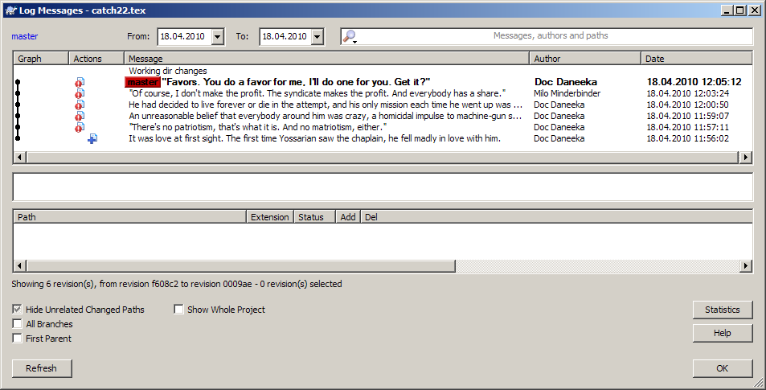
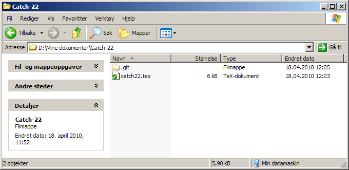

Vi skriver 2010, og skikkelige lagringssystemer er ikke lenger forbeholdt dem som driver med teknisk utvikling. De kan og bør brukes av alle. Versjonskontroll gir deg:

-   **Lagring:** en svært trygg og oversiktlig måte å lagre arbeidet på.
-   **Sikkerhet:** systemet beregner sjekksummen av filene dine, og verifiserer at de er intakte.
-   **Endringslogg:** oversikt over hvordan prosjektet skrider fremover.
-   **Filhistorikk:** alle tidligere utgaver kan hentes frem igjen.
-   **Diffing:** de konkrete endringene gjort fra en versjon til den neste.
-   **Merging:** ulike personer kan arbeide samtidig på den samme filen, og endringene kan integreres.
-   **Branching:** du kan jobbe på «eksperimentelle» utgaver av prosjektet i parallell, og integrere dem med hovedutgaven når de er gode nok.
-   **Distribuering:** du kan dele arbeidet ditt via sosiale utviklingsportaler som [GitHub](http://github.com/) og [BitBucket](http://bitbucket.org/).

La oss se på dette i praksis.

Her er endringsloggen til et TeX-dokument. Kommentarene gir oss en oppsummering av endringene fra versjon til versjon, og forfatterkolonnen forteller oss hvem som har gjort hva. Jeg kan klikke på en hvilken som helst versjon i listen og gjenopprette denne: Ingenting som slettes, går tapt.

Det minner litt om [Wikipedia](http://en.wikipedia.org/w/index.php?title=Catch-22&action=history), ikke sant? Siden TeX er tekst, kan vi også sammenligne to versjoner med en **diff**:

Her ser vi at en mengde nye linjer er blitt lagt til siden forrige gang. Denne funksjonaliteten er kjempenyttig når man jobber sammen med andre, men også når man er usikker på hva man selv har gjort siden sist.

Hvor blir all historikken lagret? Dersom du bruker [Git](http://git-scm.com/), opprettes det en skjult undermappe med navnet `.git` i arbeidskatalogen din. Med et grafisk grensesnitt som [TortoiseGit](http://code.google.com/p/tortoisegit/) får også filikonene et nytt utseende, der grønt betyr «sjekket inn» og rødt at det er gjort endringer siden sist.

For å plassere et nytt prosjekt under versjonskontroll, høyreklikker man bare på mappen med prosjektet, velger *Create repository here*, og legger til filene. (Alt kan også gjøres via kommandolinjen, naturligvis, men Tortoise-klientene fungerer som en forlengelse av det grafiske grensesnittet.)

Du kan i prinsippet plassere **hva som helst** under versjonskontroll, f.eks. musikk, bilder og video. Men TeX-dokumenter er særlig godt egnet fordi de er ren tekst, og kan dermed «diffes», dvs. betraktes som linjer fjernet og lagt til. Diffen kan lagres og utveksles med andre som sitter med den samme filen (men Git har også egne og automatiske verktøy for synkronisering). Når du har blitt vant til dette, vil du aldri mer gå tilbake til Word, og du vil se med skjevt blikk på alle som «lagrer» arbeidet sitt i binære og proprietære formater.

**Sett i gang!** Installer [Git](http://git-scm.com/) (Windows: [msysGit](http://code.google.com/p/msysgit/)) eller [Mercurial](http://mercurial.selenic.com/) -- samt en grafisk klient som [TortoiseGit](http://code.google.com/p/tortoisegit/) eller [TortoiseHg](http://tortoisehg.bitbucket.org/), om du vil -- og les [innføringen](../20/):

-   **[Pro Git](http://progit.org/book/)**
-   **[Hg Init: A Mercurial tutorial](http://hginit.com/)**

Det spiller ingen stor rolle om du velger Git eller Mercurial, bare du styrer langt, langt unna utdaterte og sentraliserte systemer som Subversion. (Mercurial er imidlertid bedre for dem som er vant med Subversion.) Git og Mercurial er *distribuerte*, som vil si at all revisjonshistorikk ligger lokalt i arbeidsmappen din (i underkatalogen `.git` eller `.hg`), og du er ikke avhengig av en server.

**Bruk versjonskontroll. Begynn i dag.**
