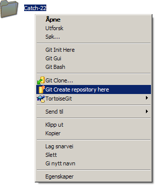
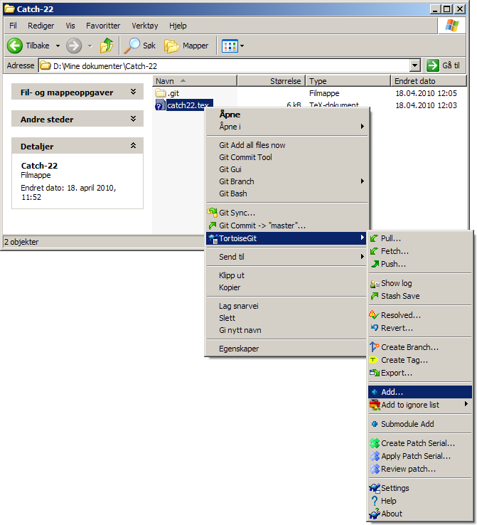
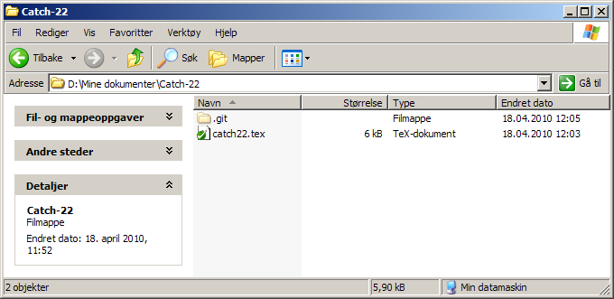
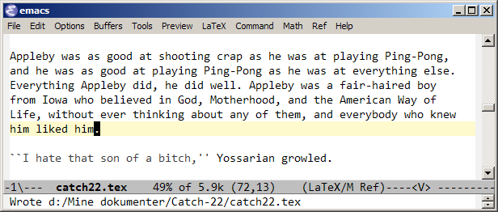
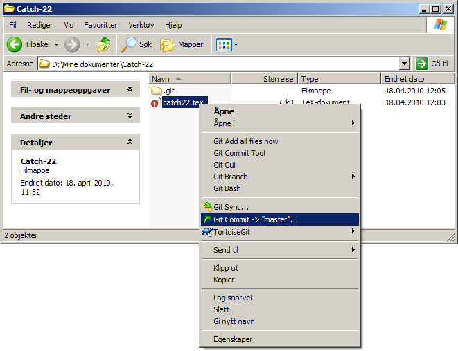
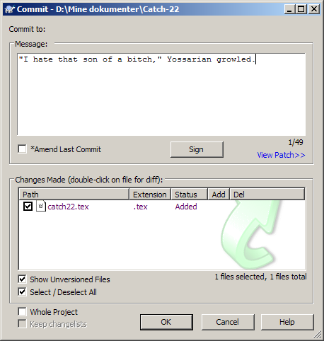

Før vi begynner, **installer** [Mercurial](http://mercurial.selenic.com/) eller [Git](http://git-scm.com/) ([msysGit](http://code.google.com/p/msysgit/) på Windows), samt [TortoiseHg](http://tortoisehg.bitbucket.org/) eller [TortoiseGit](http://code.google.com/p/tortoisegit/). De siste er ikke strengt nødvendige, men gir et felles brukergrensesnitt, slik at du kan følge denne veiledningen uansett hva du velger.

Første steg er å **initialisere et repository**. Høyreklikk på prosjektmappen din og velg *Create repository here*:

I tillegg må vi inn i mappen, markere de aktuelle filene og **legge dem til**. (Du kan ha filer i repo'et ditt som ikke er under versjonskontroll: De vises med et blått spørsmålstegn, som under.) Her høyreklikker vi på `catch22.tex` og velger *TortoiseGit* -> *Add*:

Da er vi klare! Filen er nå **grønn**, ettersom de siste endringene er sjekket inn:

La oss gjøre noen **nye endringer**. Vi åpner `catch22.tex` i en teksteditor, legger til litt tekst og lagrer:

Nå blir filen **rød**, fordi det er avvik mellom den og det som er sjekket inn siden sist. For å sjekke inn, høyreklikker vi på filen (eller den overordnede mappen) og velger *Commit*:

Vi får opp et tekstfelt hvor kan skrive et kort **sammendrag** av hva vi har gjort:

Suksess! Filen er nå **oppdatert** og grønn igjen.

Stort mer er det ikke. Du kan opprette en konto på [GitHub](http://github.com/) eller [BitBucket](http://bitbucket.org/) og synkronisere arbeidet ditt mot en ekstern server, men i utgangspunktet gjøres alt lokalt (distribuert). Du sjekker inn arbeidet ditt så ofte du føler for det, kanskje ved arbeidsdagens slutt. For å se hvordan prosjektet skrider fremover, høyreklikk på filen/mappen og velg *TortoiseGit* -> *Show log*.

**Lykke til!** :)

(Fortsatt ikke overbevist? Les om [fordelene med versjonskontroll](../18/).)
