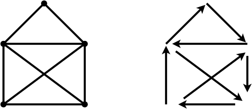
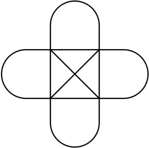
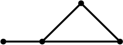
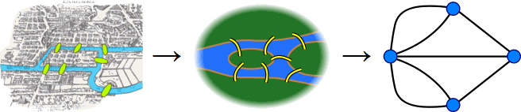

I min bardom dukket denne oppgaven opp mange ganger: tegn en figur uten å løfte blyanten fra papiret og uten å tegne samme kant to ganger. Den klassiske utfordringen var en konvolutt, som kan tegnes på mange måter, en av dem vist under.

Mine skolekamerater og jeg eksperimenterte med modifikasjoner av figuren. En av dem så slik ut:

Kunne denne tegnes på tilsvarende måte? Det var valgfritt om man ville regne krysset i midten som et forbindelsespunkt. Likevel kom ingen frem til en løsning de kunne vise andre.

I 1736 behandlet matematikeren Leonhard Euler et problem han kalte «[Bruene i Königsberg](http://no.wikipedia.org/wiki/Broene_i_K%C3%B6nigsberg)». Byen var delt i fire deler: nord- og sørsiden av elven Pregel, samt to øyer midt i elven. Syv bruer forbandt disse delene. Han ville finne en vei som passerte alle bruene akkurat én gang, noe som har fått navnet [Euler-sti](http://en.wikipedia.org/wiki/Eulerian_path).

Euler kom frem til noen elegante innsikter vi kan bruke for å analysere problemstillingen over. De har å gjøre med *graden* til et forbindelsespunkt, dvs. hvor mange kanter punktet forbinder.

Denne enkle figuren har fire forbindelsespunkter. Punktet lengst til venstre har grad $1$. Punktet til høyre for det har grad $3$. De øvrige punktene har grad $2$. Det er mulig å tegne figuren uten å løfte blyanten fra papiret, men det avhenger av hvor man begynner.

Den store forskjellen går mellom punkter hvor graden er et *partall*, og punkter hvor graden er et *oddetall*.

Partallsgrader er greie å håndtere. Hvis du besøker et punkt, vil du som oftest forlate det også, og dermed bruker du opp $2$ kanter. Et punkt av partallsgrad $N$ kan dermed besøkes og forlates $N/2$ ganger.

Oddetallsgrader er det verre med, for det er én kant «mer». Enten kan du forlate punktet en gang mer enn du besøker det, eller så kan du besøke punktet en gang mer enn du forlater det.

Konsekvensen er at et punkt med oddetallsgrad er en «felle». Enten er det å besøke punktet for $N$'te gang det siste du gjør, eller så er det å forlate punktet det første du gjør. Dermed er det bare to plasser i en Euler-sti hvor vi kan ha punkter av oddetallsgrad: begynnelsen og slutten.

Ta den enkle figuren over. Vi kan begynne i punktet av grad $1$ og slutte i punktet av grad $3$. Eller vi kan begynne i punktet av grad $3$ og slutte i punktet av grad $1$. Flere muligheter er det ikke. Tilsvarende må konvolutten begynne i et av de nedre hjørnene av grad $3$ og slutte i det andre.

Dette gir opphav til følgende teorem:

> **Dersom figuren har mer enn to forbindelsespunkter av oddetallsgrad, finnes det ingen løsning.**

Nå kan vi gå tilbake til den modifiserte figuren og telle grader:

Uansett hvordan vi tegner den, har figuren fire punkter av grad $5$. Dermed følger det at den *ikke* kan tegnes uten å løfte blyanten fra papiret.

Og bruene i Königsberg? De er skissert under. Det er nå lett å se hvorfor det ikke går, det heller.

