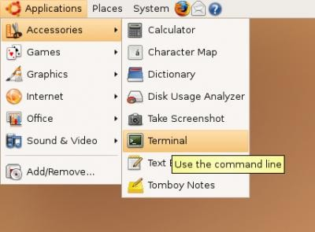
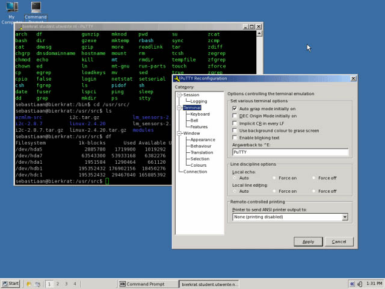
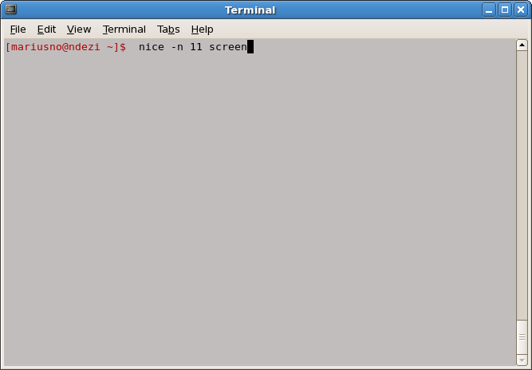
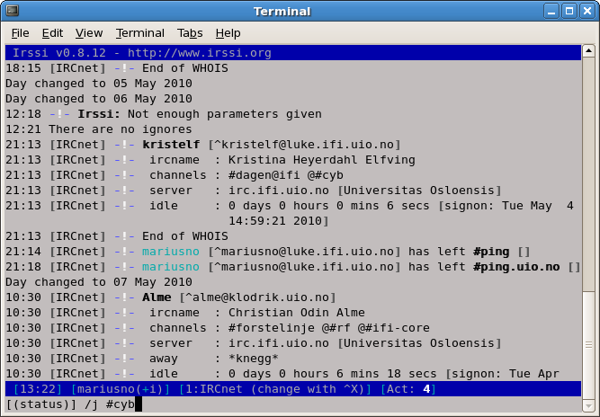
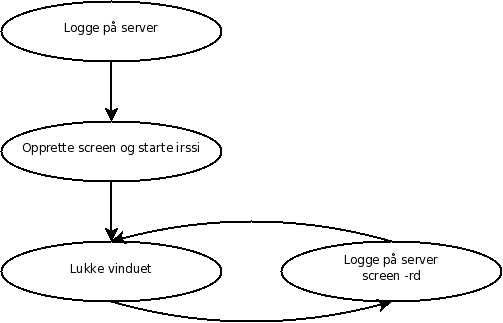

Hva er `screen`, `nice` og `irssi`
----------------------------------

**`screen`** er et terminalprogram som lar deg kjøre prosesser selv etter at du er logget ut, eller nettlinjen har falt ned. Prosessen blir liggende og kjøre i en virtuell terminal på serveren.

**`nice`**: UiO har implementert IJK (Idle Job Killer), som vil drepe denne prosessen etter en stund. Dette løses ved å sette en spesiell `nice`-verdi til prosessen, som gjør at IJK ikke vil drepe prosessen.

**`irssi`** er en terminalbasert IRC-klient. Grunnen til at man bruker dette er fordi at man i kombinasjon med `screen` kan ligge tilkoblet konstant til IRC-nettverket. Fordelene er at man har en konstant backlog, samt at man ikke plager allerede påloggede brukere med stadige pålogginger. Man vil også kunne beholde sin operator-status (`@`).

Opprette `screen`
-----------------

1.  Åpne en terminal:

    

    Eller last ned PuTTY om man bruker Windows:

    

2.  **Koble til med SSH til en server du husker** (*safir*, *rubin*, *smaragd*, *diamant*):

        ssh safir.ifi.uio.no

3.  Opprett en `screen` som ikke blir avsluttet av IJK:

        nice -n 11 screen

    

4.  Start `irssi`:

        irssi

5.  Du er nå koblet på `irssi` og kan koble til `#cyb` med følgende kommando:

        /join #cyb

    

Neste gang du nå skal hente opp igjen din `screen`
--------------------------------------------------

1.  SSH til serveren du valgte i første del:

        ssh safir.ifi.uio.no

2.  Koble til din `screen` med:

        screen -rd

Hvis din `screen` ikke dukker opp igjen, sjekk om du er på riktig server eller om serveren har blitt restartet i senere tid (`screen -ls`). Gjør om igjen fra første del.

(For å [avslutte](http://stackoverflow.com/questions/1509677/kill-detached-screen-session) en `screen`-økt for godt, skriv `C-a :quit`.)

Bruk av `irssi`
---------------

For å bytte kanalfane, trykk kombinasjonen: <kbd>Alt</kbd> + <kbd>*tall*</kbd> (f.eks.
<kbd>Alt</kbd> + <kbd>1</kbd>).

Alternativt: <kbd>Esc</kbd> + <kbd>*tall*</kbd> (f.eks. <kbd>Esc</kbd> + <kbd>1</kbd>).

Alternativt: <kbd>Ctrl</kbd> + <kbd>N</kbd> eller <kbd>Ctrl</kbd> + <kbd>P</kbd>.

Alternativt: skriv `/win + tall` (f.eks. `/win 2`).

For å liste brukere i kanalen, skriv:

    /names

For å scrolle opp/ned: <kbd>PgUp</kbd>/<kbd>PgDn</kbd>.

For å starte en privat samtale:

    /msg hei

Bla eller hopp deg så frem til vinduet samtalen ble startet i.

(Husk: man kan kopiere og lime inn!)

Oppsummert
----------

