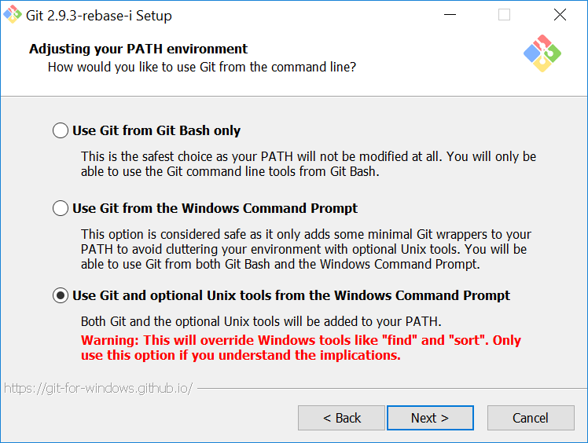

The following setup allows one to run Bash scripts from Windows' command prompt. It also augments it with common Unix commands like `cp`, `rm` and `mv`, which is useful if these are ingrained into muscle memory.

Note that this setup affects the *command prompt* (AKA `cmd.exe`). Although Windows 10 includes a full-fledged [Ubuntu Linux Bash Shell](#standalone-shells), that shell -- like PowerShell -- is separate from the command prompt. Therefore, the following instructions still apply to Windows 10, as well as to earlier Windows versions. (For a brief list of standalone Bash shells for Windows, see the [discussion](#standalone-shells) at the end.)

*Bash scripts* (with an extension of `.sh`) are a Unix invention, and should not be confused with *batch files* (with an extension of `.bat`), which are a Windows invention. However, we could say that our goal is to help Windows run Bash scripts *as if* they were batch files.

[Git for Windows](https://git-scm.com/)
---------------------------------------

Install [Git for Windows](https://git-scm.com/). When asked whether to install additional Unix utilities, choose *Use Git and optional Unix tools from the Windows Command Prompt*:

(The lighter *Use Git from the Windows Command Prompt* option can also be chosen, but then one must [install MSYS manually](#msys).)

We can now open a command prompt window and run a Bash script as follows:

    sh script.sh

If the script accepts parameters, we just provide them at the end:

    sh script.sh --param1 val1 --param2 val2

Git for Windows also extends the command prompt with common Unix commands like `cp`, `rm` and `mv`:

    cp script.sh script2.sh
    rm script.sh
    mv script2.sh script.sh

Git Bash, a [standalone shell](#standalone-shells), is installed as well. It can be run as a separate program, or in the command prompt. To do the latter, just type `bash`; to return to the standard command prompt, type `exit`. A `.bash_profile` file can be used to store settings between sessions. To edit this file, start Git Bash and type:

    notepad ~/.bash_profile

(Feel free to substitute `vi` for `notepad` if familiar with the former.) Below is an example file that configures the history size:

    HISTSIZE=10000
    HISTFILESIZE=10000

Configuring Bash settings is not covered here -- that is a topic in its own right. Note that Git Bash typically stores the `.bash_profile` file at `C:\Users\user\.bash_profile`.

### Update `PATHEXT`

With further refinements, we can trim the initial "`sh`" from the script invocation in the command prompt. First, associate `.sh` files with `sh.exe`. To do this, create a blank `script.sh` file (with Notepad, for example) and right-click on it. Choose *Open with* from the context menu. Click *More apps* and navigate to `C:\Program Files\Git\bin\sh.exe`. Enable *Always use this app to open .sh files* and click *OK*.

Next, update the value of the `PATHEXT` environmental variable. To access the variable, go to *Control Panel* -> *System* -> *Advanced* -> *Environment Variables*. The value is a list of file extensions separated by `;`, for example:

    .COM;.EXE;.BAT;.CMD;.VBS;.VBE;.JS;.JSE;.WSF;.WSH;.MSC

Add `;.SH` to the end:

    .COM;.EXE;.BAT;.CMD;.VBS;.VBE;.JS;.JSE;.WSF;.WSH;.MSC;.SH

We can now run `.sh` files *directly* from the command prompt, like so:

    script.sh --param1 val1 --param2 val2

We can also run a `.sh` file by clicking on it. However, note that the `.sh` extension is required to identify the file as a Bash script. Windows does *not* parse the `#!/bin/sh` shebang line; to execute an extensionless script, use `sh` (e.g., `sh script`).

[G*nu*W*in*32](http://gnuwin32.sourceforge.net/)
------------------------------------------------

For even more Unix utilities, install [G*nu*W*in*32](http://gnuwin32.sourceforge.net/). Ensure that its utilities are globally available by *appending* the location of G*nu*W*in*32's executables (its `bin/` directory) to the `PATH` environment variable. The value is a list of file paths separated by `;`, for example:

    %SystemRoot%\system32;%SystemRoot%;C:\Ruby22\bin

Thus, if G*nu*W*in*32's executables are located in `C:\GnuWin32\bin`, simply add `;C:\GnuWin32\bin` to the end:

    %SystemRoot%\system32;%SystemRoot%;C:\Ruby22\bin;C:\GnuWin32\bin

On Windows 10, the variable may be displayed as an editable list of directories. Add the directory to the bottom of the list.

We now have a host of tools at our command. For example, `make` builds a software project from a Makefile, while `wget` downloads a file from the Internet. Peruse G*nu*W*in*32's [package list](http://gnuwin32.sourceforge.net/packages.html) to get a sense of the possibilities.

[MinGW](http://www.mingw.org/)
------------------------------

For additional developer tools, augment the above setup with a complete installation of [MinGW](http://www.mingw.org/). Append its directory to `PATH` *after* the other directories.

We can now link (`ld`) and compile C programs (`gcc`) and C++ programs (`g++`).

Alias `open`
------------

Windows does not have the `open` command, and none of the packages above provide it. To alias `open` to Windows' `start` command, navigate to MSYS' `bin/` directory (`C:\Program Files\Git\usr\bin` or `C:\msys\1.0\bin`) and create an `open.bat` file containing the following:

    @echo off
    start %*

For Git Bash, we need to add a Bash alias to `.bash_profile`. Start Git Bash and type:

    notepad ~/.bash_profile

Then add the following line:

    alias open='start'

Alias `find`
------------

Windows' own `find` utility shadows the Unix `find` command. To create an alias for the latter, make a copy of `find.exe`, `find2.exe`, in the same folder (typically `C:\Program Files\Git\usr\bin`). The Unix command can now be accessed as `find2`.

Alternatively, switch to Git Bash for the duration of the command:

    bash
    find . -name "*.txt"
    exit

Alternatives
------------

### [MSYS](http://www.mingw.org/wiki/msys)

The above instructions assume that MSYS is installed along with [Git for Windows](#git-for-windows). However, it is also possible to install MSYS manually. If this applies, then run the [MSYS](http://www.mingw.org/wiki/msys) installer and append MSYS' `bin/` directory to `PATH` *after* the other directories.

### Standalone shells

Windows 10 includes its own [Linux Bash Shell](http://www.howtogeek.com/249966/how-to-install-and-use-the-linux-bash-shell-on-windows-10/), based on Ubuntu. Note that this is a *standalone* shell, similar to PowerShell; Windows 10's command prompt is unaffected and will still benefit from the instructions above. However, a standalone shell may provide built-in functionality that cannot be added to the command prompt (searchable history, for example).

Also note that if we install the Linux Bash Shell, then the `bash` command switches to that shell, not to Git Bash. However, we can still use the `git bash` command to change to Git Bash from the command prompt.

Another comprehensive standalone shell is provided by the [Cygwin](http://www.cygwin.com/) project, which can be used on older Windows versions. [MSYS](#msys) and [MinGW](#mingw) also provide standalone shells. Git Bash, the shell provided by [Git for Windows](#git-for-windows), is in fact an extension of these.

<!--
-   ~~MSYS may be superfluous.~~
    -   ~~If so, where to place `open.bat`?~~
-   ~~On Windows 10, the `PATH` variable is not separated by `;`.~~
-   ~~Update PATHEXT~~
-   ~~.bashrc~~
-   ~~Update CSS so that header does not affect the width of the window.~~
    -   ~~Requires refactoring the default stylesheet~~
-   ~~Git Bash should be installed first.~~
    -   How does the override option affect `PATH`?
-   Does Git Bash's MingGW differ from the default MinGW?
-->
