A study on fish-eye undistortion.
**[PDF](thesis.pdf)**, [TXT](index.md). DUO: [URN:NBN:no-51670](http://urn.nb.no/URN:NBN:no-51670).^[<http://hdl.handle.net/10852/47636>.]

---

{width=400}

Vegard Øye

Advisors:
[Carsten Griwodz](https://www.simula.no/people/griff) (Simula Research Laboratory)
[Andreas Aardal Hanssen](https://no.linkedin.com/in/andreas-aardal-hanssen-a1b2b110) (Cisco Systems)

---

### Abstract

We study the use of OpenGL ES to achieve hardware acceleration of nonlinear image transformations, in particular, performing fish-eye undistortion. We outline a hierarchy of transformations and describe interpolation methods. We compare several models of barrel distortion. Our code compares five different implementation strategies. Time measurements show that the best efficiency is achieved by accelerating the transformation in the fragment shader. This is also the setup that provides the greatest flexibility with regard to interpolation. We demonstrate an adaptive interpolation strategy where the most suitable interpolation kernel is chosen depending on to the distortion of the surrounding area. We conclude that OpenGL ES is well suited for accelerating nonlinear image transformations, and outline some ways in which greater speed may be achieved with the use of a parallel computing framework such as OpenCL.

### Changelog [...]

| Version | Date       | Changes |
| ------- | ---------- | ------- |
| 1.0.2   | 2018-09-15 | Linguistic corrections |
| 1.0.1   | 2016-11-17 | Created [Markdown](index.md) version |
| 1.0.0   | 2015-07-01 | First public version |

Acknowledgments
===============

I would like to thank my advisors Carsten Griwodz and Andreas Aardal Hanssen for their help and support throughout the writing of this thesis.

Thanks to Bård Winter for help with LaTeX typesetting.

Thanks also to my fellow students at the University of Oslo for making my time there an enjoyable period of my life.

Finally, I would like to thank my family and friends -- for being there when I needed you.

Vegard Øye
July 2015

1 Introduction {#chap-introduction}
==============

In the 21st century, video cameras are everywhere. Whether the technology is used for communication or surveillance purposes, there is a growing need for efficient processing of video data. Such processing may need to be adapted to the resources that are available on a mobile device. With the emergence of the multi-core imperative, parallel computing is increasingly important.

A taxing post-processing task is performing high-quality barrel undistortion. This well-studied problem crops up in several forms. At one end of the spectrum, there is the regular lens, whose inherent imprecision can be undistorted by means of careful calibration and a precise distortion model. At the other end of the spectrum, there is the wide-angle lens, which produces a characteristic "fish-eye" effect. This effect can undistorted in a similar manner, although a stronger model is needed. With an efficient implementation, this process may even be performed in real-time with limited resources.

Videoconferencing is on the rise thanks to the emergence of wide-spread, low-cost and high-capacity broadband connectivity, combined with powerful graphics hardware and software. Such systems require on-the-fly processing of video streams, placing severe constrains on the implementation. With video, performance is vital: in a live video session, it is expected that a well-functioning system can provide a steady stream of $30$--$60$ video frames per second. Any software performance issue may cause frame skips, which disturbs the immersive video experience that such technology is meant to provide. Performance and latency requirements, therefore, place severe constraints on the implementation of post-production effects.

Although most video cameras use regular lenses, wide-angle lenses are also gaining traction in automatic systems. One example is rear-window cameras in modern vehicles. The author took a bus equipped with such a camera, whose feed was displayed on a curved screen in front of the bus and also on rectangular screens spread throughout the bus. A more sophisticated example is Nvidia's Drive CX automotive system, which stitches together data from multiple wide-angle lenses in order to provide surround vision ([Nvidia 2015](#nvidia15-drivepx)).

The main topic of the thesis is the efficient undistortion of photographs taken with fish-eye lenses, and we will look at various ways of modeling such distortion. Barrel undistortion is an instance of a general class of operations on an image: applying a geometric transformation to it, also known as "warping" the image. Such an operation transforms the spatial relationship between points in the image. In his seminal work on digital image warping, [Wolberg (1990)](#wolberg90-digital-image-warp) offers the following analogy:

> Imagine printing an image onto a sheet of rubber. Depending on what forces are applied to that sheet, the image may simply appear rotated or scaled, or it might appear wildly distorted, corresponding to the popular notion of a warp. While this example might seem to portray image warping as a playful exercise, image warping does serve an important role in many applied sciences. Over the past twenty years, for instance, image warping has been the subject of considerable attention in remote sensing, medical imaging, computer vision, and computer graphics. It has made its way into many applications, including distortion compensation of imaging sensors, decalibration for image registration, geometrical normalization for image analysis and display, map projection, and texture mapping for image synthesis.^[[Wolberg (1990)](#wolberg90-digital-image-warp), chapter 1: "Introduction", p. 1.]

As the problem of image transformation is a general one, our findings can be generalized to other types of transformation. We investigate how custom methods of interpolation can produce smoother results when dealing with complex transformations, and how graphics acceleration may help us in this regard.

1.1 The multi-core imperative
-----------------------------

In recent times, the focus has shifted from raw performance to performance per watt expended. Although vendors will continue to fit more and more transistors onto a single die, they will compete on power efficiency instead. This entails a transition to multi-core chips.

The multi-core imperative was first laid out by [Chandrakasan et al. (1995)](#chandrakasan95-power). The gist of their argument is as follows. The energy expended in switching the gates in a processor is given by:

$$P = CV^2f$$

Here, $C$ is the capacitance, $V$ is the voltage and $f$ is the frequency. According to their models, if we compare a single-core processor running at voltage of $V$ and a frequency $f$ to a dual-core processor running at $f/2$, then the capacitance for the latter increases by $2.2$, while the voltage drops to $0.6V$. Therefore, the power in the dual-core case is $0.396$ of the power in the single-core case. In general, many cores running at lower frequencies are fundamentally more power-efficient.

Power considerations are especially important on mobile devices. Whenever maximizing performance per watt is essential, the general trend will be towards multi-core and specialized processors. To reap the benefits of this heterogeneous future, we must choose a well-supported framework.

1.2 OpenGL
----------

OpenGL is a cross-language, multi-platform API for rendering graphics. The API abstracts access to a graphical processing unit (GPU) in order to achieve hardware-accelerated rendering. It enjoys the strong advantage that it supports a wide range of platforms and hardware. It is maintained by the non-profit technology consortium Khronos Group.

Current GPUs consist of a large number of programmable processors called *shader cores* which run mini-programs called *shaders*. While each core may be relatively primitive -- having low throughput and typically lacking advanced features like branch prediction -- the GPU may contain thousands of these cores ([Sellers et al. 2014](#sellers14-opengl-super)). This enables for very efficient parallelization of program code.

Historically, OpenGL was structured around a fixed-function pipeline. This allowed a variety of effects to be accomplished simply by referencing built-in functions. However, this programming style is going out of favor and is being replaced by a more "dynamic" approach, where everything is computed by user-written shader programs.

There are several versions of OpenGL. The main series is henceforth referred to as *desktop OpenGL*, to differentiate it from *OpenGL ES*, the mobile version.

OpenGL ES is a new version of OpenGL, aimed at mobile devices. It is the primary graphics library for handheld and embedded devices with programmable 3D hardware including cell phones, personal digital assistants (PDAs), consoles, appliances, vehicles, and avionics ([Munshi et al. 2014](#aaftab14-opengl-es)). It is a stripped-down and updated version that is simpler than desktop OpenGL in some respects, and more advanced and flexible in other respects. OpenGL ES can also be run on the desktop, and it provides the underpinnings of WebGL, a web standard for browser-based 3D graphics. As much as possible, OpenGL ES is designed with backward compatibility in mind: applications written to the embedded subset of functionality in OpenGL would also run on OpenGL ES.

OpenGL ES emphasizes the dynamic programming style; indeed, from OpenGL ES 2.0 and onward, fixed-function techniques are no longer available and must instead be implemented in terms of shaders. This obliges the programmer to piece together the graphics pipeline from the ground up by writing shader programs. There are two classes of shaders: *vertex shaders* and *fragment shaders*. A vertex shader operates on a position, which it may transform; a fragment shader is responsible for specifying the color of a fragment, which determines the value of an output pixel. In general, fragments and output pixels are not the same concept: in multipass shading, for example, the fragment shader may be run multiple times per pixel. However, our implementation does not employ such techniques. Indeed, its pipeline is simple enough that for all practical purposes, fragments and output pixels can be considered to be the same thing. Shaders are written in a C-like language called GLSL (OpenGL Shading Language). Figure [1.1](#fig-pipeline) shows the general OpenGL ES pipeline; the data flow of our implementation is described in chapter [4](#chap-strategies).

{#fig-pipeline width=500}

Both vertices and fragments are automatically shaded in parallel. This gives rise to a significant performance boost while freeing the programmer of the burden of coordinating parallel tasks. However, there are some disadvantages. Shader instances cannot communicate with each other or reuse previous computations, although some may be cached behind the scenes. A shader program only specifies a mapping from its inputs to its outputs; the rest is handled by OpenGL ES behind the scenes.

1.3 Other frameworks
--------------------

OpenGL ES is not the only API for enabling hardware acceleration. With the move from serial programming to parallel programming and the widespread availability of GPU hardware, we have seen the emergence of several libraries utilizing GPU hardware for general-purpose programming.

Recall that in OpenGL ES, each shader runs in isolation and with little knowledge of how it fits into the larger picture. Furthermore, OpenGL ES offers limited support for profiling code. A motivation for using a general library in place of OpenGL ES would be to gain more fine-grained control over parallelized code. Indeed, as we will see in chapter [7](#chap-conclusion), there are some aspects of our implementation that may benefit from such control.

### 1.3.1 CUDA

CUDA (short for Compute Unified Device Architecture) is a parallel computing API created and backed by Nvidia. It allows both the CPU (the "host") and the GPU (the "device") to be programmed in regular C. Parallel code is written in the form of "kernels" that are spawned on the GPU and may intercommunicate. Furthermore, CUDA provides fine-grained memory handling: computations may be cached and reused by other threads. Threads are organized into thread blocks, which in turn are organized into grids.

CUDA is currently officially executable only on CUDA-enabled Nvidia hardware. It can be run on mobile devices powered by the Tegra chip, such as the Shield and Google Nexus 9 tablets. While CUDA boasts great efficiency, this speed is contingent on that the kernel code maxes out the GPU's resources. This leads to code that is often optimized towards specific hardware and is not very portable.

CUDA enjoys a huge community, and there are some independent efforts to make CUDA programming more heterogeneous. A compiler from PGI makes it possible to use the same CUDA code on x86 processors, Nvidia chips, or both ([PGI 2010](#pgi2010-cuda)). It is also possible to combine CUDA with OpenGL.

### 1.3.2 OpenCL

OpenCL is an open and cross-platform standard maintained by the non-profit Khronos Group. Its parallelization framework is similar to CUDA's, although the precise terms differ. OpenCL is also more oriented towards heterogeneous programming, and an OpenCL kernel can be run on both the CPU and the GPU.

At first glance, as CPUs become more multi-core and "GPU-like", abstracting away their differences behind a common interface seems to offer an elegant approach to parallel programming. In practice, it is still necessary to optimize the code for the hardware it is running on.

Thus, with both OpenCL and CUDA, we run into the same paradox: the development of GPGPU standards was motivated by an aim of uniformity and portability. However, obtaining good results from parallelized code is difficult without custom optimization; and optimization makes the code hardware-specific. In general, it is not possible to create a low-level API that is cross-platform *and* offers optimal efficiency at the same time.

Speed-wise, OpenCL is almost on par with CUDA. The hardware support is broader, and includes mobile devices: OpenCL can be run on a number of Android phones. The development environment is not as uniform. There is no single company backing OpenCL, although AMD, ARM and Intel have declared support for the standard.

As with CUDA, OpenCL can be combined with OpenGL ES, a task that is outlined in section [7.2](#sec-furtherwork). However, this is a complex affair. All in all, little compares to OpenGL ES in terms of mobile support and ease of use with regard to graphical problems.

1.4 Challenges {#sec-challenges}
--------------

In implementing and accelerating barrel undistortion using OpenGL ES, we are met with several challenges:

-   To model the distortion in a way that is both efficient and produces precise results.
-   To select an implementation strategy that is a good fit for the chosen model.
-   To exploit the parallelizable features of the problem to achieve good execution speed.
-   To provide high-quality interpolation, adapted to the characteristics of the transformation.

We will reassess these challenges in chapter [7](#chap-conclusion).

1.5 Overview
------------

The structure of the thesis is as follows.

1.  **[Chapter 1: Introduction](#chap-introduction).** This chapter investigates the motivation for accelerating image transformation, along with the available technologies for doing so.
2.  **[Chapter 2: Image transformation](#chap-trans).** The task of performing fish-eye undistortion is indicative of a larger class of problems. In this chapter, we outline a hierarchy of transformation problems and investigate their challenges with regard to interpolation.
3.  **[Chapter 3: Models of fish-eye distortion](#chap-models).** Fish-eye distortion can be modeled in different ways. We compare several models and their pros and cons with regard to implementation.
4.  **[Chapter 4: Implementation strategies](#chap-strategies).** We outline five implementation strategies for accelerating fish-eye undistortion. We also describe several interpolation methods.
5.  **[Chapter 5: Implementation with OpenGL ES](#chap-opengl).** The aforementioned strategies are implemented with a combination of Qt and OpenGL ES. We describe the class structure and give examples of shader code.
6.  **[Chapter 6: Results](#chap-results).** We compare the execution times of the implemented strategies. We also give visual examples of the interpolation results.
7.  **[Chapter 7: Conclusion](#chap-conclusion).** We sum up which strategies give the best results. We also highlight some weaknesses and suggest ways to improve the efficiency even further.

Summary
-------

Image transformation is a general problem that crops up in different forms. A particularly well-studied form of the problem is barrel undistortion, which can be used to correct for the inherent imprecision of regular lenses or to reverse the "fish-eye" effect of photographs taken with wide-angle lenses. This task raises interesting challenges with regard to precision, efficiency and quality.

The demand for efficient post-procession of images and video streams is increasing, as much of that procession takes place on mobile devices with limited resources. The multi-core imperative has intensified the need for code that runs fast in parallel.

There are several frameworks for achieving hardware-accelerated rendering: OpenGL, CUDA and OpenCL. The most widely supported standard is OpenGL. A recent version, OpenGL ES, is adapted towards mobile devices and enjoys widespread support. This is the framework chosen for our implementation.

2 Image transformation {#chap-trans}
======================

In this chapter we will provide a general discussion of how images can be transformed. We will first look at how transformations can be expressed mathematically, and then we will investigate the challenges with regard to interpolation. In particular, we are interested in the following issues:

-   How the problem of barrel undistortion fits into the larger picture, and to which degree our findings can be generalized to other transformations.
-   How the challenges with regard to interpolation depend on the complexity of the transformation. Much of the literature discusses interpolation techniques in a context of 3D applications. Barrel undistortion raises issues that are not addressed in this context.
-   How these transformations can be expressed in OpenGL ES. The shader language and its constructs lends itself well to the class of transformations that can be expressed as matrix multiplication, but barrel undistortion falls outside this class.

We will outline a simple hierarchy of transformations that is roughly based on the terminology of [Wolberg (1990)](#wolberg90-digital-image-warp). Then we will discuss various interpolation techniques.

2.1 Types of transformation
---------------------------

Image transformations can be roughly ordered from simple, linear transformations to complex, nonlinear transformations (figure [2.1](#fig-transformations)). In the following discussion, we will consider that each sample in the source image has a coordinate $[x, y]$, and it is our task to calculate the corresponding position $[x', y']$ in the transformed image. The problem of blending together samples in order to produce a smooth output image is postponed to our treatment of interpolation in section [2.2](#sec-interpolation).

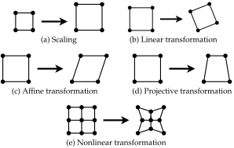{#fig-transformations width=400}

Note that in the following discussion, the transformation takes us *from* the untransformed coordinates of the source image *to* the transformed coordinates of the output image. As we will see later on, it can also be useful to go in the reverse direction. Many transformations are invertible and can be expressed either way.

### 2.1.1 Scaling

At the lower end of the spectrum, we have scaling, probably the most common way of transforming an image. It is very easy to implement and accelerate, since the neat rows-and-columns shape of the problem lends itself particularly well to implementation by basic data structures.

Mathematically, scaling can be expressed as multiplying the image coordinates with a scalar $k$. If the operation is expressed as matrix multiplication, then the scaling matrix has the form $[\begin{smallmatrix}
  k & 0\\
  0 & k
\end{smallmatrix}]$, or $k$ times the identity matrix:

$$\left[\begin{matrix}
  k & 0\\
  0 & k
\end{matrix}\right]
\left[\begin{matrix}
  x\\
  y
\end{matrix}\right] =
\left[\begin{matrix}
  kx\\
  ky
\end{matrix}\right]$$

Of course, scaling is invertible, since scaling by $k$ can be undone by scaling by $1/k$.

### 2.1.2 Linear transformations

One step up from scaling, we have linear transformations, such as rotation, reflection, and shearing. Intuitively, these transformations can be thought of as ones where parallel lines remain parallel after transformation.

Mathematically, a transformation $F(\mathbf{x})$ is linear if it preserves the basic operations of addition and multiplication by a scalar $k$:

$$\begin{aligned}
  F(\mathbf{x} + \mathbf{y}) &= F(\mathbf{x}) + F(\mathbf{y})\\
  F(k\mathbf{x}) &= kF(\mathbf{x})
\end{aligned} $$

Note that the transformation doesn't shift the coordinate system -- it maps the zero coordinate onto itself:

$$\label{eq:zero}
F(\mathbf{0}) = \mathbf{0} $$

Linear transformations can be expressed as multiplication by a two-by-two matrix $[\begin{smallmatrix}
  m_{11} & m_{12}\\
  m_{21} & m_{22}
\end{smallmatrix}]$. For all practical purposes, these matrices are invertible, excluding a few corner cases which are meaningless in the context of image transformation.

### 2.1.3 Affine transformations

An affine transformation is a linear transformation followed by translation, i.e., shifting the coordinate system by offsets $\Delta x$ and $\Delta y$. Translations cannot be expressed by a two-by-two matrix, as equation shows. However, if we extend our two-dimensional coordinates with a "dummy" coordinate $z = 1$, we can express translation as multiplication by a three-by-three matrix:

$$\left[\begin{matrix}
  1 & 0 & \Delta x\\
  0 & 1 & \Delta y\\
  0 & 0 & 1
\end{matrix}\right]
\left[\begin{matrix}
  x\\
  y\\
  1
\end{matrix}\right] = \left[\begin{matrix}
  x + \Delta x\\
  y + \Delta y\\
  1
\end{matrix}\right]$$

An affine transformation can then be expressed as:

$$\left[\begin{matrix}
  m_{11} & m_{12} & \Delta x\\
  m_{21} & m_{22} & \Delta y\\
  0 & 0 & 1
\end{matrix}\right]
\left[\begin{matrix}
  x\\
  y\\
  1
\end{matrix}\right] = \left[\begin{matrix}
  m_{11}x + m_{12}y + \Delta x\\
  m_{21}x + m_{22}y + \Delta y\\
  1
\end{matrix}\right]$$

In actuality, the coordinate $[x, y, z]$ is a *homogeneous* coordinate. OpenGL ES provides built-in support for such coordinates, which extends the scope of transformations that can be expressed as matrix multiplication.

### 2.1.4 Projective transformations

If the three-by-three matrix modifies the $z$ coordinate, then the transformation is projective:

$$\left[\begin{matrix}
  m_{11} & m_{12} & m_{13}\\
  m_{21} & m_{22} & m_{23}\\
  m_{31} & m_{32} & m_{33}
\end{matrix}\right]
\left[\begin{matrix}
  x\\
  y\\
  z
\end{matrix}\right] = \left[\begin{matrix}
  m_{11}x + m_{12}y + m_{13}z\\
  m_{21}x + m_{22}y + m_{23}z\\
  m_{31}x + m_{32}y + m_{33}z
\end{matrix}\right]$$

In this case, the $z$ value contains information. We map from homogeneous coordinates to image coordinates by dividing by $z$:

$$\frac{1}{z}
\left[\begin{matrix}
  x\\
  y\\
  z
\end{matrix}\right] = \left[\begin{matrix}
  x/z\\
  y/z\\
  1
\end{matrix}\right]$$

By transforming the input coordinates with this two-step process -- first multiplying with an homogeneous matrix and then mapping back to two-dimensional coordinates -- we can express more advanced transformations, for example perspective projection (figure [2.2](#fig-perspective)). Any planar quadrilateral can be transformed to any other quadrilateral.

{#fig-perspective width=300}

In the case of nonplanar quadrilaterals, however, a more general solution is necessary. The general quadrilateral-to-quadrilateral problem can be expressed as a bilinear transformation:

$$\left[\begin{matrix}
  a_3 & a_2 & a_1 & a_0\\
  b_3 & b_2 & b_1 & b_0
\end{matrix}\right]
\left[\begin{matrix}
  xy\\
  x\\
  y\\
  1
\end{matrix}\right] = \left[\begin{matrix}
  a_3xy + a_2x + a_1y + a_0\\
  b_3xy + b_2x + b_1y + b_0
\end{matrix}\right]$$

For example, a photograph can be transformed from perspective projection to orthographic projection by mapping a rectangle imaged as a quadrilateral to a rectangle with the correct aspect ratio ([Hartley and Zisserman 2004](#zisserman04-multiple-view)).

Because projective transformations do not distribute samples as uniformly as simpler transformations do, they tend to present aliasing issues. A textured surface rendered at an angle as shown in figure [2.2](#fig-perspective), for example, may introduce artifacts in the distance. We'll discuss how such effects can be mitigated in our treatment of interpolation in section [2.2](#sec-interpolation).

### 2.1.5 Nonlinear transformations {#sec-nonlinear}

At an even higher level are the transformations that cannot be expressed as matrix multiplication at all. We'll refer to this amorphous class of transformations as "nonlinear" transformations.

Barrel distortion, for example, belongs in this class. A coordinate is skewed depending on its distance from the center. Coordinates near the margins are moved together, while coordinates near the center are spread apart. This gives rise to higher frequencies near the margins, which may produce unwanted aliasing effects.

A nonlinear transformation is not necessarily costly to calculate. If it is, however, then it might be preferable to compute it in advance and store it as a table of $[x, y]$-offsets:

$$\left[
\begin{matrix}
  F(\mathbf{x}_{11}) & F(\mathbf{x}_{12}) & F(\mathbf{x}_{13}) & F(\mathbf{x}_{14}) & \dotsb & F(\mathbf{x}_{1n}) \\
  F(\mathbf{x}_{21}) & F(\mathbf{x}_{22}) & F(\mathbf{x}_{23}) & F(\mathbf{x}_{24}) & \dotsb & F(\mathbf{x}_{2n}) \\
  F(\mathbf{x}_{31}) & F(\mathbf{x}_{32}) & F(\mathbf{x}_{33}) & F(\mathbf{x}_{34}) & \dotsb & F(\mathbf{x}_{3n}) \\
  F(\mathbf{x}_{41}) & F(\mathbf{x}_{42}) & F(\mathbf{x}_{43}) & F(\mathbf{x}_{44}) & \dotsb & F(\mathbf{x}_{4n}) \\
  F(\mathbf{x}_{41}) & F(\mathbf{x}_{42}) & F(\mathbf{x}_{43}) & F(\mathbf{x}_{44}) & \dotsb & F(\mathbf{x}_{4n}) \\
  \vdots             & \vdots             & \vdots             & \vdots             & \ddots & \vdots             \\
  F(\mathbf{x}_{m1}) & F(\mathbf{x}_{m2}) & F(\mathbf{x}_{m3}) & F(\mathbf{x}_{m4}) & \dotsb & F(\mathbf{x}_{mn})
\end{matrix}
\right]$$

Since coordinate transformation is reduced to a single table lookup, this is very efficient, at least for small tables. For large tables, cache misses may outweigh the cost of computing the value directly. Note that if the image resolution is not known beforehand (e.g., because of user-adjustable resizing), then this approach requires us to calculate the table at some sufficiently rich resolution, and then interpolate between table entries in order to up- or downsample the table to the given image size. A simple way to achieve this is to store the table as a texture and let OpenGL ES interpolate between texel values.

In general, we are met with two challenges: how to express the transformation precisely, and how to deal with aliasing effects. Both are complex problems, and raise a trade-off between quality and efficiency.

2.2 Interpolation {#sec-interpolation}
-----------------

Thus far, we have only considered how coordinates in the input image map onto coordinates in the output image. When we work with images, we encounter the practical problem that continuous coordinates may not map precisely onto discrete pixels. There may be "clusters" and "gaps": when enlarging an image, for example, the samples are spread further apart, leaving empty spaces in between. To produce a smooth output image, we must perform interpolation.

In the abstract, interpolation can be decomposed into two general problems: that of reconstructing a discrete image into a continuum, and that of rasterizing the continuum into a discrete image again. Transformation is performed in between. Adding an optional filtering step, the process can be divided into four stages:

1.  **Reconstruction:** The discrete input $f(x)$ is reconstructed into the continuous input $f_c(x)$ with the reconstruction filter $r(x)$. This can be expressed as convolution: $f_c(x) = f(x) * r(x) = \Sigma_{k} f(x) r(x - k)$. In informal terms, the surrounding samples are summed up and weighed according to their relative distance to the reconstructed position. A simple reconstruction filter may consider only the nearest sample, while a more sophisticated filter may compute a weighted average of the surrounding area (see section [2.2.1](#sec-filter)).
2.  **Transformation:** The continuous input $f_c(x)$ is transformed to $g_c(x)$ according to the transformation function $F$. In the case of backward mapping, the transformation is defined as an inverse mapping: $g_c(x) = f_c(F^{-1}(x))$. It is also possible to perform this step as forward mapping.
3.  **Filtering:** Depending on the transformation, $g_c(x)$ may contain arbitrarily high frequencies. To prevent aliasing, the result may be bandlimited by a filter $h(x)$. Since this step is performed in the continuous domain, the convolution is defined as an integral: $g_c'(x) = g_x(x) * h(x) = \int g_c(t) h(x - t)\,\mathrm{d}t$. In informal terms, high frequencies are smoothed out by passing each position through a filter that weighs its surroundings.
4.  **Rasterization:** The continuous, transformed, bandlimited result $g_c'(x)$ is sampled by $s(x)$, the "comb function", to produce the discrete output $g(x)$. The "comb function" is simply defined as $1$ for discrete positions and $0$ otherwise, so that sampling can be expressed as multiplication: $g(x) = g_c'(x)s(x)$. Note that the output isn't necessarily sampled at the same density as that of the input.

In practice, interpolation is usually expressed in more compact terms (although there are promising efforts to bring a more "functional" style into graphics).^[[Heard (2008)](#heard08-beaut-code) explores Haskell's *monad* concept in conjunction with graphics processing, giving several examples of how the control flow can be abstracted away.] The main point, for our purposes, is that the transformation is performed either through *forward mapping* or *backward mapping*. As we will see in chapter [5](#chap-opengl), OpenGL ES lends itself well to both approaches. In the case of a forward mapping implementation, we go *from* coordinates in the input image *to* coordinates in the output image (figure [2.3a](#fig-forwardandbackwardmapping)). This is done by constructing a constructing a grid mesh, transforming it, and then rasterizing the result. In the case of backward mapping, we go *from* output coordinates *to* input coordinates (figure [2.3b](#fig-forwardandbackwardmapping)). We therefore make use of the *inverse* transformation $F^{-1}(\mathbf{x})$, rather than the original transformation $F(\mathbf{x})$. For example, if the application is scaling, then instead of scaling coordinates in the input image by a factor of $k$, we scale coordinates in the output image by a factor of $1/k$.

{#fig-forwardandbackwardmapping width=600}

Which approach is better is a question of context. A complex transformation may be faster to compute in one direction than the other. The geometry of the problem may also be exploited to increase performance. When scaling an image, for example, the interpolation is usually done in one direction and then in the orthogonal direction (e.g., first horizontally and then vertically): the first step produces a set of intermediate values which are blended together in the second step. But as complex transformations are not geometrically simple, it is difficult to generalize techniques which depend on the rows-and-columns shape of the problem. In section [2.2.3](#sec-adaptiveinterpolation), we will outline an interpolation method that is general enough to work well with any complex transformations, yet flexible enough to be adapted to the parameters of the transformation.

### 2.2.1 Reconstruction {#sec-filter}

Although interpolation has been expressed as convolution, it is usually implemented in terms of evaluating the interpolation polynomial directly at the resampling positions. For example, in the common case of *bilinear* interpolation, the interpolation is performed first in one direction, and then again in the orthogonal direction (thus the interpolation as a whole is actually quadratic, not linear).

The choice of reconstruction filter has a huge impact on quality and performance. The simplest filter is the *nearest-neighbor* filter, which simply copies the value of the nearest sample to the reconstructed position. This is very efficient (practically a "no-op"), but tends to yield a blocky and jagged result. In the case of bilinear interpolation, the *four* ($2 \times 2$) nearest samples are considered, and a weighted average is computed according to the proximity to each. Even smoother results can be obtained with *bicubic* interpolation, although some sharpness of edges gets lost; this method considers *sixteen* ($4 \times 4$) samples and is more computationally intensive.^[An even more sophisticated choice for resampling is *Lanczos interpolation*, which [Turkowski and Gabriel (1990)](#turkowski90-graph-gems) considered the "best compromise in terms of reduction of aliasing, sharpness, and minimal ringing".] OpenGL ES contains built-in support for bilinear filtering; other methods can be implemented as shaders ([Bjorke 2004](#bjorke04-filter)).

### 2.2.2 Antialiasing {#sec-prefilter}

As we consider more complex transformations, we encounter a new problem: aliasing. Scaling, linear transformations and affine transformations are uniform, so that the same quality of interpolation applies to the whole image. If part of the image is jagged, the whole image is jagged; if part of the image is smooth, the whole image is smooth. When we consider projective transformations and beyond, this no longer holds true. Instead, the "density" of the image may vary, giving rise to high frequencies that, when undersampled, produce aliasing artifacts.

The ideal way to handle these frequencies would be to sample the image at a higher resolution. Since this is often prohibitively expensive, the alternative solution is to get rid of the higher frequencies by bandlimiting. A crude approach would be to blur the whole image before transformation. A smarter way is to blur *adaptively*: if we know where in the image the high frequencies are clustered, we can single those areas out for adaptive bandlimiting.

In 3D applications, this is often done with a prefiltering technique known as "mip-mapping".^["Mip" stands for "multum in parvo", a Latin phrase meaning "many things in a small place".] The same texture is stored in a range of decreasing resolutions before use. For example, when a polygon is rendered at an angle, high-resolution textures may be used for the close parts of the polygon and low-resolution textures for the distant parts. Anisotropic filtering builds upon mip-mapping by also downsampling the texture to nonproportional resolutions.

Prefiltering techniques are optimized for the scenario where the same image is stored once and rendered many times. When processing a stream of images on-the-fly, this may not be viable. The following techniques merge interpolation and antialiasing together in one step.

### 2.2.3 Adaptive interpolation {#sec-adaptiveinterpolation}

One such antialiasing technique is *area sampling*. We may consider each pixel in the output image to be a square that is mapped to some shape in the input image, called the "preimage". By computing this area and blending together the samples contained therein, we obtain a better value for the output. That is, pixels with a large preimage (and therefore potentially high frequencies) are sampled at a higher frequency than pixels with a small preimage.

Computing the preimage raises issues on its own, however. As a first approximation, the coordinates of the four corners of the pixel may be transformed in reverse to produce the input coordinates of some approximately quadrilateral shape. For more complex transformations, the preimage may *not* be quadrilateral at all, and additional coordinates may be necessary. There is also the recurrent problem that a "pixel is *not* a little square" ([Smith 1995](#smith95-pixel)). A pixel is, in fact, a point sample that is rendered in the form of a little square. This complicates the matter of drawing the line between samples that are "inside" the preimage and samples that are outside it. In practice, some approximation is necessary.

{#fig-supersampling width=500}

The technique of *supersampling* sidesteps these geometrical difficulties (figure [2.4](#fig-supersampling)). Instead of dealing directly with the shape of the preimage, the preimage is merely "sampled" a number of times. The value of the output pixel is computed on the basis of, say, nine ($3 \times 3$) positions that are overlaid onto the pixel in the form of a uniform grid and then transformed to input coordinates. These samples are then blended together.

Supersampling should not be confused with *multisampling*, which is a built-in anti-aliasing technique provided by OpenGL ES. If multisampling is enabled, then each pixel at the edge of a polygon is sampled multiple times at a slight offset that is smaller than the pixel size. The samples are averaged together, producing a smoother edge. However, this does little for the problem of image transformation, where aliasing artifacts are not confined to polygon edges. We need to provide a more general method, over whose implementation we can exert direct control.

As we will see in chapter [4](#chap-strategies), supersampling is simple to implement, but has the cost of increasing the amount of computations by nine in this case. If the input is a high-resolution image with lots of detail, then additional samples may be necessary, making the method increasingly costly. More efficient results can be obtained by *adaptive supersampling*. We may estimate the size of the preimage on the basis of a transformed quadrilateral. Large preimages are supersampled with a higher number of samples, while small preimages need not be supersampled at all. In this way, adaptive supersampling improves efficiency.

We can also adapt the way that the samples are blended together, and thus improve interpolation quality. In the case of barrel undistortion, we know that the "sampling density" depends on the distance from the center of the image. By building this knowledge into our interpolation method, we can employ a sharpening filter for "low-density" areas and a blurring filter for "high-density" areas. Section [4.2.5](#sec-gdbm) describes such a strategy.

Summary
-------

Image transformations can be ordered by complexity. Some transformations can be expressed and implemented as matrix multiplications, while others require higher-order math. While the former lends itself well to OpenGL ES' data structures, the latter may be costly to compute.

In general, the more complex a transformation is, the harder it is to interpolate in a way that alleviates aliasing effects. Prefiltering methods commonly used in 3D applications, where a texture is stored once and used many times, don't generalize well to the problem of image transformation. Furthermore, nonlinear transformations may give rise to uneven aliasing effects. When choosing an interpolation method, a trade-off between quality and efficiency is raised.

Supersampling is a very adaptable method. The number of samples used and the way they are blended together can both be adjusted on the basis of knowledge of the behavior of the transformation.

In the following chapters, we will look at how we can implement forward mapping and backward mapping in the context of OpenGL ES, as well as how we can improve on OpenGL ES' built-in interpolation with a supersampling solution. First, however, we will take a closer look at the problem of modeling barrel distortion.

3 Models of fish-eye distortion {#chap-models}
===============================

Wide-angle lenses produce a "fish-eye" effect, but all lenses exhibit some degree of barrel distortion. By modeling the distortion precisely, it is possible to undistort the image, producing a "pincushion" effect instead. In this way, we can correct for the inherent imprecision of regular lenses, as well as for the "fish-eye" effect of wide-angle images.

Barrel distortion and pincushion are illustrated in figure [3.1](#fig-distortion). Observe that in the case of barrel distortion, the "density" of the lines increases towards the edges. In the case of pincushion distortion, on the other hand, the reverse is true: the center of the image has the highest "density". It is this area that is prone to aliasing effects when undistorting a high-frequency image.

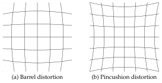{#fig-distortion width=400}

The main challenge is to model the distortion precisely. Mitigating the "fish-eye" effect of a wide-angle lens can be done on the basis of known lens parameters. Correcting for the inherent imprecision of a normal lens, on the other hand, requires more fine-grained parameters measured by a calibration routine. These parameters must then be fed into an equation that is precise enough to undo the distortion, without introducing additional distortion of its own.

When we compare models, we encounter a trade-off between precision and efficiency. If only approximate results are needed, then undistorting an image requires little computing power, and can be modeled in many ways. *Precisely* modeling the distortion is another matter. Not only are the precise models more costly; unfortunately, they are also less mathematically tractable than the simpler models.

3.1 Polar coordinates
---------------------

Barrel distortion is most easily expressed in polar coordinates, with the center of the lens at the center of the coordinate system. OpenGL ES, however, uses Cartesian coordinates. Luckily, it is not necessary to perform coordinate conversion to and from polar coordinates in order to calculate the distortion. In this section, we will derive a *displacement factor* that lets us compute the distortion in Cartesian space (figure [3.2](#fig-displacement)).

{#fig-displacement width=400}

If $[x, y]$ are the Cartesian coordinates of a point, then the polar coordinates $[r, \theta]$ represent the radius $r$ and the angle $\theta$ with the positive $x$ axis. The relationship between Cartesian coordinates and polar coordinates is:

$$\label{eq:cartesiantopolar}
[r, \theta] = \left[\!\sqrt{x^2 + y^2}, \operatorname{atan2}(y, x)\right]$$

where $\operatorname{atan2}$ is the arcus tangent function of *two* arguments $y$ and $x$, which expresses the quadrant of the angle accurately.^[This is provided as the `atan()` function in OpenGL ES.] The inverse relationship is given by:

$$\label{eq:polartocartesian}
[x, y] = [r\cos{\theta}, r\sin{\theta}]$$

A model is a mapping from an untransformed coordinate $[r, \theta]$ to a transformed coordinate $[r', \theta']$. (It may map undistorted coordinates to distorted coordinates or vice versa; for the time being, we ignore the direction of the model and only concern ourselves with the mapping itself.) Since the angle doesn't change (i.e., $\theta' = \theta$), the model can be expressed more compactly as the relationship between the undistorted radius $r$ and the distorted radius $r'$:

$$\label{eq:model}
r' = F(r)$$

We can avoid incurring the cost of the trigonometric functions in equations (\ref{eq:cartesiantopolar}--\ref{eq:polartocartesian}). Let $d$ be the displacement factor, expressed as the ratio of the distorted radius to the undistorted radius:

$$\label{eq:displacement}
d = \frac{r'}{r} = \frac{F(r)}{r} $$

Then the relationship between undistorted polar coordinates and distorted polar coordinates can be expressed in terms of this factor:

$$\label{eq:polardisplacement}
[r', \theta'] = [F(r), \theta] = \left[\frac{F(r)}{r}r, \theta\right] = [dr, \theta]$$

Likewise, the relationship between undistorted Cartesian coordinates and distorted Cartesian coordinates is given by:

$$\label{eq:cartesiandisplacement}
[x', y'] = d[x, d] = [dx, dy]$$

This is easily verified by substituting equation \eqref{eq:polardisplacement} into equation \eqref{eq:polartocartesian}. In the rest of the chapter, we will consider distortion to be a function of the radius.

3.2 Polynomial models
---------------------

The classical distortion model is Brown's model. In addition to radial distortion, it also models tangential distortion, which occurs when the lens is not aligned with the sensor. The model is commonly approximated as a Taylor series:

$$\label{eq:brown}
\begin{split}
  x_u &= x_d + (x_d - x_c)(\kappa_1r^2 + \kappa_2r^4 + \kappa_3r^6 + \dotsb) + {} \\
  &\phantom{{}={}} [(\rho_1(r^2 + 2(x_d - x_c)^2) + 2\rho_2(x_d - x_c)(y_d - y_c))(1 + \rho_3r^2 + \dotsb)]\\
  y_u &= y_d + (y_d - y_c)(\kappa_1r^2 + \kappa_2r^4 + \kappa_3r^6 + \dotsb) + {} \\
  &\phantom{{}={}} [(\rho_1(r^2 + 2(y_d - y_c)^2) + 2\rho_2(y_d - y_c)(y_d - y_c))(1 + \rho_3r^2 + \dotsb)]
\end{split} $$

where $[x_u, y_u]$ is the undistorted image point, $[x_d, y_d]$ is the distorted image point, $[x_c, y_c]$ is the center of distortion (i.e., $[0, 0]$ under our assumptions), $\kappa_n$ is the $n$th radial distortion coefficient and $r$ is the radius as defined in equation \eqref{eq:cartesiantopolar}. The part in brackets expresses tangential distortion, where $\rho_n$ is the $n$th tangential distortion coefficient.

If we substitute $[x_c, x_c] = [0, 0]$ and remove the tangential part, the model simplifies to:

$$\label{eq:brownradial}
\begin{split}
  x_u &= x_d(1 + \kappa_1r^2 + \kappa_2r^4 + \kappa_3r^6 + \dotsb)\\
  y_u &= y_d(\underbrace{1 + \kappa_1r^2 + \kappa_2r^4 + \kappa_3r^6 + \dotsb}_d)
\end{split} $$

where $d$ is the displacement factor we defined in equation \eqref{eq:displacement}. Since the polynomial $d = f(r)$ must be symmetric in $r$, only the coefficients of even powers of $r$ will be nonzero. Higher-order terms contribute very little, so equation \eqref{eq:brownradial} can be approximated by a finite expression where the coefficient $\kappa_1$ controls the general behavior of the distortion:

$$\label{eq:taylorone}
d = f(r) = 1 + \kappa_1r^2$$

The coefficient $\kappa_2$ needs only be added if a first-order approximation is insufficient:

$$\label{eq:taylortwo}
d = f(r) = 1 + \kappa_1r^2 + \kappa_2r^4)$$

However, for larger distortions (i.e., wide-angle lenses), at least three terms are needed:

$$\label{eq:taylorthree}
d = f(r) = 1 + \kappa_1r^2 + \kappa_2r^4 + \kappa_3r^6$$

Brown's model is a mapping from distorted positions to undistorted positions, i.e., a relationship of the form $[x_u, y_u] = F(x_d, y_d)$. This allows us to determine where any point in the distorted image would appear if there was *no* lens distortion. Applied as a forward mapping image transformation, it produces a "pincushion" effect (the opposite of barrel distortion). However, lens undistortion can also be implemented in terms of the reverse relationship, $[x_d, y_d] = F^{-1}(x_u, y_u)$, provided we substitute backward mapping for forward mapping. Table [3.1](#tab-mappings) shows the relationships between interpolation method, model direction, and the produced effect.

> | Interpolation    | Model                           | Effect     |
> | ---------------- | ------------------------------- | ---------- |
> | Forward mapping  | $[x_u, y_u] = F(x_d, y_d)$      | Pincushion |
> | Backward mapping | $[x_u, y_u] = F(x_d, y_d)$      | Barrel     |
> | Forward mapping  | $[x_d, y_d] = F^{-1}(x_u, y_u)$ | Barrel     |
> | Backward mapping | $[x_d, y_d] = F^{-1}(x_u, y_u)$ | Pincushion |
>
> Table 3.1: Forward mapping and backward mapping
{#tab-mappings}

If we want to implement a backward mapping image transformation in terms of the inverse relationship, we encounter the problem that equation \eqref{eq:taylorthree} has no closed-form solution. If precision is less of a concern, we can precompute the mapping and store the values in a table, as outlined in section [2.1.5](#sec-nonlinear). However, methods like supersampling are likely to request a position that is not stored in the table, requiring us to interpolate between table entries.

Another approach is to compute the inverse by an iterative method such as Newton--Raphson approximation:

$$\label{eq:newton}
x_{n+1} = x_n - \frac{f(x_n)}{f'(x_n)} $$

To approximate a value for $r$ corresponding to a displacement $d$, we rewrite equation \eqref{eq:taylorthree} on the form $f(r) = 0$:

$$\label{eq:rewrite}
f(r) = 0 = 1 + \kappa_1r^2 + \kappa_2r^4 + \kappa_3r^6 - d$$

The derivative of this polynomial is:

$$\label{eq:derivative}
f'(r) = 2\kappa_1r + 4\kappa_2r^3 + 6\kappa_3r^5$$

Substituting equations (\ref{eq:rewrite}--\ref{eq:derivative}) into equation \eqref{eq:newton} gives us:

$$\label{eq:approximation}
r_{n+1} = r_n - \frac{1 + \kappa_1r^2 + \kappa_2r^4 + \kappa_3r^6 - d}{2\kappa_1r + 4\kappa_2r^3 + 6\kappa_3r^5} $$

This is an iterative equation for finding better and better estimates of $r$ such that $f(r) = d$. Since the equation is considerably more complicated than the forward relationship, we would like to reduce the number of iterations to a minimum. Note that the approximation converges towards better estimates depending on how good the previous estimate was. Thus, by combining Newton--Raphson approximation with precomputed values in a table, the number of iterations can be reduced. The initial estimate is picked from a precomputed table $T$, and subsequent iterations refine it. Algorithm [1](#alg-newton) illustrates this approach.

> Algorithm 1: Newton--Raphson approximation
>
> ```python
> r <- T(d) # initial estimate from table
> for n = 0 to N do
>   # refine estimate
>   r <- r - (1 + k_1 * r^2 + k_2 * r^4 + \k_3 * r^6 - d)
>          / (2 * k_1 * r + 4 * k_2 * r^3 + 6 * k_3 * r^5)
> end for
> return r # final estimate
> ```
{#alg-newton}

In general, Brown's model is cheap in one direction, but costly in the other direction. That makes it a less than optimal choice for backward mapping implementations with advanced interpolation methods, since in addition to the cost of interpolation, we also get the cost of approximating the model's inverse. If precision is less of a concern, then an alternative is to use a less precise model which is easier to invert. There are several such models to choose from.

3.3 Non-polynomial models
-------------------------

### 3.3.1 Exponential model {#sec-exponential}

[Schwarz (1980)](#schwarz80-comput) showed that the relationship between the distorted radius $r_d$ and the undistorted radius $r_u$ can be approximated by the following exponential equation:

$$\label{eq:exp}
r_u = (\mathrm{e}^{r_d/s} - 1) / \lambda$$

where $s$ is a scaling factor and $\lambda$ is the amount of distortion. The *inverse* relationship is given by a logarithmic equation:

$$\label{eq:logarithm}
r_d = s\ln(1 + \lambda r_u)$$

[Basu and Licardie (1995)](#basu95-alter) compared this model with a polynomial model, and found it to produce good results.

### 3.3.2 Trigonometric model

[Devernay and Faugeras (2001)](#devernay01-straig-lines) proposed an alternate approximation:

$$\begin{aligned}
  \label{eq:devernay}
  r_u &= \tfrac{1}{\omega} \operatorname{atan}(2r_d\tan{\tfrac{\omega}{2}})\\
  r_d &= \frac{\tan(r_u\omega)}{2\tan{\tfrac{\omega}{2}}}
\end{aligned} $$

where $\omega$ is the field-of-view of the corresponding ideal wide-angle lens.

### 3.3.3 Division model

[Fitzgibbon (2001)](#fitzgibbon01-simul) described a fast inverse model called the "division model":

$$\label{eq:division}
r_d = \frac{1}{1 + \kappa r^2}r_u$$

This model is about as good an approximation as the first-order Taylor expansion in equation \eqref{eq:taylorone}, but in the opposite direction.

3.4 Parameter estimation
------------------------

The coefficients of the models can be fitted to a curve using the least squares method. In the case of polynomial models, [Basu and Licardie (1995)](#basu95-alter) showed that the resulting set of linear equations can be solved by an analytical method such as Gauss--Jordan elimination.

In the case of non-polynomial models, there is no simple relationship between the parameters of one model and the parameters of another. Therefore, analytical methods are not applicable. Instead, the parameters can be estimated with successive evaluation techniques such as Newton--Raphson approximation.

Using Matlab's `fitnlm()` function, we obtained the following coefficients for Brown's model:^[The complete Matlab code is given in Appendix [B](#chap-matlab).]

$$\label{eq:taylorparam}
d = f(r) = 1 - 3.5778r^2 + 7.1946r^4 + -3.9842r^6$$

For the exponential model:

$$\begin{aligned}
  \label{eq:expparam}
  r_u &= (\mathrm{e}^{r_d/0.76} - 1) / 3.8342\\
  \label{eq:logparam}
  r_d &= 0.76\ln(1 + 3.8342r_u)
\end{aligned} $$

For the trigonometric model:

$$\begin{aligned}
  \label{eq:devernayparam}
  r_u &= \tfrac{1}{0.95617} \operatorname{atan}(2r_d\tan{\tfrac{0.95617}{2}})\\
  r_d &= \frac{\tan(0.95617r_u)}{2\tan{\tfrac{0.95617}{2}}}
\end{aligned} $$

For the division model:

$$\label{eq:divisionparam}
r_d = \frac{1}{1 - 0.29948r^2}r_u$$

Summary
-------

Fish-eye distortion can be modeled in various ways. Polynomial models offer high precision, and are a good choice for forward mapping implementations. In the case of backward mapping implementations, however, polynomial models are expensive to invert, requiring precomputed tables in combination with interpolation methods or iterative approximation. If loss of precision is acceptable, then non-polynomial models are a better fit for backward mapping implementations.

While there are no straightforward relationships between the parameters of one model and another, the coefficients can be estimated with nonlinear regression.

4 Implementation strategies {#chap-strategies}
===========================

So far, we have considered how image transformation can be expressed mathematically, the challenges it raises with regard to interpolation, and what models we may use to express fish-eye distortion. In this chapter, we will consider various strategies for implementing such distortion using OpenGL ES.

4.1 Implementation considerations
---------------------------------

There are several factors to consider:

1.  **CPU or GPU:** Whether we want to calculate the distortion on the CPU, or accelerate it with the GPU.
2.  **Precomputed or dynamic:** Whether we want to store the transformation in a lookup table, or compute it mathematically.
3.  **Forward mapping or backward mapping:** Whether we compute output coordinates in terms of input coordinates (forward mapping), or input coordinates in terms of output coordinates (backward mapping).
4.  **Built-in or manual interpolation:** Whether we rely on OpenGL ES' built-in interpolation methods, or implement our own.

Let us discuss each of these items in detail.

### 4.1.1 CPU or GPU

An OpenGL ES pipeline uses both the CPU and the GPU to some extent (figure [4.1](#fig-flow)). However, the brunt of the workload can be computed by the CPU, or it can be accelerated by the GPU.

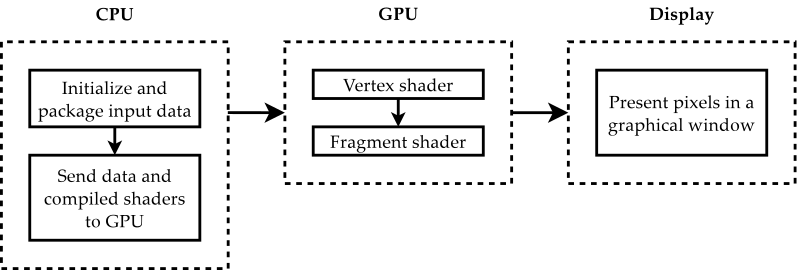{#fig-flow width=600}

The transformation may be programmed in C (or in our case, in C++) and computed entirely by the CPU. If a vertex mesh is used to transform the image, this mesh needs only be computed once, and can be reused many times. The task of OpenGL ES is then to apply a texture to this mesh and interpolate the result.

Alternatively, the transformation may be programmed in shader code and computed by the GPU. Since each coordinate can be transformed without relation to the others, the whole task is "embarrassingly parallel", and easy to code in terms of shaders. Furthermore, this approach is more flexible in that it can be combined with a custom interpolation technique.

### 4.1.2 Precomputed or dynamic

There are several ways of caching the computations for later use. Transforming a vertex mesh entirely on the CPU is one strategy. Hybrid approaches are also possible: the CPU may compute a lookup table which is used by the shader. To obtain continuous values, the shader may interpolate between table entries, or use the closest table entry to seed an estimation method such as Newton--Raphson approximation.

### 4.1.3 Forward mapping or backward mapping

If the image is transformed by applying a texture to a grid mesh, there is a mapping between vertex positions and texture coordinates. A forward mapping implementation transforms the vertex positions; a backward mapping implementation transforms the texture coordinates. This transformation can be computed by the CPU or in the vertex shader.

Alternatively, a backward mapping implementation may be implemented in the fragment shader. In such an implementation, each pixel in the output image is computed by determining the corresponding position in the input image and sampling it.

### 4.1.4 Built-in or manual interpolation

OpenGL ES provides built-in bilinear interpolation. This option is very fast and yields reasonable results. It also simplifies the implementation; all that needs to be coded is the mathematical relationship of the image transformation.

Alternatively, more sophisticated means of interpolation can be implemented manually, at the cost of more code and more computations. We will explore how interpolation can be performed in the fragment shader.

4.2 Implementation strategies {#implementation-strategies}
-----------------------------

As we can see, we have several options when implementing image transformation. Table [4.1](#tab-strategies) lists some possible *interpolation strategies* -- that is, ways of combining these options. Some options tend to go together with other options, but the table is not exhaustive; many other combinations are possible. In this section, we will focus on a selection of implementation strategies to illustrate the possibilities.

> |   | Acceleration:<br>CPU/GPU | Computation:<br>Precomputed/Dynamic | Mapping:<br>Forward/Backward | Interpolation:<br>Built-in/Manual |
> | - | ------------------------ | ----------------------------------- | ---------------------------- | --------------------------------- |
> | 1 | C                        | P                                   | F                            | B                                 |
> | 2 | C                        | P                                   | B                            | B                                 |
> | 3 | G                        | D                                   | F                            | B                                 |
> | 4 | G                        | D                                   | B                            | B                                 |
> | 5 | G                        | D                                   | B                            | M                                 |
>
> Table 4.1: Implementation strategies
{#tab-strategies}

### 4.2.1 Strategy 1: CPFB

The first strategy computes the transformation on the CPU (C), precomputes the transformation before use (P), employs forward mapping (F), and uses OpenGL ES' built-in interpolation (B). This is done by loading the image as a texture which is projected onto a transformed grid mesh. The crucial insight is that the mesh needs only be transformed once, and can be reused many times (e.g., when transforming a video sequence). If the image size is known in advance, the mesh need not even be computed when running the program; it can be stored as precomputed data.

The strategy uses forward mapping, since the shape of the mesh is transformed directly. We can think of it like this: we create a grid mesh of, say, $10 \times 10$ vertices. Each vertex is mapped to a corresponding coordinate in texture space: the bottom-left vertex is mapped to the bottom-left corner of the texture, the upper-right vertex is mapped to the upper-right corner, and so on. Then the positions of the vertices are transformed by means of the chosen model. In consequence, the texture is warped.

As illustrated in figure [4.2](#fig-gridmapping), the transformation is a mapping from regular rectangles (the undistorted grid) to quadrilaterals (the distorted grid). Although the vertex positions have changed, the texture coordinates still map to the undistorted grid.

{#fig-gridmapping width=400}

The strategy leaves interpolation to OpenGL ES. The smoothest results are achieved by OpenGL ES' `GL_LINEAR` option. Some versions also supports multisampled anti-aliasing, although this is considerably more expensive. However, since the strategy is very efficient in the first place, the impact may be negligible.

### 4.2.2 Strategy 2: CPBB

The second strategy is like the first, but employs backward mapping instead (B). This is done by transforming the other end of the mapping between vertex positions and texture coordinates. That is, while the forward mapping strategy transformed the vertex positions and held the texture coordinates constant, the backward mapping strategy transforms the texture coordinates and holds the vertex positions constant ([McReynolds and Blythe 2005](#mcreynolds05-advanced)).

To explain this transformation in detail, we need to give an overview of OpenGL ES' coordinate spaces. By itself, OpenGL ES contains a mapping between *two* coordinate spaces: vertex positions $[x, y]$ in the range $[-1, 1]$ and texture coordinates $[s, t]$ in the range $[0, 1]$. The default mapping is given by the equation:

$$\label{eq:mapping}
\left[\begin{matrix}
  s\\
  t
\end{matrix}\right] = \left[\begin{matrix}
  x/2 + 1/2\\
  y/2 + 1/2
\end{matrix}\right]$$

This is an affine transformation, where vertex space is centered around $[0, 0]$. It is translated and scaled to texture space, which is centered around $[1/2, 1/2]$. Using the conventions established in chapter [2](#chap-trans), we can express the translation in matrix form:

$$\label{eq:affinemapping}
\left[\begin{matrix}
  s\\
  t\\
  1
\end{matrix}\right] =
\left[\begin{matrix}
  x\\
  y\\
  1
\end{matrix}\right]
\left[\begin{matrix}
  1/2 & 0 & 1/2\\
  0 & 1/2 & 1/2\\
  0 & 0 & 1
\end{matrix}\right]$$

Or in tableaux form:

$$\label{eq:table}
\left[\begin{matrix}
  s\\
  t
\end{matrix}\right] = \begin{cases}
  [0, 0] & \text{if $[x, y] = [-1, -1]$}\\
  [0, 1] & \text{if $[x, y] = [-1, 1]$}\\
  [1, 0] & \text{if $[x, y] = [1, -1]$}\\
  [1, 1] & \text{if $[x, y] = [1, 1]$}\\
  [1/2, 1/2] & \text{if $[x, y] = [0, 0]$}\\
  \dots & \\
  [x/2 + 1/2, y/2 + 1/2] &
\end{cases} $$

The inverse relationship is of course given by:

$$\label{eq:inversemapping}
\left[\begin{matrix}
  x\\
  y
\end{matrix}\right] = \left[\begin{matrix}
  2(s - 1/2)\\
  2(t - 1/2)
\end{matrix}\right]$$

The utility of equations (\ref{eq:mapping}--\ref{eq:inversemapping}) is evident when we want to transform texture space. The transformation equations assume that the coordinate space is centered around $[0, 0]$, *not* $[1/2, 1/2]$. Therefore we must translate the coordinates before and after conversion, as shown in algorithm [2](#alg-coord).

> Algorithm 2: Coordinate conversion
>
> ```python
> [x, y] <- [2(s - 1/2), 2(t - 1/2)] # convert to vertex space
> [x', y'] <- F([x, y]) # transform coordinate
> [s', t'] <- [x'/2 + 1/2, y'/2 + 1/2] # convert to texture space
> ```
{#alg-coord}

Aside from these caveats, the implementation is straightforward and yields comparable results to the first strategy. The additional computations introduced by the coordinate conversion in algorithm [2](#alg-coord) are negligible and do not contribute much to the overall cost. Which is the better choice? It depends. If all necessary parameters are known beforehand so that the whole mesh can be stored as precomputed data, it doesn't really matter whether we choose one or the other. However, if the image size is not known and the mesh needs to be computed as least once when the program is initialized, then backward mapping may be preferable over forward mapping *if the chosen model is faster in that direction*. As we saw in chapter [3](#chap-models), models differ in this regard: a model well-suited for a forward mapping strategy may be a poor choice for a backward mapping strategy, or vice versa. If there is an "impedance mismatch" between model and strategy, we should change one or the other.

### 4.2.3 Strategy 3: GDFB

The previous strategies have left little work to be performed by the GPU. For anything to be rendered, OpenGL ES requires us to at least write a simple vertex shader that passes the vertex data through unchanged (assuming that the input coordinates matches the screen coordinates), and a fragment shader that samples the color of the texture at the given coordinate.

We can move the transformation into these very shaders. As before, we first create a regular grid mesh of, say, $10 \times 10$ vertices. Then we pass each vertex to the vertex shader, letting the vertex shader compute the transformed position. The end result is the same as when performing forward mapping on the CPU, but the transformation is expressed in shader code instead.

If this approach is applied to a video sequence, the consequence is that the transformation is re-computed for each frame. To avoid this, the grid may be transformed by a separate vertex shader that is run only once and whose results are saved for later use. OpenGL ES 3.0 allows the output of a shader to be captured in a buffer object. The rendering itself is performed by a simple pass-through shader, as in the CPU case.

### 4.2.4 Strategy 4: GDBB {#sec-implementationgdbb}

Backward mapping can also be done on the GPU. Whereas forward mapping was performed by the vertex shader, backward mapping is more appropriately performed by the fragment shader. The reason is that in this case, we don't need a $10 \times 10$ grid mesh -- a simple quadrilateral of four vertices will suffice. The task of the fragment shader, which is run once per output pixel in this case, is to transform the corresponding texture coordinate before sampling the texture at that coordinate.

As in the CPU case, we must perform coordinate conversion before and after the transformation. We must also check if the transformation returns a position that is out of range: if so, we return a blank color (e.g., white). Section [4.2.4](#sec-implementationgdbb) describes the implementation of such a coordinate check.

### 4.2.5 Strategy 5: GDBM {#sec-gdbm}

All the previous strategies have relied on built-in interpolation. However, the last strategy, which performs backward mapping on the GPU, can be combined with supersampling as a custom interpolation step. Instead of sampling a *single* color value, which will have been interpolated for us by OpenGL ES' `GL_LINEAR` option, we can sample multiple values and blend them together ourselves. If we know that the length and height of an output pixel is $l$, then the positions of the corners are given as follows:

$$\begin{aligned}
  \label{eq:ul}
  [x, y]_{ul} &= [x - \tfrac{1}{2}l, y + \tfrac{1}{2}l] \\
  [x, y]_{ur} &= [x + \tfrac{1}{2}l, y + \tfrac{1}{2}l] \\
  [x, y]_{ll} &= [x - \tfrac{1}{2}l, y - \tfrac{1}{2}l] \\
  [x, y]_{lr} &= [x + \tfrac{1}{2}l, y - \tfrac{1}{2}l]
\end{aligned} $$

These four coordinates plus the original coordinate can then be transformed to input coordinates that are sampled to compute an average of five values. Alternatively, we can overlay a grid of $3 \times 3$ positions over the pixel and sample the input at nine different positions. This gives us four more positions to compute:

$$\begin{aligned}
  [x, y]_{um} &= [x, y + \tfrac{1}{2}l] \\
  [x, y]_{ml} &= [x - \tfrac{1}{2}l, y] \\
  [x, y]_{mr} &= [x + \tfrac{1}{2}l, y] \\
  \label{eq:lm}
  [x, y]_{lm} &= [x, y - \tfrac{1}{2}l]
\end{aligned} $$

An unweighed average produces a smooth, if somewhat fuzzy result. We can achieve a different filtering effect by adjusting the coefficients -- that is, by computing a weighed average. A weighed average can be expressed a two-dimensional dot product with a weight matrix (or "kernel") divided by a normalization value ([Bjorke 2004](#bjorke04-filter)):

$$\label{eq:kernel}
\frac{1}{d}
\left[\begin{matrix}
  w_{ul} & w_{um} & w_{ur}\\
  w_{ml} & w_{mm} & w_{mr}\\
  w_{lr} & w_{lm} & w_{lr}
\end{matrix}\right]
\cdot
\left[\begin{matrix}
  c_{ul} & c_{um} & c_{ur}\\
  c_{ml} & c_{mm} & c_{mr}\\
  c_{lr} & c_{lm} & c_{lr}
\end{matrix}\right] =
\tfrac{1}{d}(w_{ul}c_{ul} + w_{um}c_{um} + \dotsb + w_{lr}c_{lr})$$

A brief discussion of a few very simple filters follows. For example, the previously mentioned average of nine samples can be expressed as a matrix of $1$'s divided by $9$ (figure [4.4b](#fig-kernels)). This is also known as a box filter, since it weighs the neighboring samples equally (figure [4.3a](#fig-boxfilterandgaussianfilter)). Such a filter removes much of the noise in the original image by averaging samples together; but it also removes a significant amount of detail that isn't noise.

{#fig-boxfilterandgaussianfilter width=400}

In this regard, better results are typically achieved by a Gaussian filter (figure [4.3b](#fig-boxfilterandgaussianfilter)). Filtering with such a filter produces a blurring effect similar to that of the box filter, but the priority is on the central sample and the samples adjacent to it. The Gaussian kernel (figure [4.4c](#fig-kernels)) gives most weight to the center position, less weight to the closest neighbors, and least weight to the corners. Thus, the filter keeps more of the differences between one sample and the next. As such, the Gaussian filter is a compromise between the unfiltered image and the deep blurring effect produced by the box filter.

Instead of reducing the difference between samples, we can also accentuate it. A sharpening filter works in the opposite way to the previous filters: instead of adding the values of the neighboring samples, the sharpening filter subtracts them from the central sample (figure [4.3c](#fig-boxfilterandgaussianfilter)). If the central sample has the same value as the surrounding samples, then the filtered value is equal to the original (figure [4.4d](#fig-kernels)). But if the central sample has a greater value than the surrounding samples, then the filtered value is magnified significantly. Note that as a sharpening filter magnifies noise along with other details in the image, it can be a good idea to apply a blurring filter, such as the Gaussian filter, prior to sharpening.

{#fig-kernels width=300}

These are only some of the image effects that can be expressed in terms of $3 \times 3$ filter kernels. As we will see in section [5.8](#sec-implementationgdbm), one benefit of such filters is that they are easy to represent with OpenGL ES data structures. Since their dimensionality is the same, it is easy to swap out one filter in preference of another under an adaptive strategy. More sophisticated filters can be implemented, but fall outside the scope of this thesis. An examination of current film renderers performed by [Wexler and Enderton (2005)](#wexler05-rasterization) showed a wide variety of supported filters (sinc, Gaussian, Carmull-Rom, Lanczos, Mitchell and more) and default filter radii of 2 to 5 samples.

If the supersampling approach is *combined* with OpenGL ES' `GL_LINEAR` option, the result is a "two-step" interpolation method. Each color value is interpolated by OpenGL ES when it is sampled, and then it is blended together with neighbor samples by the fragment shader. Adaptive supersampling is also possible: for example, we could compute the final value on the basis of one, four, five or nine samples depending on the distance to the center and the resulting sampling density. In this way, we could improve the efficiency of the shader.

More interestingly, the kernels listed in figure [4.4](#fig-kernels) can be interchanged adaptively in order to improve interpolation quality. Recall from chapter [3](#chap-models) that as barrel undistortion produces a "pincushion" effect, the center of the image has the highest frequency, while the outer areas are often blurry because the samples are spread apart. This suggests that while a blurring kernel should be employed in the center to mitigate aliasing effects, it may be swapped out in preference of a sharpening kernel when the outer parts of the image are dealt with.

Summary
-------

We have outlined five different implementation strategies for accelerating image transformation with OpenGL ES. Two of the strategies perform the transformation on the CPU, the others perform in on the CPU. Two strategies cache the computations, while the others compute it dynamically. Two strategies use forward mapping and three strategies use backward mapping. Finally, four strategies uses OpenGL ES' built-in bilinear interpolation, while one strategy performs manual interpolation in the shader.

The strategies vary by complexity. For the CPU strategies, the transformation is done prior to any rendering, and the OpenGL ES pipeline is very simple. For the GPU strategies, transformation is either done by means of a forward mapping vertex shader, or a backward mapping fragment shader. The latter can be augmented by increasingly complex and sophisticated methods for custom interpolation, such as supersampling.

Our supersampling strategy makes use of $3 \times 3$ interpolation kernels, which, although simple, offer a variety of effects and are easy to implement in OpenGL ES. They can be replaced with more sophisticated filters, but that falls outside of the scope of this thesis.

In the next chapter, we will take a detailed look at the implementation of these strategies.

5 Implementation with OpenGL ES {#chap-opengl}
===============================

In this chapter, we describe our implementation of the strategies outlined in chapter [4](#chap-strategies). We have written a test program that runs each strategy multiple times and measures the execution time. We describe the general structure of this program, the data flow of the shaders, and our implementation of the grid mesh and the interface for transforming it. Then we turn to transformation on the GPU, illustrated by snippets of shader code.

For instructions on how to obtain and compile the code, refer to appendix [A](#chap-code).

5.1 Qt
------

The OpenGL ES API does not specify how a rendering context is created or attached to the native windowing system. There are various frameworks for creating an OpenGL ES application -- e.g., EGL, GLUT, and Qt (which builds upon EGL). For our implementation, we have chosen Qt, which is written in C++. This affords us the opportunity to structure the code in an object-oriented way.

Qt is a cross-platform application framework maintained by Qt Company. Applications written in Qt can be compiled and run on Windows, Linux and OS X, as well as mobile platforms. Qt provides the `QGLWidget` class as an abstraction layer for OpenGL ES ([Qt 2015](#qt15-qglwidget)). By subclassing this class, we can draw onto the current rendering context by invoking standard OpenGL ES functions.

OpenGL ES is for the most part a subset of desktop OpenGL, with the exception of a few precision qualifiers (`highp`, `mediump` and `lowp`). In fact, most OpenGL ES code can easily be run on desktop OpenGL by prefixing the shaders with definitions of these qualifiers, and avoiding variable names with special meanings. Qt encourages the writing of such "portable shaders", and so do we: all the code is backward compatible with desktop OpenGL.

{#fig-uml width=600}

The basic structure of the application is shown in figure [5.1](#fig-uml). A `QApplication` is instantiated with a `Window` (`main.cpp`). `Window` instantiates a `GLWidget` (`window.cpp`). `GLWidget` is a subclass of `QGLWidget`, and it sets up and runs OpenGL ES code in its `initializeGL()` and `paintGL()` functions (`glwidget.cpp`). The OpenGL ES code is structured in a number of "strategies" inheriting from a base class (`strategy.cpp`), using the Template Method pattern ([Gamma et al. 1995](#erich95-patterns)).

5.2 Shaders
-----------

Each strategy invokes a vertex shader and a fragment shader. Since OpenGL ES lacks a fixed-function pipeline, we must at the very least specify a pass-through vertex shader and a texture sampling fragment shader in order to render anything at all.

Both shaders take a number of data entries as input and return a number of data entries as output. The vertex shader (figure [5.2a](#fig-shaders)) takes a number of *input attributes* and outputs a number of *varyings*. The fragment shader (figure [5.2b](#fig-shaders)) takes the varyings as input and outputs a *color*.

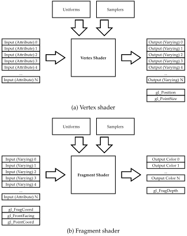{#fig-shaders width=500}

Constant data used by shaders are globally available as *uniforms*. A special type of uniform is the *sampler*, which represents a texture. It is used by the fragment shader for looking up the color of a texture coordinate. As of OpenGL ES 3.0, texture lookup operations are also possible in the vertex shader ([Munshi et al. 2014](#aaftab14-opengl-es)).

In the CPU-computed strategies, a pass-through vertex shader takes the texture coordinate and position of each vertex and outputs them unchanged as a varying and the OpenGL ES attribute `gl_Position`. A texture sampling fragment shader takes the texture coordinate as input and outputs the color of the texture at that position.

In the GPU-accelerated strategies, transformation is performed in the shaders. In the case of the vertex shader, the vertex position is transformed before it is output to `gl_Position`. In the case of the fragment shader, the texture coordinate is transformed before sampling the texture.

5.3 Compilation
---------------

When the implementation is initialized, the shaders are read from a file on disk, parsed and compiled into a *shader object* in memory. The shader objects are then attached to and linked into a *program object* that performs the rendering (figure [5.3](#fig-compilation)). At this stage, vertex positions, texture coordinates and textures can be allocated and bound to the program object.

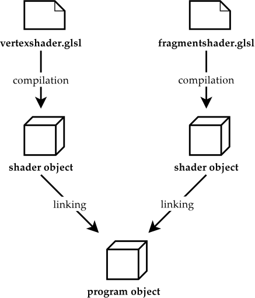{#fig-compilation width=300}

OpenGL ES does not specify a binary format for program objects. This is left to the vendor, which means that the format may change from one driver version to another. If the `glGetProgramBinary()` and `glProgramBinary()` functions are available, then a binary representation can be saved to the file system to be reused later. In this way, the cost of online compilation is avoided.

Our implementation does not cache the compilation step. Instead, time measurements are postponed until *after* OpenGL ES has been successfully initialized.

5.4 Strategy 1: CPFB
--------------------

When computing the transformation on the CPU, we need to create a grid mesh of $M \times N$ vertices -- a higher number means a more precise transformation. This task is handled by the `Grid` class (`grid.cpp`). The class encapsulates three arrays: an array of vertex positions, an array of associated texture coordinates, and an array of indices for drawing the triangles of the mesh. For example, a grid of ten rows and ten columns is instantiated with `Grid(10, 10)`, while a simple square of four corners is created with `Grid(2, 2)`.

The mesh is constructed as a `GL_TRIANGLE_STRIP`, with alternating orientations of the inner triangles so that the whole strip can be drawn in one pass (figure [5.4a](#fig-grid)). Observe that each point has a *pair* of coordinates associated with it: a vertex position in the range $[-1, 1]$ and a texture coordinate in the range $[0, 1]$. The grid may be transformed by transforming the vertex positions and holding the texture coordinates constant, or by transforming the texture coordinates and holding the vertex positions constant.

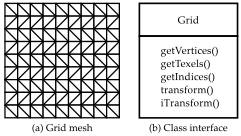{#fig-grid width=300}

To perform a forward mapping transformation, we iterate through each vertex position in the grid, transform it, and update the position. To this end, the `Grid` class provides an abstract interface (figure [5.4b](#fig-grid)). The `transform()` method takes a *functor class* as input. A functor class, in this context, is merely a wrapper class for a function on vertex positions.^[Our functor classes are implemented as *function objects*, that is, they overload the `operator()` operator. C++11 also provides support for anonymous functions in the form of lambda expressions ([Stroustrup 2013](#stroustrup13-cpp-lang)), but these are difficult to compose in the way outlined in section [5.5](#sec-implementationcpbb).] By implementing the transformation as such a class, we can pass it to the `Grid` class to perform transformation. (The vertex positions themselves are represented by a `Point` class with an `x` attribute and a `y` attribute.)

After the grid has been transformed, it is ready for use and can be textured by the input image. Its vertex positions and texture coordinates are loaded as vertex attribute arrays, and become available as input attributes for the vertex shader. Since we are not using the GPU to accelerate the transformation, a simple a pass-through vertex shader (listing [5.1](#lst-vertexshader)) and a texture sampling fragment shader (listing [5.2](#lst-fragmentshader)) suffice.

In OpenGL ES, if no default precision is specified, then the default precision is `highp` (the highest precision). It is possible that the shaders may run faster or with a better power efficiency at a lower precision. However, OpenGL ES does not require the vendor to support multiple precisions, so it is perfectly valid for an implementation to ignore all qualifiers and perform the calculations at the highest precision level.

> Listing 5.1: Pass-through vertex shader
>
> ```c
> attribute vec2 a_texcoord;
> attribute vec4 a_position;
> varying vec2 v_texcoord;
>
> void main() {
>     gl_Position = a_position;
>     v_texcoord = a_texcoord;
> }
> ```
{#lst-vertexshader}

> Listing 5.2: Texture sampling fragment shader
>
> ```c
> varying vec2 v_texcoord;
> uniform sampler2D s_texture;
>
> void main() {
>     gl_FragColor = texture2D(s_texture, v_texcoord);
> }
> ```
{#lst-fragmentshader}

5.5 Strategy 2: CPBB {#sec-implementationcpbb}
--------------------

In the second CPU-computed strategy, we perform backward mapping instead of forward mapping. That is, we hold the vertex positions constant, and transform the texture coordinates instead.

To this end, the `Grid` class provides the `iTransform()` method, which iterates through the grid's texture coordinates. Recall that texture space's range of $[0, 1]$ differs from vertex space's range of $[-1, 1]$, so the method implements algorithm [2](#alg-coord) and converts between coordinate spaces before and after transformation.

In this regard, our `Functor` interface comes in handy. Coordinate conversion, after all, is just another transformation, and can be encapsulated in a functor class of its own. By defining a `chain()` method for composing functor classes, we can build more complex transformations out of simpler transformations. Transformation in texture space, for example, can be defined as the composition of coordinate conversion and vertex transformation, composed with reverse coordinate conversion (figure [5.5](#fig-chain)). Likewise, when we initialize the grid, we employ functor classes to normalize vertex positions within the $[-1, 1]$ range and texture coordinates within the $[0, 1]$ range.

{#fig-chain width=500}

As before, once the grid has been transformed, it stays transformed. The shaders are the same as for the previous strategy (listings [5.1](#lst-vertexshader)--[5.2](#lst-fragmentshader)).

5.6 Strategy 3: GDFB
--------------------

The third strategy is a modification of the first strategy, but the transformation is performed on the GPU instead. As before, we instantiate an object of the `Grid` class, but we *don't* invoke the `transform()` method. Instead, we leave it to the vertex shader to map each vertex to the transformed position.

Listing [5.3](#lst-vertexshadertransform) outlines the structure of the vertex shader. The `transform()` function implements our choice of distortion model. Note that texture coordinates are passed through unchanged.

> Listing 5.3: Transformation in the vertex shader
>
> ```c
> attribute vec2 a_texcoord;
> attribute vec4 a_position;
> varying vec2 v_texcoord;
>
> // fish-eye transformation
> vec4 transform(vec4 pos) {
>     ...
> }
>
> void main() {
>     gl_Position = transform(a_position);
>     v_texcoord = a_texcoord;
> }
> ```
{#lst-vertexshadertransform}

5.7 Strategy 4: GDBB {#strategy-4-gdbb}
--------------------

In the backward mapping case, we transform the texture coordinates instead. This step can be performed in the fragment shader prior to sampling the texture. Since the fragment shader's texture coordinate is the interpolated value between the vertices surrounding the fragment's position, we don't need to create a detailed mesh beforehand -- a "grid" consisting of four corners suffices. Listing [5.4](#lst-fragmentshadertransform) shows how the texture coordinate is passed to `transform()` before `texture2D()`.

> Listing 5.4: Transformation in the fragment shader
>
> ```c
> varying vec2 v_texcoord;
> uniform sampler2D s_texture;
>
> // texture coordinates to vertex positions
> vec2 texcoordtopos(vec2 tex) {
>     ...
> }
>
> // vertex positions to texture coordinates
> vec2 postotexcoord(vec2 pos) {
>     ...
> }
>
> // fish-eye transformation
> vec2 fisheye(vec2 pos) {
>     ...
> }
>
> // transformation function
> vec2 transform(vec2 tex) {
>     return postotexcoord(fisheye(texcoordtopos(tex)));
> }
>
> void main() {
>     gl_FragColor = texture2D(s_texture, transform(v_texcoord));
> }
> ```
{#lst-fragmentshadertransform}

As in the CPU case, we must perform coordinate conversion before and after transformation. This is done by the functions `texcoordtopos()` and `postotexcoord()`. The `transform()` function encapsulates the invocation of these functions and the `fisheye()` function, which performs the actual transformation.

Depending on the model parameters, it may be wise to check if the transformed coordinate is within the $[0, 1]$ range, and return a blank color if it isn't. This can done by substituting a custom `color()` function for the direct invocation of `texture2D()` (listing [5.5](#lst-color)).

> Listing 5.5: Texture sampling function
>
> ```c
> vec4 color(sampler2D texture, vec2 pos) {
>     if(pos.x < 0.0 || pos.y < 0.0 ||
>        pos.x > 1.0 || pos.y > 1.0) {
>         return vec4(1.0, 1.0, 1.0, 1.0); // white
>     } else {
>         return texture2D(texture, pos);
>     }
> }
>
> void main() {
>     gl_FragColor = color(s_texture, transform(v_texcoord));
> }
> ```
{#lst-color}

5.8 Strategy 5: GDBM {#sec-implementationgdbm}
--------------------

The final strategy builds upon the previous to include custom interpolation in the form of supersampling. This is done by sampling the texture not once, but multiple times, and blending the values together. The first task of the `main()` method is to compute the neighbor coordinates according to equations (\ref{eq:ul}--\ref{eq:lm}):

> Listing 5.6: Neighbor coordinates
>
> ```c
> vec2 v0 = vec2(v_texcoord.x - px/2.0,
>                v_texcoord.y + px/2.0);
> vec2 v1 = vec2(v_texcoord.x,
>                v_texcoord.y + px/2.0);
> ...
> vec2 v8 = vec2(v_texcoord.x + px/2.0,
>                v_texcoord.y - px/2.0);
> ```
{lst-neighbor}

Here, `px` is the normalized size of a fragment (i.e., $1$ divided by the number of fragment rows or columns). The next step is to transform these coordinates:

> Listing 5.7: Transformed coordinates
>
> ```c
> v0 = transform(v0);
> v1 = transform(v1);
> ...
> v8 = transform(v8);
> ```
{#lst-transformed}

We sample the texture at the transformed positions:

> Listing 5.8: Transformed coordinates
>
> ```c
> vec4 c0 = color(s_texture, v0);
> vec4 c1 = color(s_texture, v1);
> ...
> vec4 c8 = color(s_texture, v4);
> ```
{#lst-sample}

Then we can compute our interpolate value by blending these colors together. For example, if `blend9()` is a custom function computing an unweighed average, then we can call `blend9(c0, c1, ..., c8)`.

We can also calculate a *weighed* average, expressed in terms of the kind of $3 \times 3$ kernel described in section [4.2.5](#sec-gdbm). The `mat3` data type is well suited to representing such a kernel. First we write a general `filter9()` function which takes a set of colors, a kernel, a divisor, and returns a weighed average:

> Listing 5.9: Filtering function
>
> ```c
> vec4 filter9(vec4 c1, vec4 c2, ..., vec4 c9,
>              mat3 kernel, float div) {
>     return (c1 * kernel[0][0] +
>             c2 * kernel[0][1] +
>             ...
>             c9 * kernel[2][2]) / div;
> }
> ```
{#lst-filtering}

To this function we can for example pass a Gaussian kernel (figure [4.4c](#fig-kernels)):

> Listing 5.10: Filtering function
>
> ```c
> vec4 gaussian9(vec4 c1, vec4 c2, ..., vec4 c9) {
>     mat3 kernel = mat3(1.0, 2.0, 1.0,
>                        2.0, 4.0, 2.0,
>                        1.0, 2.0, 1.0);
>     return filter9(c1, c2, ..., c9, kernel, 16.0);
> }
> ```
{#lst-gaussian}

This will typically produce a crisper result than the unweighed average.

The choice of kernel can be determined adaptively by specifying a way to classify the image into concentric regions. For example, classifying on the radius describes a circular area, while classifying on the maximum transformed width or height describes a "pincushion"-shaped area (illustrated in figure [6.8](#fig-distance)):

> Listing 5.11: Distance measure
>
> ```c
> // radius
> float distance() {
>     return length(texcoordtopos(v_texcoord));
> }
>
> // maximum transformed width/height
> float distance2() {
>     vec2 vx = abs(fisheye(texcoordtopos(v_texcoord)));
>     return max(vx.x, vx.y);
> }
> ```
{#lst-distance}

The appropriate kernel can be selected according to a given threshold:

> Listing 5.12: Adaptive interpolation
>
> ```c
> float r = distance();
> if(r > 0.8) {
>     gl_FragColor = sharpen9(c0, c1, ..., c8);
> } else {
>     gl_FragColor = gaussian9(c0, c1, ..., c8);
> }
> ```
{#lst-adaptive}

See section [6.6](#sec-adaptive) for the visual results of adaptive interpolation.

Summary
-------

Our implementation uses Qt for its surrounding framework, and is a mixture of C++ and shader code. The CPU strategies leverages the object orientation of C++ in order to structure the code. Both the grid mesh and the transformation code are encapsulated in composable classes.

The GPU strategies rely on shader code, which is not as structured. Forward mapping is done in the vertex shader and backward mapping is done in the fragment shader. In the latter case, no vertex grid is necessary and a simple rectangle of four corner suffices.

When performing manual supersampling in the fragment shader, OpenGL ES' matrix data types can be used to represent filtering kernels. By measuring the distance from the center, the image can be divided into regions which are interpolated differently.

In the next chapter, we will measure the efficiency of these strategies and compare their visual output.

6 Results {#chap-results}
=========

In this chapter, we compare the efficiency of the implementations. We also compare built-in interpolation against manual interpolation.

6.1 Setup
---------

The code was executed on a MacBook Air 13" 2011 model with a 1,7 GHz Intel Core i5 processor, 4 GB 1333 MHz DDR3 RAM, and a Intel HD Graphics 3000 graphics card with 384 MB memory, running OS X Yosemite 10.10.4.

Our test image is a photograph of $700 \times 700$ pixels (figure [6.1](#fig-testimage)).^[Figure [6.1](#fig-testimage) is an excerpt from the picture "Many Lovers" by Thomas Hawk, which is released under Creative Commons at <http://www.flickr.com/photos/thomashawk/102065939/>.] It has a grid-like structure, which makes it easy to gauge the effects of the transformation. It is also rich in detail, which makes it possible to spot aliasing effects.

{#fig-testimage width=400}

Our model of choice is the exponential model with $s = 0.76$ and $\lambda = 3.8342$ (section [3.3.1](#sec-exponential)). We will use equation \eqref{eq:expparam} for forward mapping and equation \eqref{eq:logparam} for backward mapping, which produces a strong pincushion effect when applied to a regular image (figure [6.2](#fig-transformedimage)). In other words, our setup would *undistort* a photograph exhibiting a large degree of barrel distortion.

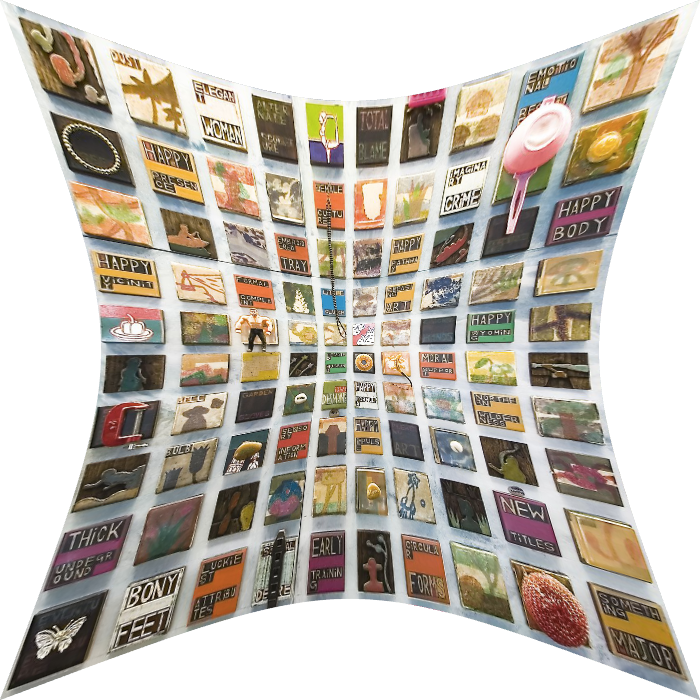{#fig-transformedimage width=400}

6.2 Measuring
-------------

Execution time was measured with the Qt class `QElapsedTimer`, which attempts to use monotonic clocks if possible. Its `nsecsElapsed()` method returns the elapsed time in nanosecond resolution if available. Although this precision is available on the MacBook Air, our measurements are all in the millisecond range. We execute each strategy $1000$ times. Then we compute the average and the standard deviation of the measurements, which are stored in a designated class `Measurements` (`measurements.cpp`). For each execution, we reload the test image into memory, forcing recomputation (listing [6.1](#lst-reload)). The image is loaded in `GL_RGBA` format; some GPUs may prefer a different format (e.g., `GL_BGRA`), which forces the driver to perform an automatic conversion.

> Listing 6.1: Reloading the image
>
> ```c
> GLuint id = 0;
> glDeleteTextures(1, &id);
> glTexImage2D(GL_TEXTURE_2D, 0, GL_RGBA,
>              img.height(), img.width(),
>              0, GL_RGBA, GL_UNSIGNED_BYTE,
>              img.constBits());
> ```
{#lst-reload}

We measure the CPU strategies somewhat differently from the GPU strategies. For the CPU strategies, the main work is done prior to the rendering, when initializing the grid; the rendering itself is cheap. For the GPU strategies, the opposite is the case: grid initialization is negligible, and all the work is done during rendering. For the former, we time grid transformation and rendering; for the latter, we time first-pass rendering and subsequent rendering.

To achieve parity between the CPU strategies and the GPU strategies, the grid is $700 \times 700$ vertices and the rendering surface is $700 \times 700$ pixels. These dimensions make the number of vertices equivalent to the number of fragments. Of course, since the GPU strategies are processed in parallel, we should expect them to outperform the linear CPU strategies. However, a less fine-grained grid suffices in order to get good results, and we will experiment with lowering the vertex count in section [6.4](#sec-vertexcount). For the backward mapping strategies on the GPU, a simple rectangle of four points is substituted for the grid.

6.3 Results {#results}
-----------

The results are listed in table [6.1](#tab-measurements). For the CPU strategies, initializing and transforming the grid is considerably more costly than rendering, but this operation needs only be done once. Initialization is more costly for the backward mapping strategy than for the forward mapping strategy. This goes to show that the exponential equation \eqref{eq:logparam} is more costly to compute than the logarithmic equation \eqref{eq:expparam}. Thus, in this context, the exponential model is *not* a good choice for backward mapping.

For the GPU strategies, forward mapping on the GPU is considerably faster than on the CPU, as we expected. This suggests that the optimal design for a forward mapping implementation would be to transform the grid with a special "initialization shader" that is run only once and whose results are saved for later use. The rendering time is the same as for the CPU strategies.

For the backward mapping strategies on the GPU, an interesting pattern emerges: the first rendering pass takes a long time, but subsequent passes are very efficient. This pattern is illustrated in figure [6.3](#fig-timeseries), which shows the five first measurements from a test run of the strategies. For strategies 1--3, the measurements are in the same range, but for strategies 4--5, there is a sharp drop-off after the first pass. In other words, the computations are cached, even when the texture is reloaded.

The first pass of strategy 5 (GDBM) is about an order of magnitude more costly than the first pass of strategy 4 (GDBB). This is what we would expect, since supersampling multiplies the workload with a factor of nine. However, subsequent passes are an order of magnitude cheaper for strategy 4, and *two* orders of magnitude cheaper for strategy 5. In other words, strategy 4 and strategy 5 perform in the same range after the initial pass. Even more interestingly, this range is an order of magnitude cheaper than the other strategies, including strategy 3, which is also done on the GPU.

> |   | Strategy |                     | Average  | Std. deviation |
> | - | ------   | ------------------- | -------- | -------        |
> | 1 | (CPFB)   | grid transformation | 69.3 ms  | 7.8 ms         |
> |   |          | rendering           | 28.3 ms  | 11.6 ms        |
> | 2 | (CPBB)   | grid transformation | 89.8 ms  | 6.4 ms         |
> |   |          | rendering           | 35.2 ms  | 5.6 ms         |
> | 3 | (GDFB)   | first rendering     | 25.5 ms  |                |
> |   |          | next renderings     | 28.2 ms  | 3.6 ms         |
> | 4 | (GDBB)   | first rendering     | 33.4 ms  |                |
> |   |          | next renderings     | 3.5 ms   | 0.9 ms         |
> | 5 | (GDBM)   | first rendering     | 293.8 ms |                |
> |   |          | next renderings     | 5.8 ms   | 9.1 ms         |
>
> Table 6.1: Time measurements
{#tab-measurements}

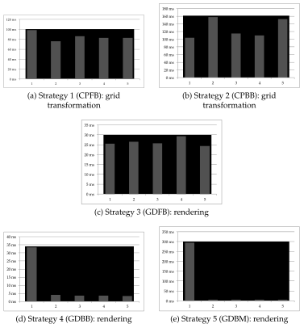{#fig-timeseries width=600}

6.4 Vertex count {#sec-vertexcount}
----------------

The impact of vertex count on rendering time is illustrated in figure [6.4](#fig-strategy3graph), which plots time measurements of strategy 3 (GDFB). It is not until the grid resolutions falls below $100 \times 100$ vertices that the efficiency becomes comparable to that of the other two GPU strategies.

Moreover, the measurements of the CPU strategies in table [6.1](#tab-measurements) show that a high vertex count has a significant impact on rendering time in and of itself, even when the transformation is precalculated.

However, it is not necessary to employ a high-resolution grid in order to see good results. Even a grid of as $50 \times 50$ vertices produces adequate, if less precise results.

{#fig-strategy3graph width=500}

6.5 Aliasing
------------

The impact of manual interpolation depends on the frequencies in the test image. Figure [6.5](#fig-interpolation) compares OpenGL ES's built-in bilinear interpolation against strategy 5 with a Gaussian kernel for a detail of the test image. Manual interpolation produces a slightly smoother result.

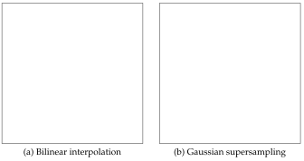{#fig-interpolation width=500}

Aliasing effects can be brought to the fore by substituting a high-frequency test pattern for the test image (figure [6.6a](#fig-stripes)). In this case, pronounced aliasing effects are unavoidable (figure [6.6b](#fig-stripes)).

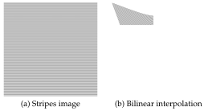{#fig-stripes width=400}

The effects are mitigated by supersampling (figure [6.7](#fig-supersamplingresults)). The softest output is produced by supersampling with an averaging kernel of five values (figure [6.7a](#fig-supersamplingresults)) or nine values (figure [6.7b](#fig-supersamplingresults)). Gaussian supersampling produces a somewhat sharper result (figure [6.7c](#fig-supersamplingresults)). A sharpening kernel retains the crispness of the lines, but pronounces the aliasing effects, particularly in the center of the image (figure [6.7d](#fig-supersamplingresults)).

{#fig-supersamplingresults width=400}

6.6 Adaptive interpolation {#sec-adaptive}
--------------------------

To smooth out the aliasing effects in the center of the image while mitigating the blurriness in the outer parts, we classify the image into different regions. In figure [6.8a](#fig-distance), we classify based on the calculated radius, which produces a number of concentric, circular regions. In figure [6.8b](#fig-distance), we classify based on the maximum transformed width or height, which produces a number of concentric, transformed rectangles.

{#fig-distance width=400}

Figure [6.9](#fig-adaptive) shows the result with the maximum transformed width or height as a distance measure, using gaussian supersampling for the center of the image and sharpening supersampling for the outer parts of the image. Regular bilinear interpolation is used as a compromise between the two.

{#fig-adaptive width=500}

Summary
-------

The GPU strategies outperform the CPU strategies, and the backward mapping GPU strategies outperform the others for repeated rendering passes. Calculating the transformation in the fragment shader is faster than calculating it in the vertex shader, even when the number of vertices is lowered.

Supersampling adds an initial cost, but the efficiency is similar for repeated passes. The visual impact depends on the image. In the case of a photograph, supersampling a photograph produces a smoother result. In the case of a test pattern, the aliasing effects are more pronounced, and the smoothness depends on the choice of kernel.

Adaptive supersampling divides the image into regions that are interpolated differently. This allows us to apply a smoothing filter to oversampled areas and a sharpening filter to undersampled areas. Such an interpolation strategies directly addresses the nonlinear characteristics of a transformation such as barrel undistortion.

In the last chapter, we will sum up our findings and look into further areas of investigation.

7 Conclusion {#chap-conclusion}
============

In this thesis, we have studied and compared various approaches for accelerating image transformation using OpenGL ES. Our case has been the undistortion of fish-eye distortion, a problem that can be modeled in different ways. However, our results can be generalized to other transformations as well.

In fitting a transformation model to an implementation strategy, we can identify the following trade-offs:

1.  **Precision:** Does the model produce accurate results? Is it a good fit to the error margins of the application, or does it introduce significant distortion of its own?
2.  **Speed:** Is the model faster in the forward direction or in the backward direction? Is its efficiency offset by the chosen implementation strategy?
3.  **Quality:** What interpolation method should be used? Does the input exhibit high frequencies that are prone to introduce aliasing effects? Should these effects be mitigated?

Weighing these factors against each other, the best results by far are produced by the backward-mapping strategies 4 (GDBB) and 5 (GDBM). Even though the exponential model is slower in the backward direction (and this is even more the case for other models, such as the polynomial model), this is more than offset by the efficiency of the strategies and the flexibility with regard to interpolation.

In other words: the model would have to be *significantly* faster in the forward direction than in the backward direction in order to warrant a forward-mapping strategy over the backward-mapping strategies mentioned above.

7.1 Discussion
--------------

In chapter [1](#chap-introduction) we identified a number of challenges: choosing a good model, selecting a fitting implementation strategy, writing parallel code and achieving high-quality interpolation. What is our assessment of these challenges?

-   Among the several distortion models that are available, many deliver approximate results at low cost, but higher precision requires a more sophisticated model. Some models, like the polynomial model, can be orders of magnitude more expensive when applied in the reverse direction. The exponential model is a good compromise with comparable efficiency in both directions.
-   The cost of a precise model can be offset by an implementation strategy that is cheap, just like an imprecise model frees up resources for an expensive strategy. For the polynomial model, for example, a forward mapping strategy would be a better fit than a backward mapping strategy. For a model that is comparably efficient in both directions, such as the exponential model, a backward mapping strategy is superior in both efficiency and flexibility.
-   OpenGL ES is eminently well suited to exploiting the parallelizable features of the problem. Data-parallel computing is achieved by implementing the transformation in terms of a vertex shader or fragment shader.
-   Although OpenGL ES' built-in bilinear interpolation produces good results by itself, better results can be achieved by means of supersampling in the fragment shader. Such a method has the added benefit that it can be adapted to the transformation.

We conclude that OpenGL ES is a good fit to the problem of accelerating barrel undistortion, that the implementation adapts well to the challenges raised, and that it is well supported by the hardware of today.

7.2 Further work {#sec-furtherwork}
----------------

The multisampling shader makes nine texture accesses, most of which are shared by the surrounding fragments, as shown in figure [7.1](#fig-overlap). This means redundant accesses and coordinate transformations, which are "hopefully cached by the GPU", in the words of [Bjorke (2004)](#bjorke04-filter).

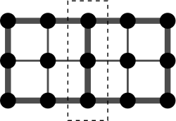{#fig-overlap width=200}

[Sigg and Hadwiger (2005)](#sigg05-filtering) have presented a method for third-order texture filtering which performs cubic filtering by building on linear texture fetches, which considerably reduces the number of input texture fetches. This could be used to optimize the supersampling method presented in this thesis.

Furthermore, [Wexler and Enderton (2005)](#wexler05-rasterization) have described a supersampling technique for rendering images of arbitrary resolution with arbitrarily wide user-defined filters and high sampling rates. The image is divided into constant-size rectangular tiles in order to support large supersampling rates and large final images.

To accelerate the code beyond what is possible with OpenGL ES, we may look into other frameworks. [Scarpino (2012)](#scarpino12-opencl) goes into detail on how to combine OpenGL with OpenCL in order to implement a sharpening filter. In this setup, the filter is computed in parallel by an OpenCL kernel, whose output is communicated to OpenGL by means of a pixel buffer object. OpenGL is then used for rendering.

As OpenCL provides fine-grained memory handling where worker threads may share data, this approach would make it possible to eliminate the redundancy mentioned earlier. Indeed, it is similar to our CPU strategies, except that the computations are not performed on the CPU, but by a designated parallelization framework. However, such an implementation would become considerably complex. As [Scarpino](#scarpino12-opencl) puts it:

> OpenCL and OpenGL are both powerful toolsets, but no one has ever called them simple. Getting the two to work together is one of the most complex programming tasks I can think of ... I can't think of a harder topic related to OpenCL.^[[Scarpino (2012)](#scarpino12-opencl), chapter 16: "Textures and renderbuffers", p. 349.]

There is also the consideration that OpenCL is not as widely supported, especially on mobile devices. A combined setup may pose serious restrictions on portability and development environments.

Summary
-------

We have found OpenGL ES to be well suited to the problem at hand. The gains of parallelization are impressive, and a custom supersampling strategy offers results above and beyond the standard interpolation options. The supersampling strategy we have outlined is simple, but adaptable.

The simplicity of OpenGL ES comes with a disadvantage: it offers little control over the parallelization. There is some redundancy in the supersampling strategy that could be reduced by sharing memory between worker threads. One way of exploring this possibility would be to rewrite our OpenGL ES shaders into OpenCL (or CUDA) kernels.

A Source code {#chap-code}
=============

The source code is freely available from a Git repository. To obtain the code, run the following command:

    $ git clone https://epsil@bitbucket.org/mpg_papers/thesis-2015-vegard.git

To compile and run the code, run the included compilation script:

    $ ./compile.sh

This will generate a Makefile (using `qmake`), run the Makefile, and then execute the resulting application.

The code is freely available under the MIT License.^[<http://opensource.org/licenses/MIT>.]

B Matlab program {#chap-matlab}
================

Matlab program for estimating model parameters:

```matlab
%% Nonlinear regression

%% Barrel distortion: r_d = f(r_u)

% Reference

barrel = @(x) x - 0.5 * x.^2;
x = linspace(0,1)';
logRef = @(b,x) b(1) * log(1 + b(2) * x);
logNlm = fitnlm(x,barrel(x),logRef ,[1.0 1.0])

% Logarithmic model

% s = 1.0;
% lambda = 1.7;
s = logNlm.Coefficients.Estimate(1);
lambda = logNlm.Coefficients.Estimate(2);
logModel = @(x) s * log(1 + lambda * x);

% Polynomial model

pModel = @(b,x) b(1) + b(2) * x + b(3) * x.^2 +
                b(4) * x.^3 + b(5) * x.^4;
pNlm = fitnlm(x,logModel(x),pModel ,[0.5; 1.0; 0.01; 0.001; 0.0001])

% Trigonometric model

trigModel = @(b,x) tan(b(1) * x) / (2 * tan(b(1) / 2));
trigNlm = fitnlm(x,logModel(x),trigModel ,[0.1])

% Division model

divNlm = fitnlm(x,logModel(x),divModel ,[1.0])

%% Pincushion distortion: r_u = f(r_d)

% Reference
pincushion = @(r) abs(-sqrt(1.0 - 2.0 * r) + 1.0);

% Exponential model
expModel = @(x) (exp(x / s) - 1) / lambda;

% Polynomial model

pModelInv = @(b,x) x .* (1 + b(1) * x.^2 + b(2) * x.^4 +
                         b(3) * x.^6);
pNlmInv = fitnlm(x,expModel(x),pModelInv ,[1.0; 1.0; 1.0])

% Trigonometric model

omega = trigNlm.Coefficients.Estimate(1);
trigModelInv = @(x) 1/omega * atan(2 * x * tan(omega/2));

%% Plot models

plot(x,x,x,barrel(x),x,pincushion(x),x,logModel(x),x,expModel(x),
     x,predict(pNlm ,x),x,predict(pNlmInv ,x),x,predict(trigNlm ,x),
     x,trigModelInv(x),x,predict(divNlm ,x));
legend('x','barrel','pincushion','logModel','expModel','pModel',
       'pModelInv','trigModel','trigModelInv','divModel');
axis([0.0 1.0 0.0 1.0]);
```

Bibliography
============

Anup Basu and Sergio Licardie. Alternative models for fish-eye lenses. *Pattern Recognition Letters*, 1995. {#basu95-alter}

Kevin Bjorke. High-quality filtering. In Randima Fernando, editor, *GPU Gems*. Addison-Wesley, 2004. {#bjorke04-filter}

A. P. Chandrakasan, M. Potkonjak, R. Mehra, J. Rabaey, and R.W. Brodersen. Optimizing power using transformations. *IEEE Transactions on Computer-Aided Design of Integrated Circuits and Systems*, 14(1), 1995. {#chandrakasan95-power}

Frederic Devernay and Olivier Faugeras. Straight lines have to be straight: Automatic calibration and removal of distortion from scenes of structured environments. *Machine Vision and Applications*, 2001. {#devernay01-straig-lines}

Andrew W. Fitzgibbon. Simultaneous linear estimation of multiple view geometry and lens distortion. Technical report, The University of Oxford, Department of Engineering Science, 2001. {#fitzgibbon01-simul}

Erich Gamma, Richard Helm, Ralph Johnson, and John Vlissides. *Design Patterns: Elements of Reusable Object-Oriented Software*. Addison-Wesley, 1995. {#erich95-patterns}

Richard Hartley and Andrew Zisserman. *Multiple View Geometry in Computer Vision*. Cambridge University Press, 2 edition, 2004. {#zisserman04-multiple-view}

Jeff R. Heard. Beautiful code, compelling evidence: Functional programming for information visualization and visual analytics. Technical report, University of North Carolina, 2008. {#heard08-beaut-code}

Tom McReynolds and David Blythe. *Advanced Graphics Programming Using OpenGL*. Morgan Kaufmann Publishers, 2005. {#mcreynolds05-advanced}

Aaftab Munshi, Dan Ginsburg, and Dave Shreiner. *OpenGL ES 3.0 Programming Guide*. Addison-Wesley Professional, 2014. {#aaftab14-opengl-es}

Nvidia. Drive px from nvidia tegra automotive, 2015. URL <http://www.nvidia.com/object/drive-px.html>. {#nvidia15-drivepx}

PGI. Pgi cuda-x86: Cuda programming for multi-core cpus, 2010. URL <https://www.pgroup.com/lit/articles/insider/v2n4a1.htm>. {#pgi2010-cuda}

Qt. Qt documentation: Qglwidget, 2015. URL <http://doc.qt.io/qt-4.8/qglwidget.html>. {#qt15-qglwidget}

Matthew Scarpino. *OpenCL in Action*. Manning, 2012. {#scarpino12-opencl}

E. L. Schwarz. Computational anatomy and functional architecture of striate cortex: a spatial mapping approach to perceptual coding. *Vision Research*, 20:656--669, 1980. {#schwarz80-comput}

Graham Sellers, Richard S. Wright, and Nicholas Haemel. *OpenGL SuperBible: Comprehensive Tutorial and Reference*. Addison-Wesley, 2014. {#sellers14-opengl-super}

Christian Sigg and Markus Hadwiger. Fast third-order texture filtering. In Matt Pharr, editor, *GPU Gems 2*. Addison-Wesley, 2005. {#sigg05-filtering}

Alvy Ray Smith. A pixel is *Not* a little square, a pixel is *Not* a little square, a pixel is *Not* a little square! (and a voxel is *Not* a little cube). Technical report, Microsoft, 1995. {#smith95-pixel}

Bjarne Stroustrup. The *C++ Programming Language*. Addison-Wesley, 4 edition, 2013. {#stroustrup13-cpp-lang}

Ken Turkowski and Steve Gabriel. *Graphics Gems I*, chapter Filters for Common Resampling Tasks, pages 147--165. Academic Press, 1990. {#turkowski90-graph-gems}

Dan Wexler and Eric Enderton. High-quality antialiased rasterization. In Matt Pharr, editor, *GPU Gems 2*. Addison-Wesley, 2005. {#wexler05-rasterization}

George Wolberg. *Digital Image Warping*. Columbia University, 1990. {#wolberg90-digital-image-warp}
