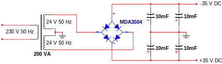

Rapport for konstruksjon av den 60 W klasse AB-forsterkeren
*Project 3A*: enkelt design og god lydkvalitet.
**[PDF-utgave](rapport.pdf)**.

---

{width=280}

Stian Rishaug, Bastian S. Solem, Aleksander Uthus og Vegard Øye.

Veileder: Herman Ranes.

---

### Sammendrag

Simulering ga jevn forsterkning i det hørbare området (20 Hz--20 kHz).
Målt forsterkning var 24,9 dB, med en effekt på 2 × 55 W ved 8 Ω.

En detaljert kretsanalyse av forsterkeren trinn for trinn ga en
forsterkning uten tilbakekobling på 20714 ganger; beregnet
forsterkning med tilbakekobling var 23 dB.

Strømforsyningen var en 200 VA 24--0--24 V transformator; fortrinnsvis
bør en på 300 VA brukes.

Kabinettet og innsiden er dokumentert med fotografier. Forsterkeren
har to forsterkerkretser, en for hver lydkanal, med felles kjøleribbe.
Kretskortenes «silk screen» har enkelte feil.

Grunnet støyproblemer er kretsen lettere modifisert ved å lodde fast
ekstra kondensatorer. Kjølingen bruker termisk tilbakekobling.
Hvilestrømmen bestemmes ved å skru på et potensiometer og bør ligge på
ca. 75 mA.

Budsjettet lå på 1000,-- kr, mens utgiftene ble 1085,70 kr, bl.a. på
grunn av dyre utgangstransistorer. Testing ble gjort med billige
BD911- og BD912-transistorer; lydkvaliteten økte dramatisk da de ble
byttet ut med MJL3281A- og MJL1302A-transistorer.

Forsterkeren kan anses som høyst vellykket lydmessig, men det er rom
for forbedringer: automatisk utlading av glattefilteret, DC-vern over
utgangstrinnet for å beskytte høyttalerne ved kortslutning av
utgangene, kraftigere strømforsyning, større kjøleribbe, mindre
kretskort og ev. delefilter.

Forsterkertype og spesifikasjoner
=================================

Mens det er trivielt å forsterke en konstant inngangsstrøm
eller -spenning, er det vanskelig å gjengi endringer i den samme
strømmen eller spenningen. Både blant hobbyentusiaster og
profesjonelle går det sport i å konstruere en «enda bedre» forsterker,
og *hi-fi*-pressen ser aldri ut til å gå tom for anledninger til å
presentere det nyeste, mest avanserte og angivelig beste innen
elektronisk lydgjengivelse. Hvor mye av utviklingen som er reell, er
det opp til den enkelte å vurdere, men et kjapt overblikk over
markedet levner ingen tvil om at lydforsterkning er *big business*.

Mot denne bakgrunnen presenterer vi et forsterkerdesign som er 20 år
gammelt og forbausende enkelt. Rod Elliotts *Project 3A* (fork. *P3A*)
gir høy ytelse ved lave kostnader, er velutprøvd og er lett å bygge.
Det er et ideelt design for nybegynneren, men kan også anbefales til
den kresne *hi-fi*-entusiasten. Designet bygger videre på det
opprinnelige *Project 03*, og drar nytte av nyere og bedre
utgangstransistorer.

De oppgitte spesifikasjonene til forsterkeren er som følger:

|                       |                         |
| --------------------- | ----------------------- |
| Effekt:[^1]           | Ca. 2 × 60 W (8 Ω)      |
| Strømforsterkning:    | 27 dB                   |
| Inngangsimpedans:     | 24,2 kΩ                 |
| Inngangssensitivitet: | 1,22 V for 100 W (8 Ω)  |
| Båndbredde:           | 10 Hz--30 kHz ($-1$ dB) |
| Klirr:                | 0,04 %, 1--80 W         |
| DC offset:            | <100 mV                 |

[^1]: Avhenger av transformator.

Forsterkeren er en *klasse AB-forsterker*, altså en blanding av en
klasse A-forsterker og en klasse B-forsterker. For små signaler
fungerer den som en klasse A-forsterker, og utgangstransistorene er
konstant «på» -- men siden dette bare gjelder små signaler, trekker
ikke forsterkeren like mye strøm som en ekte klasse A-forsterker, som
er konstant «på» uavhengig av lydnivået. For store signaler fungerer
forsterkeren som en klasse B-forsterker, og utgangstransistorene
bytter på å forsterke positive deler av signalet og negative.
Forsterkeren bruker negativ tilbakekobling for å oppnå linearitet for
høye strømmer og spenninger. (For en detaljert gjennomgang av kretsens
oppbygning og virkemåte, se [kretsanalysen](#analyse).)

Simulering
----------

Bode-diagrammet viser at forsterkeres maksimale båndbredde ligger fra
1/2 Hz til ca. 500 kHz. Den originale kretsen ville normalt gått mye
høyere, men siden vi har *modifisert* kretsen noe ved å koble 368 pF
kondensatorer i parallell med $C_4$ og $C_6$ (se
[modifikasjonene](#modifikasjoner) for detaljer), blir de flaskehalsen
i kretsen.

Det lydmessig interessante området ligger fra 20 Hz til 20 kHz
(hi-fi), og av utsnittet ser vi at dette området ligger ganske flatt.

Målinger
--------

### Forsterkning

Vi fikk at 8 mV inn ga 140 mV ut. Det gir en forsterking på

$$A = \frac{0,14\text{ V}}{0,008\text{ V}} = 17,5$$

I desibel tilsvarer dette

$$A_{\mathrm{dB}} = 20\lg{17,5} = 24,9\text{ dB} $$

### Utgangsimpedans

Utgangsimpedansen finnes ved å sammenligne utgangsspenningen med last
med utgangsspenningen uten last. Vi har følgende målinger for 40 mV
inn på inngangen:

| Frekvens | Uten last         | Ved 1 Ω              | Tap                   |
| -------- | ---------------   | ----------------     | --------------------- |
| 40 Hz    | $v_o = 833,40$ mV | $v_{oL} = 830,50$ mV | $\Delta v_o = 2,9$ mV |
| 1 kHz    | $v_o = 834,78$ mV | $v_{oL} = 832,08$ mV | $\Delta v_o = 2,7$ mV |
| 16 kHz   | $v_o = 833,90$ mV | $v_{oL} = 831,90$ mV | $\Delta v_o = 2,0$ mV |

Gjennomsnittlig verdi for utgangsspenning uten last blir
$v_o = 834,03$ mV, for utgangsspenning med last $v_{oL} = 831,49$ mV
og for tap $\Delta v_o = 2,5$ mV.

For å finne utgangsimpedansen, la oss betrakte en skjematisk
fremstilling av forsterkeren uten last:

{width=435}

Ettersom det ikke går noen strøm i forsterkeren, er spenningsfallet over
utgangsimpedansen, $R_o$, lik null, og vi har $v_o = Av_i$. Med last:

{width=362}

Her har vi følgende spenningsdeling over $R_o$ og $R_L$:

$$\begin{split}
    v_{oL} &= Av_i\frac{R_L}{R_o + R_L}\\
    &= v_o\frac{R_L}{R_o + R_L}
\end{split} $$

hvor vi utnytter at $v_o = Av_i$ for å få en sammenheng mellom
$v_{oL}$ og $v_o$. Uttrykket kan så ordnes for $R_o$:

$$\begin{split}
    R_o &= R_L\left(\frac{v_o - v_{oL}}{v_{oL}}\right)\\
    &= \frac{v_o - v_{oL}}{v_{oL}}\quad\text{dersom }R_L = 1\text{ $\Omega$}
\end{split} $$

Her ser vi verdien av å måle med en utgangslast på 1 Ω -- uttrykket
blir enklere. Vi setter inn for gjennomsnittsverdiene og får en
utgangsimpedans på

$$R_o = \frac{\overline{v_o} -
    \overline{v_{oL}}}{\overline{v_{oL}}}
  = \frac{834,03\text{ mV} -
    831,49\text{ mV}}{831,49\text{ mV}} = 0,003\text{ $\Omega$} $$

På grunn av forsterkerens negative [tilbakekobling](#tilbakekobling)
blir utgangsimpedansen mindre enn den ellers ville ha vært.

### Dempningsfaktor

> «Damping factor ... is probably the all-time least important and
> over-used non-specification for an amplifer.»
>
> -- Richard D. Pierce, rec.audio.high-end

Dempningsfaktor ved 8 Ω:

$$\frac{R_L}{R_o} = \frac{8\text{ $\Omega$}}{0,003\text{ $\Omega$}} = 2667$$

### Klirr

I et lydsignal er det ved siden av grunntonen også til stede flere
overharmoniske toner. Disse overharmoniske tonene er toner med
frekvenser som er $N$ ganger høyere enn grunntonens frekvens. Det er
denne sammensetningen av de overharmoniske tonene sammen med
grunntonen som bestemmer klangen til en tone.

Når vi skal forsterke et signal, er vi kun interessert i å forsterke
grunnfrekvensen, og unngå å få med andre overtoner enn de som allerede
er i signalet. Får vi med flere overharmoniske toner, har vi fått det
som kalles klirr. Får man med veldig mange overtoner, blir
klirrfaktoren stor og signalet blir deformert gjennom forsterkeren.

En måte klirr ofte oppstår på er hvis en eller flere transistorer
jobber på feil arbeidspunkt. Det vil da oppstå klirr på signalet.
Klirr måles ved hjelp av et klirrmeter som registrerer de
overharmoniske komponentene til et sinussignal og returnerer en
prosentverdi.

For å beregne klirr har man følgende formel:

$$K = \sqrt{\frac{\hat{U}_2^2 + \hat{U}_3^2 + \hat{U}_4^2 + \dotsb}{\hat{U}_1^2}} \cdot 100\text{ %} $$

Vi målte klirr ved å koble opp og måle som vist på figuren:

{width=566}

Vi målte en klirrfaktor på 0,015 % ved 1 W og 1 kHz.

### Båndbredde

Båndbredden er 20 Hz--20 kHz. Målinger ved 8 Ω og 1 W ga:

|           |          |
| --------- | -------- |
| 20 Hz     | 2,933 mV |
| 100 Hz    | 2,948 mV |
| 1000 Hz   | 2,950 mV |
| 10 000 Hz | 2,949 mV |
| 20 000 Hz | 2,946 mV |

Dermed har vi

$$2,950\text{ mV} - 2,933\text{ mV} = 17\text{ mV} $$

som gir

$$20\lg\left(\frac{17\text{ mV}}{2,950\text{ mV}}\right) = 0,05\text{ dB} $$

### Effekt

Utgangseffekten målt med effektmeter var 2 × 55 W ved 8 Ω.

En dobling av effekten vil ikke gi mer enn 3 dB økning i lyden. For
eksempel vil en høyttaler med sensitivitet lik driftseffekten 96 dB
ved 1 m 1 W gi:

$$I_{\mathrm{dB}_{\mathrm{maks}}} = I_{\mathrm{sens}} +
  10\lg\left(\frac{P_{\mathrm{maks}}}{1\text{ W}}\right) =
  96\text{ dB} +
  10\lg\left(\frac{55\text{ W}}{1\text{ W}}\right) = 113,4\text{ dB} $$

Dette vil ved en sitteavstand på 4 m gi:

$$I_{\mathrm{dB}_{\mathrm{maks}}} = I_{\mathrm{sens}} -
  20\lg\left(\frac{4\text{ m}}{1\text{ m}}\right) =
  113,4\text{ dB} -
  20\lg\left(\frac{4\text{ m}}{1\text{ m}}\right) = 101,36\text{ dB} $$

hvor vi ser bort fra akustikk i vegger.

Kretsskjema {#kretsskjema}
===========

> {width=847}
>
> Kretsskjema fra Multisim. For det opprinnelige kretsskjemaet til Rod
> Elliott, se [kretsanalysen](#analyse). For et modifisert skjema som
> viser hvordan kretsen ble etter egne justeringer, se
> [modifikasjonene](#modifikasjoner).

Kretsanalyse {#analyse}
============

Grunnleggende begreper
----------------------

Den følgende kretsanalysen forutsetter en viss kjennskap til
elektroniske kretser og modellering av disse. For å gjøre den mer
tilgjengelig, men også for presisjonens skyld, gjennomgår vi her noen
av de grunnleggende begrepene som analysen baserer seg på.

Denne seksjonen kan skumleses eller hoppes over av dem som allerede er
kjent med elementær elektronisk kretsteori.

### Forspenning av transistorer i det aktive området

En transistor har tre utganger eller *terminaler* -- base (B), emitter
(E) og kollektor (C) -- og dermed også tre *overganger* --
base--emitter-, base--kollektor- og kollektor--emitter-overgangen.
Transistorens «oppførsel» eller *modus* avhenger av hvilke spenninger
man påtrykker disse overgangene, dvs. av hvordan man *forspenner*
transistoren. Den modusen man typisk er interessert i hva forsterkere
angår, kalles *det aktive området*, og er kjennetegnet ved at *små*
endringer i base--emitter-spenningen ($v_{BE}$) gir *store* endringer
i kollektorstrømmen ($i_C$). Kollektorstrømmen er relatert til den mye
mindre basestrømmen ($i_B$) ved $i_C = \beta i_B$, der $\beta$ er
transistorens *strømforsterkning*.

Såkalte BJT-transistorer (bipolare transistorer) kommer i to
varianter: *NPN-transistorer* og *PNP-transistorer*. I en
NPN-transistor går strømmen *inn i* basen og kollektoren og kommer *ut
av* emitteren. I en PNP-transistor går strømmen *inn i* emitteren og
kommer *ut av* basen og kollektoren. (For begge transistorer er
emitterstrømmen lik summen av base- og kollektorstrømmen, dvs.
$i_E = i_B + i_C$.) Transistorene symboliseres med en pil på
emitterutgangen som indikerer strømretningen og dermed også
transistortypen.

> {width=206}
> {width=205}
>
> NPN- og PNP-transistorer i det aktive området.

For å forspenne en NPN-transistor i det aktive området må
base--emitter-spenningen være rundt 0,7 V, dvs. basespenningen må
ligge ca. 0,7 V *over* emitterspenningen (eller *under* for en
PNP-transistor).[^2] Dessuten må kollektorspenningen ikke ligge mer
enn ca. 0,4 V *under* basespenningen (eller *over* for en
PNP-transistor); vanligvis ligger kollektorspenningen godt over (eller
under) basespenningen, som på figuren.

[^2]: Vi kan ikke snakke om «spenningen i et punkt» i kretsen på samme
måte som vi snakker om strømmen i punktet (strømgjennomgangen målt i
coulomb per sekund eller ampere), for spenning er alltid *over en
strekning*, dvs. mellom to ytterpunkter. Når vi f.eks. sier at
«kollektorspenningen er 12 V», mener vi alltid at kollektorutgangens
*spenningspotensial i forhold til jord* er 12 V (hvor jord er
nullpotensialet, 0 V); eller med andre ord, spenningen over
strekningen fra kollektorutgangen til jord er 12 V (dersom det er
flere slike strekninger, spiller det ingen rolle hvilken man betrakter
ettersom spenningen er den samme over alle grener i en
parallellkobling). At spenningen i et punkt ligger «over» spenningen i
et annet, er å forstå som at det første punktets spenningspotensial i
forhold til jord er større enn det andres. I denne rapporten bruker vi
om hverandre uttrykksmåter som «basespenningen» (baseutgangens
spenningspotensial i forhold til jord, dvs. spenningen over
strekningen fra basen til jord), «base--emitter-spenningen»
(spenningen over strekningen fra basen til emitteren, eller *mer
presist*, baseutgangens spenningspotensial i forhold til jord minus
emitterutgangens spenningspotensial i forhold til jord) og
«spenningsfallet over motstanden» (spenningen over motstanden, dvs.
mellom motstandens to terminaler).

### Arbeidspunkt og småsignal

En forsterkerkrets inneholder *flere* spenningskilder, både
konstantkilder (DC-spenning) og en signalkilde (AC-spenning). Ifølge
*superposisjonsprinsippet* kan en hvilken som helst spenning eller strøm
i kretsen finnes ved å beregne *summen av strøm- og spenningskildenes
enkeltbidrag*, der bidraget fra en strøm- eller spenningskilde finnes
ved å erstatte de øvrige strøm- eller spenningskildene med hhv. brudd
eller kortslutninger, og så beregne den resulterende spenningen eller
strømmen. For eksempel: Hvis kretsen inneholder DC-kildene $V_+$ og
$V_-$ og AC-kilden $v_{\sim}$ (og ingen strømkilder), kan
spenningspotensialet i punktet $P$, $v_P$, uttrykkes som

$$v_P = v_P'(V_+) + v_P''(V_-) + v_P'''(v_{\sim})$$

hvor $v_P'(V_+)$ er spenningspotensialet i $P$ når $V_-$ og $v_{\sim}$
erstattes med kortslutninger, $v_P''(V_-)$ er spenningspotensialet i
$P$ når $V_+$ og $v_{\sim}$ erstattes med kortslutninger, osv.[^3] La
oss gruppere enkeltbidragene i DC- og AC-bidrag:

$$\begin{split}
    v_P &= \underbrace{v_P'(V_+) + v_P''(V_-)}_{\mathrm{DC}} +
    \underbrace{v_P'''(v_{\sim})}_{\mathrm{AC}}\\
    &= V_{PQ} + v_p
  \end{split} $$

hvor $V_{PQ} = v_P'(V_+) + v_P''(V_-)$ og $v_p = v_P'''(v_{\sim})$.
Vi kan nå innføre følgende terminologi: $V_{PQ}$ er *arbeidspunktet
til $v_P$*, og $v_p$ er *småsignalet til $v_P$*. Arbeidspunktet er
DC-delen av $v_P$, som AC-delen -- småsignalet -- varierer rundt.

Siden superposisjonsprinsippet gjelder for strømmer så vel som
spenninger, kan alle strømmer og spenninger i kretsen deles opp i en
arbeidspunktsdel og en småsignalsdel.

[^3]: Det er vanlig å bare skrive $v_P'$, $v_P''$, osv. Her anfører vi
spenningskilden i parentes for å gjøre notasjonen tydeligere.

### Småsignalmodeller

Superposisjonsprinsippet gjør det mulig å betrakte kretsens DC- og
AC-egenskaper hver for seg. Ved å fjerne alle konstantkildene, men
beholde signalkilden, får man et *småsignalskjema*, som gjør det mulig
å analysere og beregne forsterkerens signalegenskaper, f.eks.
signalforsterkningen.

Slike analyser *modellerer* transistorenes småsignalegenskaper. De to
mest brukte småsignalmodellene er den *forenklede hybride
$\pi$-modellen* og *T-modellen*. Disse modellene inneholder en styrt
strømkilde som tilsvarer strømforsterkningen ($\beta$), samt en
inngangsmotstand enten på basen ($r_\pi$) eller emitteren ($r_e$).

> {width=350}
> {width=134}
>
> Forenklet hybrid $\pi$-modell og T-modell (NPN-transistor).

Modellenes parametre avhenger av transistorens parametre. $\beta$ er her
transistorens *småsignal*-strømforsterkning, altså forholdet mellom
*småsignal*-kollektorstrømmen og *småsignal*-basestrømmen
($\beta = i_c / i_b$). Den er ofte oppgitt i databladet som $h_{fe}$
(hvis den ikke er oppgitt, kan den tilnærmes med DC-forsterkningen
$h_{FE}$).

$r_\pi$, brukt i den hybride $\pi$-modellen, er inngangsmotstanden til
base--emitter-overgangen *sett fra basen*. Den er definert som
*småsignal*-base--emitter-spenningen delt på *småsignal*-basestrømmen:

$$r_\pi = \frac{v_{be}}{i_b} $$

For å finne $r_\pi$ er det vanlig å gå veien om *transkonduktansen*,
$g_m$, som er forholdet mellom *småsignal*-kollektorstrømmen og
*småsignal*-base--emitter-spenningen:

$$g_m = \frac{i_c}{v_{be}} = \frac{I_{CQ}}{nV_T} = \frac{I_{CQ}}{V_T}\quad\text{dersom $n = 1$} $$

der $n = \text{1--2}$ (ofte settes $n = 1$ slik at den kan sløyfes)
og $V_T = 25\text{ mV}$ ved en omgivelsestemperatur på 25 °C.
Dersom transistoren er i det aktive området, er forholdet nesten
konstant, og transkonduktansen kan forstås som *stigningsgraden* til
$i_C$--$v_{BE}$-kurven *i arbeidspunktet*:

$$g_m \approx \left.\frac{\partial i_C}{\partial v_{BE}}\right|_{i_C = I_{CQ}} $$

Ettersom $i_c = g_mv_{be}$, er basestrømmen gitt ved
$i_b = i_c / \beta = g_mv_{be} / \beta$, og vi får for $r_\pi$:

$$r_\pi = \frac{v_{be}}{i_b}
  = \frac{v_{be}}{g_mv_{be} / \beta}
  = \frac{\beta}{g_m} $$

Tilsvarende er $r_e$, brukt i T-modellen,
inngangsmotstanden til base--emitter-overgangen *sett fra emitteren*:

$$r_e = \frac{v_{be}}{i_e} $$

Ettersom $i_e = i_b + i_c$ og $i_c = \beta i_b$, er
$i_e = (\beta + 1)i_b$. Det gir for $r_e$:

$$r_e = \frac{v_{be}}{(\beta + 1)i_b}
  = \frac{v_{be}}{(\beta + 1)g_mv_{be} / \beta}
  = \frac{\beta}{(\beta + 1)g_m}
  = \frac{\alpha}{g_m}
  \approx \frac{1}{g_m}
  = \frac{V_T}{I_{CQ}} $$

der $\alpha$ er forholdet mellom emitterstrømmen og kollektorstrømmen
($i_c = \alpha i_e$) og er tilnærmet lik $1$. Da $v_{be} = i_br_\pi =
i_er_e$, finnes følgende sammenheng mellom $r_\pi$ og $r_e$:

$$r_\pi = (\beta + 1)r_e$$

Råforsterkning og tilbakekobling {#tilbakekobling}
--------------------------------

En klasse AB-forsterker kombinerer egenskapene til en klasse
A-forsterker og en klasse B-forsterker. For *små* inngangssignaler
(lav musikk) fungerer forsterkeren som en klasse A-forsterker, og
utgangstransistorene er i det aktive området. For *store* signaler
(høy musikk) fungerer forsterkeren som en klasse B-forsterker, og
utgangstransistorene bytter på å forsterke henholdsvis positive
halvperioder og negative halvperioder (for et sinussignal). Når
forsterkeren fungerer som en klasse B-forsterker, påtrykkes
utgangstransistorene spenninger langt utover det aktive området.
Forsterkningen blir dermed ikke lineær, ettersom transistorene bare er
i det aktive området for *små* strømmer og spenninger.

For å oppnå en kraftig forsterkning som også er lineær, anvendes
*negativ tilbakekobling*: Det ulineært forsterkede signalet fra
utgangstransistorene sendes tilbake inn på en *differensialforsterker
ved inngangen* (utgjøres av transistorene $Q_1$ og $Q_2$). I dette
oppsettet *tvinges de to inngangssignalene til å være så like
hverandre som mulig*, noe som har en fordelaktig effekt på det
ulineært forsterkede signalet.

Med andre ord gjør den negative tilbakekoblingen den ulineære
forsterkningen *mindre*. Differensialforsterkeren sammenligner det
«lineære» inngangssignalet med det «ulineære» forsterkningssignalet og
gir utgangstransistorene det signalet de trenger for å *summa
summarum* produsere en nær lineær forsterkning.

{width=599}

For å finne forsterkningen med tilbakekobling må vi først finne
forsterkningen *uten* tilbakekobling, dvs. råforsterkningen. Det betyr
å følge signalets bane gjennom kretsen og, for hvert trinn i
forsterkeren, beregne forsterkningen.[^4] Den totale råforsterkningen
er dermed gitt som produktet av alle enkelttrinnforsterkningene. Fordi
vi får behov for å beregne utgangslasten til hvert trinn, går vi
gjennom kretsen *baklengs* -- fra utgangssignalet til inngangssignalet
-- slik at vi kan uttrykke utgangslasten til tidligere trinn med
utgangspunkt i inngangsimpedansen til senere trinn.

[^4]: Her bruker vi ordet «forsterkning» i en noe utvidet betydning,
dvs. som en multiplikator som godt kan være under 1. En verdi på
f.eks. 0,8, som effektivt vil *forminske* signalet snarere enn
forsterke det i den ordinære betydningen, betraktes altså også som en
«forsterkning».

> {#elliot}
>
> Det opprinnelige kretsskjemaet for forsterken, etter Rod Elliott.
> Komponenter markert med $*$ er utelatt fra kretskortet.

### Utgangstransistorene

Forsterkeren har to store utgangstransistorer, $Q_7$ og $Q_8$, som
forsterker henholdsvis positive og negative halvperioder av signalet
når den fungerer som en klasse B-forsterker, som vi i denne analysen
vil betrakte den som. Vi vil derfor begrense oss til å se på $Q_7$,
som er koblet sammen med $Q_5$ i en såkalt *Sziklai-kobling*. Denne
koblingen gjør det mulig å betrakte $Q_7$ og $Q_5$ som én stor
transistor med strømforsterkning lik produktet av strømforsterkningene
til $Q_7$ og $Q_5$ (noe som vil vises under), og det er dermed rimelig
å regne også $Q_5$ som en del av dette trinnet.

Strømmen avhenger av utgangslasten (dvs. impedansverdien til
høyttaleren), som vi kaller $R_L$, og som typisk er på 8 Ω. Verdien er
imidlertid ikke relevant før vi har foretatt en *arbeidspunktanalyse*
av kretsen som gir oss den informasjonen vi trenger for numeriske
utregninger. Inntil videre begrenser vi oss til *småsignalanalyser*,
som gir oss symbolske uttrykk for enkelttrinnforsterkningene. De
numeriske verdiene fyller vi inn siden.

For å analysere Sziklai-koblingen av $Q_5$ og $Q_7$ bytter vi ut begge
transistorene med forenklede hybride $\pi$-modeller. Vi får dermed to
basemotstander, $r_{\pi5}$ og $r_{\pi7}$, og to styrte strømkilder med
forsterkningsgrad $\beta_5$ og $\beta_7$, henholdsvis. Basestrømmen
til $Q_5$ kaller vi $i_{b5}$, emitterstrømmen $i_{e5}$ og
kollektorstrømmen $i_{c5}$, mens basestrømmen til $Q_7$ kaller vi
$i_{b7}$, osv. Dette navngivningssystemet følger vi konsekvent i hele
analysen for å skille kretsens mange størrelser fra hverandre.

{width=397}

Vi tar utgangspunkt i $i_{b5}$, som vi betrakter som trinnets
inngangsstrøm -- og basespenningen til $Q_5$, $v_{b5}$, er tilsvarende
inngangsspenningen. Trinnets utgangsspenning er spenningen over $R_L$,
$v_o$, som skapes av utgangsstrømmen $i_o$. Vi vil i analysen anta at
den samme strømmen går gjennom $R_{13}$ og $R_L$: Strømmen fra $R_{13}$
går riktignok også til $R_5$, $R_{14}$ og $R_{15}$, men $R_5$ ses bort
fra ettersom vi beregner forsterkningen *uten tilbakekobling*, $R_{15}$
er koblet i serie med kondensatoren $C_7$, som har veldig lav kapasitans
og dermed høy reaktans for alle frekvenser unntatt de aller høyeste, og
$R_{14}$ går til utgangstransistoren $Q_6$, som under analysens
antagelser ikke er aktiv når $Q_7$ er aktiv og forsterkeren fungerer som
en klasse B-forsterker.

Det første vi kan se er at $i_{c5}$ er lik summen av $i_{b7}$ og
strømmen gjennom $R_{11}$, og da kan vi bruke strømdelingsprinsippet for
å finne $i_{b7}$ uttrykt ved $i_{c5}$. Vi får

$$i_{b7} =
  \frac{R_{11}}{R_{11} + r_{\pi7}}i_{c5} = \frac{R_{11}}{R_{11} +
    r_{\pi7}}\beta_5i_{b5} $$

der vi bruker strømforsterkningen til $Q_5$, $\beta_5$, for å uttrykke
$i_{c5}$ med $i_{b5}$. Tilsvarende er $i_{c7} = \beta_7i_{b7}$, og vi
har

$$i_{c7} =
  \frac{R_{11}}{R_{11} + r_{\pi7}}\beta_5\beta_7i_{b5} $$

mens $i_{e5} = (\beta_5 + 1)i_{b5}$. Utgangsstrømmen, $i_o$, er nå
gitt ved

$$\begin{split}
    i_o &= i_{e5} + i_{c7}\\
    &= (\beta_5 + 1)i_{b5} + \frac{R_{11}}{R_{11} +
      r_{\pi7}}\beta_5\beta_7i_{b5}\\
    &= i_{b5}\Biggl(\underbrace{(\beta_5 + 1) + \frac{R_{11}}{R_{11} +
        r_{\pi7}}\beta_5\beta_7}_{\beta_{57}}\Biggr)
  \end{split} $$

der vi kan betrakte $\beta_{57}$ (uttrykket i parentesen) som den
totale forsterkningen til Sziklai-koblingen av $Q_5$ og $Q_7$. Ved
hjelp av noen avrundinger kan vi gjøre uttrykket for denne
forsterkningen en hel del enklere:

$$\begin{split}
    \beta_{57} &= (\beta_5 + 1) + \frac{R_{11}}{R_{11} +
      r_{\pi7}}\beta_5\beta_7 = \frac{R_{11}\beta_5\beta_7}{R_{11} +
      r_{\pi7}} + \beta_5 + 1\\
    &= \frac{\beta_5\beta_7}{1 + \frac{r_{\pi7}}{R_{11}}} + \beta_5 +
    1 \approx \beta_5\beta_7 + \beta_5 + 1\quad\text{ettersom
      $r_{\pi7} \ll R_{11}$}\\
    &\approx \beta_5\beta_7 + \beta_5 = \beta_5(\beta_7 + 1)\\
    &\approx \beta_5\beta_7
  \end{split} $$

Her har vi bekreftet det vi sa om Sziklai-koblingen innledningsvis --
at den totale strømforsterkningen er (tilnærmet) lik produktet av
strømforsterkningene til $Q_7$ og $Q_5$.

Utgangsspenningen er gitt ved $v_o = i_oR_L =
i_{b5}\beta_{57}R_L$. Inngangsspenningen er lik summen av alle
spenningsfallene fra basen til $Q_5$ til jord:

$$\begin{split}
    v_{b5} &= i_{b5}r_{\pi5} + i_oR_{13} + i_oR_L\\
    &= i_{b5}r_{\pi5} + i_{b5}\beta_{57}(R_{13} + R_L)\\
    &= i_{b5}(\underbrace{r_{\pi5} + \beta_{57}(R_{13} +
      R_L)}_{R_{iu}})
  \end{split} $$

der innholdet i parentesen, $R_{iu}$, er *inngangsimpedansen* til
trinnet. *Forsterkningen*, som vi kan kalle $A_u$, blir

$$A_u =
  \frac{v_o}{v_{b5}} = \frac{i_{b5}\beta_{57}R_L}{i_{b5}(r_{\pi5} +
    \beta_{57}(R_{13} + R_L))} = \frac{\beta_{57}R_L}{r_{\pi5} +
    \beta_{57}(R_{13} + R_L)} $$

Ettersom $\beta_{57} \approx \beta_5\beta_7$ og $r_{\pi5} \approx
\beta_5r_{e5}$, kan uttrykket avrundes og forenkles:

$$\begin{equation}\label{eq:au}
    \begin{split}
      A_u &\approx \frac{\beta_5\beta_7R_L}{\beta_5r_{e5} +
        \beta_5\beta_7(R_{13} + R_L)} =
      \frac{\beta_5\beta_7R_L}{\beta_5(r_{e5} + \beta_7(R_{13} + R_L))}
      = \frac{\beta_7R_L}{r_{e5} + \beta_7(R_{13} + R_L)}\\
      &\approx \frac{\beta_7R_L}{\beta_7(R_{13} + R_L)} =
      \frac{R_L}{R_{13} + R_L}
    \end{split}
  \end{equation} $$

Ettersom telleren er mindre enn nevneren, er $A_u < 1$.

### Klasse A-driveren

Av de foregående resultatene er to av avgjørende viktighet for
analysen av klasse A-driveren (transistoren $Q_4$). Det ene er
inngangsimpedansen til utgangstransistortrinnet, $R_{iu}$. Det andre
er nevnte trinns forsterkning, $A_u$.

$Q_4$ er koblet til en *$v_{BE}$-multiplikator* som sørger for en
konstant DC-spenning mellom $Q_5$ og $Q_6$, og som utgjøres av
transistoren $Q_9$, motstanden $R_{16}$ og potensiometeret $VR_1$.
Multiplikatoren kan erstattes med en konstant spenningskilde, som i
småsignalskjemaet erstattes med en kortslutning. Således får vi
kollektoren til $Q_4$ koblet til en parallellkobling av $Q_5$, $Q_6$
og *bootstrap*-motstanden $R_9$. Vi ser bort fra kondensatoren $C_4$,
som er en koblingskondensator som fjerner «parasitt»-oscillasjoner.

{width=376}

Når vi skal finne utgangslasten til klasse A-driveren, er
inngangsimpedansen til $Q_5$ (så vel som $Q_6$) gitt ved $R_{iu}$.
Spenningsfallet over bootstrap-motstanden $R_9$ avhenger imidlertid av
forsterkningen til utgangstransistorene, $A_u$: Spenningspotensialet i
den *øvre* terminalen til $R_9$ er $v_{b5}$, mens spenningspotensialet
i den *nedre* terminalen er $v_o$, som er gitt ved $v_o = A_uv_{b5}$.
Spenningsfallet over motstanden er differansen mellom disse to
potensialene, og vi får at $v_{R_9} = v_{b5} - v_o = v_{b5} -
A_uv_{b5}$.

> {width=257}
>
> Skjematisk fremstilling av bootstrap-koblingen.

Vi kan nå finne *strømmen* gjennom $R_9$-motstanden, som vi kaller
$i_9$. Den er gitt ved spenningsfallet delt på resistansen:

$$i_9 = \frac{v_{b5} - A_uv_{b5}}{R_9} = \frac{1 - A_u}{R_9}v_{b5} $$

*Bootstrap-resistansen* til $R_9$, dvs. inngangsimpedansen til
bootstrap-koblingen, er gitt ved spenningspotensialet ved inngangen (den
øvre terminalen til $R_9$) delt på strømmen gjennom dette punktet. Vi
kaller denne størrelsen for $R_9'$ og får

$$R_9' = \frac{v_{b5}}{i_9} = \frac{v_{b5}}{v_{b5}(1 - A_u)/R_9} =
  \frac{R_9}{1 - A_u} $$

Vi vet at $A_u < 1$, og det betyr at $R_9' > R_9$ (med en faktor på
$\frac{1}{1 - A_u}$). Så er også dette selve formålet med
bootstrap-koblingen -- å oppnå en «større» resistans AC-messig enn den
rene motstandsverdien til $R_9$. Dermed blir forsterkningen større.

Nå kan vi finne utgangslasten til klasse A-driveren, $R_{La}$. Dersom
forsterkeren fungerer som en klasse B-forsterker, får vi
inngangsimpedansen til $Q_5$ (eller $Q_6$), $R_{iu}$, i parallell med
inngangsimpedansen til bootstrap-koblingen, $R_9'$:

$$R_{La} = R_{iu} \parallel R_9' = \frac{R_{iu}R_9'}{R_{iu} + R_9'} $$

(Dersom forsterkeren fungerer som en klasse A-forsterker, er både
$Q_5$ og $Q_6$ aktive, og vi får
$R_{La} = R_{iu} \parallel R_{iu} \parallel R_9' = \frac{1}{2}R_{iu}
\parallel R_9'$.) Utgangsstrømmen, kollektorstrømmen til $Q_4$, er
tilnærmet lik $i_9$ ettersom basestrømmen til $Q_5$ er neglisjerbar.
Utgangsspenningen, kollektorspenningen til $Q_4$, er dermed gitt ved
$v_{c4} = i_{c4}R_{La} \approx i_9R_{La}$.

Ettersom det eneste som står mellom basen til $Q_4$ og jord er
basemotstanden $r_{\pi4}$ (som dermed er inngangsimpedansen), er
inngangsspenningen, $v_{b4}$, gitt ved

$$v_{b4} = i_{b4}r_{\pi4} $$

*Forsterkningen*, som vi kan kalle $A_a$, blir

$$\begin{equation}\label{eq:aa}
    A_a = \frac{v_{c4}}{v_{b4}} =
    \frac{\beta_4i_{b4}R_{La}}{i_{b4}r_{\pi4}}
    = \frac{\beta_4R_{La}}{r_{\pi4}}
  \end{equation} $$

### Differensialforsterkeren

> {width=190}
> {width=189}
>
> Differensialforsterkeren konseptualisert som en operasjonsforsterker.
>
> Til venstre: med den ene inngangen jordet.
> Til høyre: med negativ tilbakekobling.

Differensialforsterkeren på inngangen realiseres av et såkalt
*long-tailed pair* som utgjøres av de identiske transistorene $Q_1$ og
$Q_2$. Transistoren $Q_3$, som dette er koblet videre til, utgjør sammen
med lysdioden, $D_1$, en *strømkilde*. I et småsignalskjema erstattes
strømkilder med brudd, og dermed kan vi eliminere $Q_3$ fra analysen.

*Basen til $Q_1$* er differensialforsterkerens ene inngang. *Basen til
$Q_2$* er dens andre inngang. *Kollektoren til $Q_1$* er utgangen.[^5]
For å finne *differensialforsterkningen uten tilbakekobling* kobler vi
basen til $Q_2$ til jord, og bytter så ut $Q_1$ og $Q_2$ med
T-modeller.

[^5]: En differensialforsterker har vanligvis *to* utganger s.a.
utgangsspenningen er gitt ved differansen mellom
spenningspotensialene. Her er imidlertid kollektoren til $Q_2$ jordet,
så utgangsspenningen kan sies å utgjøres av spenningspotensialet til
kollektoren til $Q_1$ alene.

{width=172}

Fordi emitterne er koblet sammen og $Q_3$ faller bort, går den samme
signalstrømmen gjennom emittermotstandene til $Q_1$ og $Q_2$, som er
identiske ($r_{e1} = r_{e2}$). Ettersom basen til $Q_2$ i denne
analysen er koblet til jord, er spenningen over motstandene lik
basespenningen til $Q_1$, $v_{b1}$. Dermed er emitterstrømmen til
begge transistorene gitt ved

$$i_{e1} = i_{e2} = \frac{v_{b1}}{2r_{e1}} $$

Emitterstrømmen til $Q_1$ er relatert til kollektorstrømmen til $Q_1$
med faktoren $\alpha$, som er tilnærmet lik $1$ ettersom disse
strømmene er nesten identiske: $i_{c1} = \alpha i_{e1} \approx
i_{e1}$.[^6] Når vi kjenner kollektorstrømmen til $Q_1$, kan vi
beregne kollektorspenningen til $Q_1$ -- utgangsspenningen til
differensialforsterkeren -- ved å finne spenningsfallet fra
kollektoren til jord (dvs. signaljord, jord i småsignalskjemaet).

[^6]: $\alpha$ kan uttrykkes med $\beta$ slik:

    $$\alpha = \frac{i_C}{i_E} = \frac{\beta i_B}{(\beta + 1)i_B}
      = \frac{\beta}{\beta + 1} $$

    som er tilnærmet lik $1$ ettersom $\beta \gg 1$.

Imidlertid er kollektoren til $Q_1$ koblet til *to* komponenter i
parallell -- motstanden $R_6$ og transistoren $Q_4$. For å finne
spenningsfallet mot jord erstatter vi $Q_4$ med en forenklet hybrid
$\pi$-modell, slik at vi får basemotstanden $r_{\pi4}$ i parallell med
$R_6$.

{width=221}

Skjemaet viser at vi også får kondensatoren $C_4$ i parallell med
$r_{\pi4}$. Men vi ser bort fra $C_4$ og betrakter parallellkoblingen
av $R_6$ og $r_{\pi4}$, som vi kaller $R_6'$ (dvs.
$R_6' = R_6 \parallel r_{\pi4}$). Denne går til jord, og
kollektorspenningen er dermed gitt ved

$$v_{c1} = i_{c1}R_6' \approx i_{e1}R_6' = v_{b1}\frac{R_6'}{2r_{e1}} $$

Nå er $v_{b1}$ inngangsspenningen til differensialforsterkeren, og
$v_{c1}$ er utgangsspenningen. *Forsterkningen* til
differensialforsterkeren, som vi kan kalle $A_d$, blir da

$$\begin{equation}\label{eq:ad}
    A_d = \frac{v_{c1}}{v_{b1}} = \frac{R_6'}{2r_{e1}}
  \end{equation} $$

### Inngangen

Mellom differensialforsterkeren og inngangen er det plassert noen
kondensatorer og motstander som filtrerer bort DC-spenning og støy, samt
sørger for korrekte inngangsstrømmer og -spenninger. Vi ser bort fra
kondensatorene, men er interessert i å finne spenningsforsterkningen.
Først finner vi utgangsspenningen, $v_{b1}$, som er summen av alle
spenningsfallene fra basen til $Q_1$ og jord:

$$v_{b1} = i_{e1}(r_{e1} + r_{e2}) = (\beta_1 + 1)i_{b1}(r_{e1} +
  r_{e2}) \approx i_{b1}(\underbrace{2\beta_1r_{e1}}_{R_{Li}})$$

Her er kollektoren til $Q_2$ fortsatt koblet til jord. $i_{b1}$ er
trinnets utgangsstrøm, mens $R_{Li}$ er utgangslasten, som kan
betraktes som i serie med $R_3$. La
$R_p = R_2 \parallel (R_3 + R_{Li})$. Spenningsdelingsprinsippet gir
følgende sammenheng mellom inngangsspenningen, $v_i$, og spenningen
over parallellkoblingen, $v_p$:

$$v_p = v_i\frac{R_p}{R_1 + R_p} $$

Ettersom $v_p$ er spenningen over seriekoblingen av $R_3$ og $R_{Li}$,
er også utgangsspenningen gitt ved spenningsdeling:

$$v_{b1} = v_p\frac{R_{Li}}{R_3 + R_{Li}} $$

De to uttrykkene kan settes sammen til ett stort uttrykk.
Forsterkningen, som vi kan kalle $A_i$, blir dermed

$$\begin{equation}\label{eq:ai}
    A_i = \frac{R_p}{R_1 + R_p} \cdot \frac{R_{Li}}{R_3 + R_{Li}}
  \end{equation} $$

der $R_p = R_2(R_3 + R_{Li})/(R_2 + R_3 + R_{Li})$.

### Tilbakekoblingen

Selve tilbakekoblingen er en enkel spenningsdeler inn på basen til
$Q_2$ (kondensatoren $C_3$ ignoreres). Vi går fra høyre til venstre,
slik at inngangsspenningen til tilbakekoblingen er *utgangsspenningen*
til forsterkeren, $v_o$, mens utgangsspenningen til tilbakekoblingen
er basespenningen til $Q_2$, $v_{b2}$. Basestrømmen er neglisjerbar,
og spenningsdeleren gir følgende sammenheng mellom spenningene:

$$v_o\frac{R_4}{R_4 + R_5} = v_{b2} $$

Tilbakekoblingsfaktoren, som vi kaller $\beta$, blir dermed

$$\begin{equation}\label{eq:beta}
    \beta = \frac{v_{b2}}{v_o} = \frac{R_4}{R_4 + R_5}
  \end{equation} $$

### Arbeidspunktanalyse

For å bestemme kretsens *DC*-egenskaper tar vi utgangspunkt i
*hvilestrømmen* gjennom motstandene $R_{13}$ og $R_{14}$. Den stilles
inn med potensiometeret $VR_1$ og bør ifølge Rod Elliot ligge på ca.
$75$ mA, som svarer til $50$ over $R_{13}$ og $R_{14}$.

Vi kaller denne strømmen $I_Q$ (for *quiescent current*). (Ettersom
spenningen over base--emitter-overgangen til $Q_5$ og $Q_7$ er
ca. 0,7 -- et «diodedropp» -- når transistorene er i det aktive
området, er spenningen over $v_{BE}$-multiplikatoren gitt ved
$2 \cdot 0,7\text{ V} + 50\text{ mV} = 1,45\text{ V}$.)

Da kollektoren til $Q_7$ leverer brorparten av hvilestrømmen fra $+35$
V til jord (utgangen er DC-jord, ettersom den bare leverer
signalspenning), og kollektoren til $Q_8$ leverer brorparten fra jord
til $-35$ V, er

$$I_{C7Q} = I_{C8Q} = I_Q = 75\text{ mA} $$

Dersom $Q_7$ er av typen MJL1302A, er strømforsterkningen
$\beta_7 = 100$. Ettersom kollektorstrømmen til $Q_5$ er tilnærmet lik
basestrømmen til $Q_7$ (strømmen gjennom $R_{11}$ er veldig liten),
får vi at

$$I_{C5Q} = \frac{I_{C7Q}}{\beta_7} = \frac{75\text{ mA}}{100} =
  750\text{ $\mu$A} $$

$Q_5$ er av typen BD139, og har for denne strømmen forsterkning
$\beta_5 = 25$. Dens småsignal-motstander blir

$$\begin{aligned}
  r_{e5} &= \frac{V_T}{I_{C5Q}} =
  \frac{25\text{ mV}}{750\text{ $\mu$A}} =
  33,3\text{ $\Omega$}\\
  r_{\pi5} &= (\beta_5 + 1)r_{e5} = (25 + 1) \cdot 33,3\text{ $\Omega$} =
  866\text{ $\Omega$}\end{aligned} $$

Av ligning $\eqref{eq:au}$ blir utgangstransistorenes forsterkning
dermed:

$$A_u = \frac{\beta_7R_L}{r_{e5} +
    \beta_7(R_{13} + R_L)} = \frac{100 \cdot
    8\text{ $\Omega$}}{33,3\text{ $\Omega$} + 100 \cdot (0,33\text{ $\Omega$} +
    8\text{ $\Omega$})} = 0,92$$

som er tilnærmet lik
$R_L/(R_{13} + R_L) = 8\text{ }\Omega/(0,33\text{ }\Omega +
8\text{ }\Omega) = 0,96$.

For å beregne forsterkningen til klasse A-driveren, $A_a$, må vi først
finne kollektorlasten til $Q_4$, $R_{La}$. Den er gitt ved
parallellkoblingen av $R_{iu}$ og $R_9'$, der

$$\begin{aligned}
  R_{iu} &= r_{\pi5} + \beta_{57}(R_{13} + R_L)\\
  &= 866\text{ $\Omega$} + 25 \cdot 100 \cdot (0,33\text{ $\Omega$} +
  8\text{ $\Omega$})\quad\text{der $\beta_{57} \approx \beta_5\beta_7$}\\
  &= 21,7\text{ k$\Omega$}
  \end{aligned} $$

og

$$R_9' = \frac{R_9}{1 - A_u}
  = \frac{3,3\text{ k$\Omega$}}{1 - 0,92}
  = 41,3\text{ k$\Omega$} $$

$R_{La}$ blir dermed

$$R_{La} = R_{iu} \parallel R_9' = \frac{R_{iu}R_9'}{R_{iu} + R_9'} =
  \frac{21,7\text{ k$\Omega$} \cdot
    41,3\text{ k$\Omega$}}{21,7\text{ k$\Omega$} +
    41,3\text{ k$\Omega$}} = 14,2\text{ k$\Omega$} $$

Videre må vi finne kollektorstrømmen til $Q_4$, som er omtrent den
samme strømmen som går gjennom $R_9$ og $R_{10}$. Spenningspotensialet
i den nedre terminalen til $R_{10}$ er $-35$ V, mens potensialet i den
øvre terminalen til $R_9$ er
$-I_QR_{14} - V_{BE6} = -25\text{ mV} - 0,7\text{ V} = -0,73\text{V}$.
Strømmen blir dermed

$$I_{C4Q} =
  \frac{-0,73\text{ V} - (-35\text{ V})}{R_9 + R_{10}} =
  \frac{34,27\text{ V}}{3,3\text{ k$\Omega$} +
    3,3\text{ k$\Omega$}} = 5,19\text{ mA} $$

$Q_4$ er av typen BD140, som for denne strømmen har forsterkning
$\beta_4 = 140$. Dens småsignal-basemotstand blir

$$r_{\pi4} = (\beta_4 + 1)\frac{V_T}{I_{C4Q}} = (140 +
  1)\frac{25\text{ mV}}{5,19\text{ mA}} = 680\text{ $\Omega$} $$

Av $\eqref{eq:aa}$ blir klasse A-driverens forsterkning dermed:

$$A_a = \frac{\beta_4R_{La}}{r_{\pi4}} = \frac{140 \cdot
    14,2\text{ k$\Omega$}}{680\text{ $\Omega$}} = 2924$$

For å beregne forsterkningen til differensialforsterkeren, $A_d$, må
vi finne kollektorstrømmen til $Q_1$. Den går gjennom motstanden
$R_6$, som er koblet over base--emitter-overgangen til $Q_4$. Vi kan
dermed anta at spenningsfallet over motstanden er om lag $0,7$ V,
hvilket gir

$$I_{C1Q} = \frac{V_{EB4}}{R_6} =
  \frac{0,7\text{ V}}{560\text{ $\Omega$}} =
  1,25\text{ mA} $$

$Q_1$, som er av typen BC546, har strømforsterkning $\beta_1 = 200$
for denne kollektorstrømmen. Småsignal-emittermotstanden blir

$$r_{e1} = \frac{V_T}{I_{C1Q}} =
  \frac{25\text{ mV}}{1,25\text{ mA}} = 20\text{ $\Omega$} $$

Videre trenger vi $R_6'$, som er parallellkoblingen av $R_6$ og
$r_{\pi4}$:

$$R_6' = R_6 \parallel r_{\pi4} =
  \frac{R_6r_{\pi4}}{R_6 + r_{\pi4}} = \frac{560\text{ $\Omega$} \cdot
    680\text{ $\Omega$}}{560\text{ $\Omega$} + 680\text{ $\Omega$}} =
  307\text{ $\Omega$} $$

Av $\eqref{eq:ad}$ blir differensialforsterkerens forsterkning dermed:

$$A_d = \frac{R_6'}{2r_{e1}} = \frac{307\text{ $\Omega$}}{2 \cdot
    20\text{ $\Omega$}} = 7,7$$

For å beregne forsterkningen til inngangen, $A_i$, må vi finne
utgangslasten til trinnet, $R_{Li}$. Den er gitt ved

$$R_{Li} = 2\beta_1r_{e1} = 2 \cdot 200 \cdot 20\text{ $\Omega$} = 8\text{ k$\Omega$} $$

Vi trenger også $R_p$, som er parallellkoblingen av $R_2$ og
$R_3 + R_{Li}$:

$$R_p =
  R_2 \parallel (R_3 + R_{Li}) = \frac{R_2(R_3 + R_{Li})}{R_2 + R_3 +
    R_{Li}} = \frac{22\text{ k$\Omega$} \cdot (2,2\text{ k$\Omega$}
    + 8\text{ k$\Omega$})}{22\text{ k$\Omega$} +
    2,2\text{ k$\Omega$} + 8\text{ k$\Omega$}} = 7\text{ k$\Omega$} $$

Av $\eqref{eq:ai}$ blir inngangens forsterkning dermed:

$$A_i =
  \frac{R_p}{R_1 + R_p} \cdot \frac{R_{Li}}{R_3 + R_{Li}} =
  \frac{7\text{ k$\Omega$}}{2,2\text{ k$\Omega$} +
    7\text{ k$\Omega$}} \cdot
  \frac{8\text{ k$\Omega$}}{2,2\text{ k$\Omega$} +
    8\text{ k$\Omega$}} = 0,6$$

Til slutt er tilbakekoblingsfaktoren, $\beta$, gitt av
$\eqref{eq:beta}$, og vi får

$$\beta =
  \frac{R_4}{R_4 + R_5} =
  \frac{1\text{ k$\Omega$}}{1\text{ k$\Omega$} +
    22\text{ k$\Omega$}} = \frac{1}{23} = 0,043$$

### Forsterkning

Nå kan vi beregne forsterkningen. Råforsterkningen fra
differensialforsterkeren til utgangstransistorene er

$$A_o = A_d \cdot A_a
  \cdot A_u = 7,7 \cdot 2924 \cdot 0,92 = 20714$$

Forsterkningen når vi tar med tilbakekoblingen, men ser bort fra
inngangen, er

$$A_f = \frac{A_o}{1 + \beta A_o} = \frac{20714}{1 + 0,043 \cdot
    20714} = 23,2$$

Da råforsterkningen er stor, er $\beta A_o \gg 1$, og brøken kan
rundes av til $A_o/\beta A_o$, som tilsvarer $1/\beta$. Ettersom
utregningen for tilbakekoblingsfaktoren ga $\beta = \frac{1}{23}$, ser
vi at dette stemmer bra med den nøyaktige utregningen av $A_f$.

Den totale forsterkningen fås nå ved å multiplisere med
inngangsforsterkningen:

$$A = A_i \cdot A_f = 0,6 \cdot 23,2 = 14$$

I desibel tilsvarer dette

$$A_{\mathrm{dB}} = 20\lg{14} = 23\text{ dB} $$

Strømforsyning {#stromforsyning}
==============

Strømmen kommer fra lysnettet og inn gjennom transformatoren. Den
omgjør 230 V fra lysnettet til et spenningsnivå som passer for
elektronikken. Den gir også et galvanisk skille mellom lysnettet og
forsterkerkretsen. I vårt tilfelle bruker vi en ringkjernetrafo.
Fordelen med å bruke en ringkjernetrafo er at den gir liten
lekkasjefluks, en viktig egenskap i en lydforsterker. Strømmen går så
videre gjennom en likeretterbro. Der foregår omformingen fra AC til
DC. Til slutt har vi fire 10 mF glattekondensatorer som reduserer
rippelspenningen.

{width=572}

For å oppnå en effekt på 2 × 60 W i 8 Ω trenger vi en
spenningsforsyning på

$$U_{\mathrm{maks}} = \sqrt{2 \cdot
    P \cdot R_L} = \sqrt{2 \cdot 60\text{ W} \cdot
    8\text{ $\Omega$}} \approx 31\text{ V} $$

$U_{CC}$ blir da:

$$\begin{split}
    U_{CC} &= U_{\mathrm{maks}} + U_{CE\mathrm{sat}} +
    \text{sikkerhetsmargin}\\
    &= 31\text{ V} + 1\text{ V} + 10\text{ %} \approx
    35\text{ V}
  \end{split} $$

Dette oppnår vi med en trafospenning på

$$\frac{35\text{ V}}{\sqrt{2}} \approx 24,7\text{ V} $$

Maks strøm med en last på $8$ og $2$ tap:

$$I_{\mathrm{maks}} = \frac{35\text{ V} -
    2\text{ V}_{U_{CE\mathrm{sat}}}}{8\text{ $\Omega$}} = 4,125\text{ A} $$

Vi trenger dermed en forsyning på

$$2 \cdot I_{\mathrm{maks}} \cdot U_{CC} = 2 \cdot
  4,125\text{ A} \cdot 35\text{ V} = 2 \cdot
  144,4\text{ VA} \approx 290\text{ VA} $$

Vi ser at en trafo på 300 VA oppfyller kravet.

> 
> 
>
> Skopbilder fra glattekondensatorene (venstre) og utgangen (høyre)
> med forsterkeren på tomgang og 29--0--24 V trafo.
>
> 
> 
>
> Skopbilder fra glattekondensatorene (venstre) og utgangen (høyre)
> med forsterkeren på tomgang og 24--0--24 V trafo.

Vår trafo ytte over 600 VA, men siden den ikke hadde de rette
spenningene (29--0--24 V), oppsto det en del problemer. Forsterkeren
ville kanskje ha virket, men som man ser av figurene over, ble det
simulert at dette ville føre til dobbelt så stor rippel. Etter mye om
og men ble vi til slutt tilbudt en 200 VA 24--0--24 V trafo. Denne vil
ikke ødelegge forsterkerens lydegenskaper annet enn ved maks
belastning, som vil medføre spenningsfall og klipping.

$$\begin{aligned}
 I &=
  \frac{200\text{ VA}}{35\text{ V}} =
  5,714\text{ A} = 2 \cdot 2,857\text{ A}\\
  P &= 2 \cdot ((8\text{ $\Omega$} \cdot 2,857\text{ A}) - 2 \cdot
  1\text{ V$_{\mathrm{sat}}$}) \cdot 2,857\text{ A}\\
  &= 119,2\text{ W} = 2 \cdot
  59,6\text{ W}\quad(8\text{ $\Omega$})\end{aligned} $$

Konstruksjon
============

Kabinettet
----------

> {width=305}
> 
>
> Topp. Bunn.
>
> 
> 
>
> Front. Bak.
>
> {width=305}
> 
>
> Side. Perspektiv.

Selve kabinettet måler 46,1 × 40 × 10,2 (bredde × dybde × høyde).
Dersom ytre ekstremiteter som føtter og volumkontroll medregnes,
måler forsterkeren om lag 46,1 × 43,5 × 11,7.

Kabinettskruene er markert med piler: seks på oversiden, og to på hver
side. For å åpne kabinettet, skru ut skruene og løft opp kabinettets
øvre del. Sørg for at luftehullene ligger over kjøleribben når
kabinettet skrus sammen igjen.

Innsiden
--------

{width=639}

*1.* Strøminngang. *2.* Hovedsikring. *3.* Transformator. *4.*
Jordingspunkt (stjernejord). *5.* Brolikeretter. *6.* Glattefilter
(fire glattekondensatorer). *7.* Av/på-knapp. *8.* Lysdiode.
*9.* Volumkontroll (potensiometer). *10.* Venstre forsterkerkrets.
*11.* Høyre forsterkerkrets. *12.* Kjøleribbe. *13.* Utganger.
*14.* Innganger.

### Ledninger

Gulgrønne ledninger går til jord. Ledninger merket med gulgrønn
elektrikertape er også jordledninger.

For å unngå støy har forsterkeren ett jordingspunkt -- stjernejord.
Det befinner seg i nærheten av transformatoren og kan demonteres ved å
skru ut skruen som holder kablene sammen.

### Strømforsyningen

Strømforsyningen omfatter en strøminngang, en hovedsikring, en
transformator, en brolikeretter, et glattefilter og en av/på-knapp.

> 
> 
> 
>
> Strøminngang. Hovedsikring. Av/på-knapp.

Strøminngangen er festet til kabinettet med to skruer fra utsiden. Den
er koblet videre til hovedsikringen, som kan skiftes ut uten å åpne
kabinettet. Av/på-knappen, som fungerer som et brudd når den er av og
leder strøm når den er på, er ikke festet med skruer, men er klemt på
plass. Koblingspunktene er isolert med tape.

> 
> 
> 
>
> Transformator. Brolikeretter. Glattekondensatorer.

Strømmen går videre til transformatoren og derfra til brolikeretteren,
som hver er festet til kabinettet med en skrue fra undersiden.
Glattekondensatorene, som strømmen så går videre til, er festet parvis
til kabinettet med en holder fra oversiden og en skrue fra undersiden.

### Lysdiode

> {width=401}
>
> Dioden er koblet i serie med tre motstander for å gi riktig strøm.

Som en visuell indikator er det koblet en rød lysdiode over
påtrykksspenningene på $+35$ V og $-35$ V. Så lenge det er spenning i
glattekondensatorene, vil dioden lyse, så den vil ikke umiddelbart
slukne når forsterkeren slås av ettersom utladningen tar litt tid. Det
er imidlertid slett ikke noen ulempe med en pålitelig indikator på
glattefilterets spenningsstatus (se under).

> 
> 
>
> Venstre: Dioden forfra. Høyre: Diodekretsen er festet til
> kabinettet med tape.

### Innganger og utganger

> 
> 
>
> Inngangene utenfra. Inngangene innenfra.

Inngangene er festet til kabinettet med to skruer utenfra. De har
felles jord.

> 
> 
>
> Utgangene utenfra. Utgangene innenfra.

Utgangene har felles jord og er festet med mutter og plastskiver for å
isolere dem fra kabinettet. **Det er ekstremt viktig å unngå at
utgangene og kabinettet kortsluttes. En kortslutning vil resultere i
en så stor strøm at utgangstransistorene står i fare for å brenne
opp.** Her kan det være lurt å bruke den røde lysdioden som referanse
-- dersom det fortsatt er spenning igjen i glattekondensatorene, vil
dioden lyse, og da gjelder det å utøve den største forsiktighet ved
bytting av høyttalerledningene. Fortrinnsvis bør man spille litt
ekstra musikk etter å ha slått av forsterkeren slik at kondensatorene
utlades skikkelig. (Automatisk utladning kan fås ved å koble en
effektmotstand -- en *glider* -- over kondensatorene; høyttalerne kan
vernes ved å montere et DC-vern på utgangstrinnet.)

### Volumkontroll

> 
> 
>
> Volumkontrollen. Volumpotensiometeret.

Før det når forsterkerkretsen går inngangssignalet gjennom
volumkontrollen, som utgjøres av et dobbelt potensiometer - et for
hver kanal. Potensiometerene fungerer som en variabel spenningsdeler
som bestemmer hvor mye av inngangssignalet som skal sendes videre til
forsterkerkretsen. Hvis inngangssignalet ($v_i$) og jord kan betraktes
som ytterpunkter, er det utgangssignalet ($v_o$) sin «plassering»
mellom dem som bestemmes ved å skru på volumkontrollen. Hvert
potensiometer har tre terminaler: utgangssignalet tas ut fra den
midterste, mens de to andre kobles til inngangssignalet og jord.

> {width=447}
>
> Et potensiometer (a) kan betraktes som en enkel spenningsdeler over
> to motstander (b). Når volumet er null, er $v_o$ lik jord (c). Når
> volumet er på fullt, er $v_o = v_i$ (d).

### Kjøleribben

Kjøleribben er plassert mellom de to kretskortene og er festet til
kabinettet med fire skruer fra oversiden. Hver skrue har fire muttere
mellom kjøleribben og kabinettet for å gi riktig høyde over
kretskortene. For enkel tilgang til skruene (ovenfra) er det borret
hull i kjøleribben.

Utgangstransistorene er festet til kjøleribben med skruer fra
undersiden. Disse kan nås gjennom hull i kabinettet.

**Ikke løft opp kjøleribben uten å ha skrudd kretskortene fra
kabinettet eller utgangstransistorene fra kjøleribben.**

Kretskort
=========

> {width=480}
>
> Hvert kretskort er festet til kabinettet med to skruer, her markert
> med piler.

Forsterkeren inneholder to kretskort, et for hver lydkanal. Hvert kort
måler 10 × 16 cm og er festet til kabinettet med to skruer fra
undersiden. Hver skrue har to muttere mellom kortet og kabinettet for
å gi kortene riktig høyde.

Kortene har kobberbaner kun på undersiden, mens komponentene er på
oversiden. Til oversiden er det festet et plastoverlegg (transparent)
som viser hvor komponentene skal stå («silk screen»).

**Advarsel: Det er avvik mellom overlegget og komponentplasseringen.
Ved reparasjon på kortet *må* man først lese denne teksten.**

Kobberbunn.

«Silk screen». Kobberbanene er vist i grått.

Feil i «silk screen»
--------------------

På grunn av noen feil gjort under konstrueringen av kretskortutlegget,
kan ikke plastoverlegget stoles på hundre prosent. Skjønt det viser
hvor de ulike komponentene skal stå, er ikke *monteringen* alltid
korrekt. Vær oppmersom på følgende:

-   **Elektrolyttkondensatorene** ($C_1$, $C_3$ og $C_5$) skal stå
    *motsatt vei* -- plussterminalen skal *ikke* kobles til «`+`» på
    overlegget. Riktig montering av f.eks. $C_1$ er altså med
    plussterminalen til «`IN`» og den andre til «`+`».
-   **BC546-transistorene** ($Q_1$, $Q_2$, $Q_3$ og $Q_9$) har *byttet
    om på emitteren og kollektoren* (de ytterste benene; det midterste
    er basen). Monteringen blir altså motsatt vei av halvsirkelformen
    på overlegget (det er nødvendig å bøye benene på transistorene noe
    for å få dem til å treffe hullene). Pga. endringer beskrevet under
    er $Q_9$ koblet til kjøleribben via gule ledninger, men prinsippet
    er det samme.
-   **Utgangstransistorene** ($Q_7$ og $Q_8$) er koblet til
    kjøleribben med ledninger med følgende *fargekode*: basen -- rød,
    kollektoren -- grønn, emitteren -- blå. (På overlegget er
    emitteren og kollektoren til $Q_7$ byttet om -- fargekoden tar
    høyde for dette.) *Bruk fargekoden for å beholde oversikten.*
-   **Lysdioden** ($D_1$) er oppført som «`LED1`». (For øvrig er $C_+$
    og $C_-$ oppført som «`Cpluss`» og «`Cminus`», henholdsvis.)

Dersom det er tvil om hvordan komponentene skal monteres, så konsulter
[kretsskjemaet](#kretsskjema).

Modifikasjoner {#modifikasjoner}
--------------

Kretsen er noe modifisert for å fungere optimalt.

> {#mod width=847}
>
> Modifisert kretsskjema.

Pga. problemer med støy (1 MHz) koblet vi 368 pF kondensatorer i
parallell med $C_4$ og $C_6$, for å øke kapasitansen. De ekstra
kondensatorene er loddet fast til benene til transistorene $Q_4$ og
$Q_6$ (se bilde).

Videre er $C_+$ og $C_-$ parallellkoblet med 100 nF kondensatorer på
motsatt side av sikringene ($F_1$ og $F_2$). Disse er festet på
undersiden av kortet.

> 
>
> Termisk tilbakekobling av $Q_9$.

For å oppnå *termisk tilbakekobling* er transistoren i
$v_{BE}$-multiplikatoren, $Q_9$, limt fast til kjøleribben.
Utgangstransistorene i en lydforsterker blir gjerne svært varme, og
når temperaturen i en transistor eller diode øker, øker også
strømgjennomgangen. (Dette til forskjell fra en opphetet *motstand*:
Resistansen øker og strømgjennomgangen minker.) Dersom temperaturen
blir kritisk, oppstår det en selvforsterkende utvikling hvor den økte
strømmen øker temperaturen og omvendt, inntil transistoren brenner
opp. Dette er kjent som *thermal runaway* -- transistorene «løper
løpsk».[^7]

[^7]: Det kan legges til at vi ikke hadde noen problemer med
varmeutvikling i denne forsterkeren, hverken med eller uten termisk
tilbakekobling. Kjøleribben og utgangstransistorene ble bare varme
(men ikke faretruende varme) ved langvarig bruk på fullt volum. Ingen
komponenter brant opp under testingen av forsterkeren.

Termisk tilbakekobling tar sikte på å motvirke denne utviklingen ved å
overføre noe av varmen som genereres av utgangstransistorene til
$Q_9$. Når $Q_9$ blir varm, går det mer strøm i $Q_9$ -- og når det
går mer strøm i $Q_9$, går det *mindre* strøm i utgangstransistorene.
Dermed blir temperaturen til utgangstransistorene stabilisert.

I denne forsterkeren overføres varmen via kjøleribben, men i
prinsippet kan det også fungere å feste transistoren til en av
kollektormotstandene $R_{13}$ og $R_{14}$, som også vil utvikle varme
når strømmen i utgangstransistorene øker. Imidlertid har vi benyttet
kraftige 10 W motstander som i så stor grad «tåler en støyt» at de
ikke er egnet for tilbakekobling. Dersom 5 W motstander ble brukt i
stedet, ville ikke bare varmeutviklingen ha blitt større, men
størrelsen på kortet kunne ha blitt redusert betraktelig (til om lag
10 × 8 cm). Et mindre kort betyr kortere baner og dermed mindre støy.

Ved å speilvende kretskortet vil man for øvrig kunne feste
transistorene til kjøleribben på en annen måte -- oppå kjøleribben i
stedet for under.

Trimming {#trimming}
--------

Første gang man skal starte opp forsterkeren, anbefales det at man
gjør det med en *ekstern* spenningskilde med strømbegrensning. Ved
feil kan en ekstern kilde kuttes, mens den interne strømforsyningen
har ingen slik sikkerhet pga. glattekondensatorene.

Hvilestrømmen ($I_Q$) stilles inn med potensiometeret $VR_1$. Skru det
til full motstand (med klokken) og følg med på spenningen over
motstandene $R_{13}$ og $R_{14}$ med et multimeter. Hvis spenningen
plutselig skulle begynne å stige, er noe galt -- skru av
spenningskilden og feilsøk kretsen.

Når påtrykksspenningen er på $\pm 35$ V, justeres *hvilestrømmen*
gjennom $R_{13}$ og $R_{14}$ ved å stille på potensiometeret. Ifølge
Rod Elliott bør strømmen gjennom motstandene ligge på 75 mA, som
svarer til et spenningsfall på 50 mV:

> When you are satisfied that all is well, set the bias current.
> Connect a multimeter between the collectors of $Q_7$ and $Q_8$ --
> you are measuring the voltage drop across the two 0.33 Ω resistors.
> The most desirable quiescent current is 75 mA, so the voltage you
> measure across the resistors should be set to 50 mV $\pm$ 5 mV. The
> setting is not overly critical, but at lower currents, there is less
> dissipation in the output transistors. Current is approximately 1.5
> mA/mV, so 50 mV will represent 75 mA quiescent current.[^8]

Hvilestrømmen avgjør balansen mellom forsterkerens klasse A- og
B-funksjonalitet. For lav hvilestrøm gir overgangsforvrengning.

[^8]: Fra <http://sound.westhost.com/project3a.htm>. Gjengitt her med
typografiske justeringer.

Komponentliste
==============

### Motstander

| Komponent           | Verdi                 |
| ------------------- | --------------------- |
| $R_1$, $R_3$        | 2,2 kΩ                |
| $R_6$, $R_7$        | 560 Ω                 |
| $R_{13}$, $R_{14}$  | 0,33 Ω 5 W            |
| $VR_1$              | 2 kΩ potensiometer    |
| $R_2$, $R_5$, $R_8$ | 22 kΩ                 |
| $R_9$, $R_{10}$     | 3,3 kΩ 1/2 W          |
| $R_{15}$            | 10 Ω 1/2 W            |
| $R_4$, $R_{16}$     | 1 kΩ                  |
| $R_{11}$, $R_{12}$  | 220 Ω                 |
| Diodemotstander     | 2 × 10 kΩ, 1 × 2,2 kΩ |
| Volumpotensiometer  |                       |

### Kondensatorer

| Komponent           | Verdi                        |
| ------------------- | ---------------------------- |
| $C_1$               | 4,7 μF (bipolar elektrolytt) |
| $C_4$, $C_6$        | 100 pF 500 V                 |
| $C_2$               | 220 pF                       |
| $C_5$               | 100 μF 63 V (elektrolytt)    |
| $C_3$               | 100 μF 16 V (electrolytt)    |
| $C_7$, $C_+$, $C_-$ | 100 nF                       |
| Ladekondensatorer   | 4 × 10 000 μF 50 V           |
| Modifikasjoner      | 4 × 368 pF, 4 × 100 nF       |

### Halvledere

| Komponent                  | Type            |
| -------------------------- | --------------- |
| $Q_1$, $Q_2$, $Q_3$, $Q_9$ | BC546           |
| $Q_7$                      | MJL1302A        |
| $Q_4$, $Q_6$               | BD140           |
| $Q_8$                      | MJL3281A        |
| $Q_5$                      | BD139           |
| $D_1$                      | LED (grønn)[^9] |
| Rød lysdiode               |                 |

[^9]: Merk at fargen på lysdioden er avgjørende. Som Rod Elliott sier
det: «This is not for appearance (although the green LED looks pretty
neat on the board), but for the voltage drop -- different coloured
LEDs have a slightly different voltage drop.»

### Annet

Forsterkeren består for øvrig av:

-   Fire 5 A sikringer ($F_1$ og $F_2$) og tilhørende sikringsfester
-   En 2,5 A hovedsikring
-   Strøminngang og strømkabel
-   Av/på-knapp
-   24--0--24 V ringkjernetransformator (minst 200 VA, fortrinnsvis
    300 VA)
-   Brolikeretter
-   Kjøleribbe
-   Inngangsterminaler
-   Utgangsterminaler

Budsjett
========

| Kvanta   | Type                                   | Brukte penger | Produksjonspris |             |
| -------- | -------------------------------------- | ------------- | --------------- | ----------- |
| 4        | 5 W effektmotstand 0,3                 | 19            | 19              |             |
| 2        | 1/2 W 1 % 10                           |               |                 |             |
| 4        | 1/2 W 1 % 220                          |               |                 |             |
| 4        | 1/2 W 1 % 560                          |               |                 |             |
| 4        | 1/2 W 1 % 1K                           |               |                 |             |
| 4        | 1/2 W 1 % 2,2K                         |               |                 |             |
| 4        | 1/2 W 1 % 3,3K                         |               |                 |             |
| 6        | 1/2 W 1 % 22K                          | 12            | 12              |             |
| 2        | Variabel motstand 2K                   | 8             | 6               |             |
| 1        | Volumkontroll                          | 94,5          | 81              |             |
| 4        | 100 pF keramisk                        | 2             | 2               |             |
| 2        | 220 pF keramisk                        | 1             | 1               |             |
| 4        | 390 pF keramisk                        | 2             | 2               |             |
| 4        | 100 nF keramisk                        | 4             | 4               |             |
| 2        | 100 nF polyester                       | 7,6           | 7,6             |             |
| 4        | Pluss-utgang 100 nF polyester          | 15,2          | 15,2            |             |
| 4        | Minus-utgang 100 nF polyester          | 15,2          | 15,2            |             |
| 2        | 4,7 μF elektrolytt                     | 3             | 3               |             |
| 3        | 100 μF elektrolytt                     | 7             | 5               | 2 stk.      |
| 3        | 100 μF 35 V elektrolytt                | 7             | 5               | 2 stk.      |
| 8        | BC546 NPN 80 V                         | 11,2          | 11,2            |             |
| 4        | BD139 NPN                              | 10            | 10              |             |
| 2        | BD140 PNP                              | 9             | 9               |             |
| 2        | Power PNP MJL1302A                     | 142           | 142             |             |
| 2        | Power NPN MJL3281A                     | 148           | 148             |             |
| 1        | Ringkjerne 24--0--24 V 200 VA          | 0             | 400             | Min. 290 VA |
| 1        | Brolikeretter 280 V 400 V 15 A 300 A   | 30            | 30              |             |
| 4        | 10 000 μF 50 V ladekondensator         | 218           | 218             |             |
| 1        | Rød lysdiode                           | 0             | 1               |             |
| 2        | Grønn lysdiode                         | 0             | 3               |             |
| 8        | Sikringsholder (klips)                 | 11            | 11              |             |
| 1        | Primærsikring 2,5 A                    | 0             | 4               |             |
| 4        | 5 A sikringer                          | 0             | 17              |             |
| 1        | Strømkontakt                           | 0             | 10              |             |
| 1        | Strømkabel                             | 0             | 20              |             |
| 1        | Strømbryter                            | 21            | 21              |             |
| 2        | Audioplugger                           | 25            | 25              |             |
| 2        | Høyttalerterminaler                    | 0             | 45              |             |
| 1        | Kjøleribbe                             | 0             | 50              |             |
|          | Annet                                  | 20            | 20              |             |
| 0,544 m² | Aluminium                              | 163           | 163             |             |
| 3,2 dm²  | Ensides printkort                      | 80            | 80              |             |
|          |                                        |               |                 |             |
| Sum      |                                        | 1085,70       | 1616,20         |             |

Konklusjon
==========

Det ble en forsterker med et imponerende lydbilde. Valg av
utgangstransistorer hadde noe å si for lydkvaliteten: For testing
benyttet vi først billige BD911- og BD912-transistorer, som ga et
greit resultat, men uten presis lydgjengivning ved komplekse signaler.
Vi byttet dem siden ut med dyrere MJL3281A- og MJL1302A-transistorer
og opplevde en dramatisk økning i lydkvalitet (og pris).
Temperaturutviklingen i transistorene ble lavere ettersom de dyre
transistorene har en større flate og dermed overfører temperaturen
bedre til kjøleribben.

> 
> 
>
> Kvalitet koster: BD911 (venstre) kontra MJL3281A (høyre).

Budsjettet skulle ligge på 1000,-- kr, noe vi *nesten* overholdt med
våre totale utgifter på 1085,70 kr. Forsterkeren ville ha blitt dyrere
å produsere på egen hånd ettersom vi anskaffet en del materiale gratis
under prosjektet (kjøleribbe, transformator).

Forsterkerens største svakhet er helt klart transformatoren på 200 VA
-- det er egentlig meningen at en transformator på 300 VA skal
benyttes. Påtrykksspenningen kan også økes til $\pm 42$ V, noe som vil
gi kraftigere effekt for en 8 Ω høyttaler (men som på den annen side
umuliggjør bruk av 4 Ω høyttalere). Det er godt med plass i kabinettet
til en større transformator. Kjøleribben ble plukket fra en annen
forsterker og er noe underdimensjonert for full effekt ved 4 Ω last.

En annen svakhet er at glattekondensatorene ikke utlades automatisk.
Dette kan ordnes ved å koble en effektmotstand over dem, som vil
trekke strøm inntil kondensatorene er utladet. Dersom utgangene og
kabinettet kortsluttes mens det er spenning i filteret, kan
høyttalerne skades. Ved å montere et DC-vern på utgangstrinnet unngås
denne risikoen. DC-vernet er imidlertid en forholdsvis omfattende
krets; en enklere løsning kan være et relé som aktiveres av
spenningsfall over $R_{13}$ og $R_{14}$.

En ytterligere forbedring av forsterkeren ville være å installere et
delefilter ved inngangen, for å tilpasse lyden til høyttalerne.
