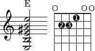
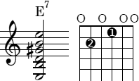
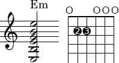
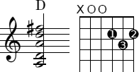
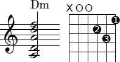
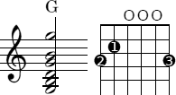
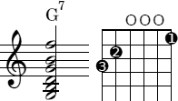
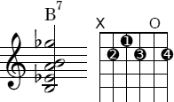
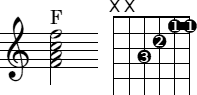
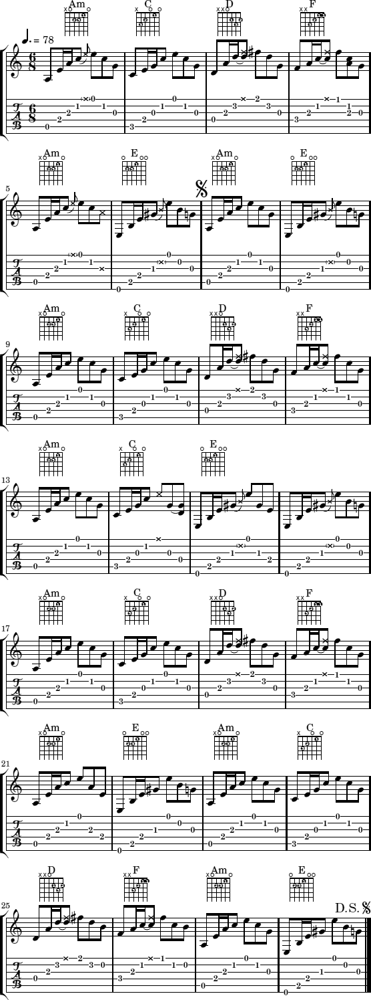

En **gitar** er et strenginstrument med vanligvis seks strenger.

Notasjon
--------

De vertikale linjene representerer strenger, og de horisontale linjene bånd:

Man nummererer strengene fra 6 til 1, der 6. streng er den tykkeste (dypeste) og 1. streng den tynneste (lyseste). Etter standard stemming er 6. streng E, 5. streng A, 4. streng D, 3. streng G, 2. streng B (det vi på norsk kaller H) og 1. streng E -- to oktaver over 6. streng.

Diagrammet viser altså gripebrettet slik det ser ut hvis man holder gitaren loddrett fremfor seg.

Når man «presser ned på 1. bånd», trykker man egentlig fingeren ned på strengen *like ovenfor* båndet. Se for eksempel på akkorden E, hvor pekefingeren presser ned 3. streng på 1. bånd, langfingeren 5. streng på 2. bånd og ringfingeren 4. streng på 2. bånd:

Sammenlign gjerne med videoen:

<iframe width="560" height="315" src="https://www.youtube.com/embed/yf_9ygMjaJ8" frameborder="0" allowfullscreen></iframe>

Ellers presiseres det at de følgende akkordene er navngitt med *engelsk* besifring. Dette gjør ikke noen forskjell unntatt i følgende tilfeller: Det vi nordmenn kaller H, kaller engelskmennene *B*, og det *vi* kaller B (eller «*b* for H»), kaller de *B flat* (B&#9837; eller «*b* for B»). Den eneste av akkordene over som påvirkes av dette, er (engelsk) B^7^, som på norsk besifres H^7^.

Akkordrepertoar for nybegynneren
--------------------------------

Dette er de [femten første akkordene man bør lære seg](http://www.amazon.com/dp/0679742751/). Når man mestrer dem, kan man spille et forenklet arrangement av mange populære sanger.

  

  

  

  

  

**X** = strengen skal ikke brukes. **O** = strengen skal slås an åpen (løs streng). **1** = pekefinger, **2** = langfinger, **3** = ringfinger, **4** = lillefinger. Klikk på akkorden for å høre hvordan den lyder.

Det anbefales å begynne med D, deretter A og E, så G, C, Am, Em og Dm før man eventuelt prøver seg på den «vriene» F. Hvis man står fast og ikke har noen som kan vise en, søk opp instruksjonsvideoer på YouTube og studer fingerstillingen. [justinguitar.com](http://www.justinguitar.com/) er et godt utgangspunkt:

<iframe width="560" height="315" src="https://www.youtube.com/embed/VsikHXIkk7g" frameborder="0" allowfullscreen></iframe>

<iframe width="560" height="315" src="https://www.youtube.com/embed/yf_9ygMjaJ8" frameborder="0" allowfullscreen></iframe>

<iframe width="560" height="315" src="https://www.youtube.com/embed/EQ7YMK1JpS4" frameborder="0" allowfullscreen></iframe>

<iframe width="560" height="315" src="https://www.youtube.com/embed/755CdzvXp8E" frameborder="0" allowfullscreen></iframe>

Slå an alle strengene samtidig, plukk ut hver enkelt streng og hør om den låter klart, og slå an på nytt («strum, pick out, strum»). Øv på å bytte fra en akkord til en annen, f.eks. så mange bytter i løpet av ett minutt som mulig.

For akkorden D er det for øvrig valgfritt om man vil slå an 5. streng eller ikke. Tas den med, får akkorden en «mørkere» klang. I samspill med akkorder med færre strenger bør den imidlertid utelates, da den ellers blir for «kraftig».

Når man kan spille alle akkordene rent og kjapt, er neste kneik for venstrehånden Barré-grep.

Barré-grep
----------

Ekte F:

<iframe width="560" height="315" src="https://www.youtube.com/embed/755CdzvXp8E" frameborder="0" allowfullscreen></iframe>

Følgende tips kan kanskje være til hjelp:

-   **Jo nærmere båndet man presser ned strengen, jo mindre kraft trenger man å bruke.** Legg merke til at når Justin bruker siden av pekefingeren til å presse ned 1. og 2. streng, så utnytter han dette prinsippet så til fulle at det *ser ut som om* fingeren presser ned direkte på båndet (noe man *aldri* gjør); fingeren ligger bare over båndet slik at *kanten* til fingeren kan presse ned *rett bak* båndet. Man ønsker å presse ned så nært opptil båndet som mulig, men ikke lenger.
-   **La tommelen presse imot fra undersiden.** Arbeidet som skal utføres, blir mye lettere dersom man deler det mellom musklene i tommelen og musklene i pekefingeren, fremfor å la pekefingeren gjøre hele jobben alene. Bruk tommelen og pekefingeren som en «klype» og klem til. Dette blir selvsagt lettere ettersom man utvikler mer styrke i fingrene og lærer seg å presse på den beste måten.

Hva man enn gjør, så ikke gi opp å lære Barré-grep -- det er en vanskelig kneik å komme over, men gevinsten ved å mestre flyttbare akkorder er en helt ny verden av muligheter hvor man ikke trenger å begrense seg til den nederste delen av gripebrettet bare fordi det er der de åpne akkordene ligger.

Noter {.collapse}
-----

### House of the Rising Sun {.collapse}

[LilyPond](hotrs.ly), [ohdan-PDF](ohdan.pdf).

Kryss (×) betyr her at strengen skal dempes med venstre hånd, men *fortsatt høres*. Alternativt kan man sørge for å ikke slå an strengen like hardt. Hilton Valentine i Animals skal ha spilt med plekter, men [fingrene inklusive lillefingeren](http://www.guitarchordsmagic.com/guitar-song-chords/house-of-the-rising-sun.html) kan også brukes.

(Jeg søkte nettet rundt etter noter til denne klassikeren uten å finne noe som holdt mål. Det som fantes av gratis «tabs», var bare omtrentlig, og *samtlige* «previews» på kommersielle nettsteder inneholdt graverende feil mht. fingerspill, forsiringer, etc. Ett hederlig unntak skal imidlertid nevnes: En Power Tab-utskrift med den mystiske teksten «Transcribed by ohdan» gjengir Animals' arrangement med imponerende presisjon. Dette er for eksempel de *eneste* notene jeg fant som legger merke til den lille tersen i fjerde takt. De ser ut til å stamme fra [Power Tabs Network](http://www.powertabs.net/tablature.php?id=13097), som for tiden er ute av drift, så jeg legger dem ved her for sammenligning.

Mine egne noter baserer seg på dette, men retter opp enkelte unøyaktigheter hos «ohdan», blant annet en forveksling av E med E^7^. 40 sekunder ute i Animals' versjon kommer orgelet inn og gitaren trer i bakgrunnen, så jeg begrenser meg til begynnelsen av denne gjentagende sangen, hvor alle de små forsiringene faktisk er hørbare. Orgelet stjeler jo showet så til de grader, så presist gitarspill er ikke like viktig etter dette punktet.)

### The Nobodies {.collapse}

[LilyPond](thenobodies.ly).

Tallene under tabulaturet er fingersetning for venstre hånd, der 1 = pekefinger, 2 = langfinger, 3 = ringfinger og 4 = lillefinger. For høyre hånd er en vanlig teknikk at tommelen slår an 6.--4. streng («basstrengene»), pekefingeren 3. streng, langfingeren 2. streng og ringfingeren 1. streng, slik det er vist i denne videoen:

<iframe width="560" height="315" src="https://www.youtube.com/embed/WW8RlKJwOZA" frameborder="0" allowfullscreen></iframe>

Resten av låten kan spilles med Barré-grep (tabulatur) eller [åpne akkorder](#Akkordrepertoar-for-nybegynneren) (fret-diagram). I sistnevnte tilfelle kan F-en gjerne byttes ut med F^maj7^, som er lettere å spille:

Dette er faktisk *nærmere* opp mot den originale fremførelsen, hvor de lysere strengene slås an åpne.

### Hallelujah {.collapse}

[PDF](hallelujah.pdf), [LilyPond](hallelujah.ly).

Eksterne linker
---------------

-   [justinguitar.com](http://www.justinguitar.com/)
-   [Gitartråden for nybegynnere](http://www.diskusjon.no/index.php?showtopic=656750) (Diskusjon.no)
    -   [Batteritid](http://www.diskusjon.no/index.php?showtopic=391636&view=findpost&p=10530493)
    -   [eBay](http://www.diskusjon.no/index.php?showtopic=391636&view=findpost&p=9165085)
    -   [Festing av strenger](http://www.diskusjon.no/index.php?showtopic=391636&view=findpost&p=8978893)
    -   [Forvrengning](http://www.diskusjon.no/index.php?showtopic=391636&view=findpost&p=8474003)
    -   [Glade jul](http://www.diskusjon.no/index.php?showtopic=391636&view=findpost&p=11943784)
    -   [Humbucker](http://www.diskusjon.no/index.php?showtopic=391636&view=findpost&p=7256730)
    -   [Justering av tremolo](http://www.diskusjon.no/index.php?showtopic=391636&view=findpost&p=8379154) (med [illustrasjoner](http://www.diskusjon.no/index.php?showtopic=391636&view=findpost&p=8379475))
    -   [Kabler](http://www.diskusjon.no/index.php?showtopic=391636&view=findpost&p=11290271)
    -   [Kammertone](http://www.diskusjon.no/index.php?showtopic=391636&view=findpost&p=7822077)
    -   [Oljing av gripebrettet](http://www.diskusjon.no/index.php?showtopic=391636&view=findpost&p=6320495)
    -   [Pedaler med bypass](http://www.diskusjon.no/index.php?showtopic=391636&view=findpost&p=9028852)
    -   [Radiorør og transistorer](http://www.diskusjon.no/index.php?showtopic=391636&view=findpost&p=5796973)
    -   [Reparere skader på polylakk](http://www.diskusjon.no/index.php?showtopic=391636&view=findpost&p=12047753) ([bilde](http://www.diskusjon.no/index.php?showtopic=391636&view=findpost&p=5537841))
    -   [Straplocks](http://www.diskusjon.no/index.php?showtopic=391636&view=findpost&p=8902180)
    -   [Summing](http://www.diskusjon.no/index.php?showtopic=391636&view=findpost&p=7250246)
