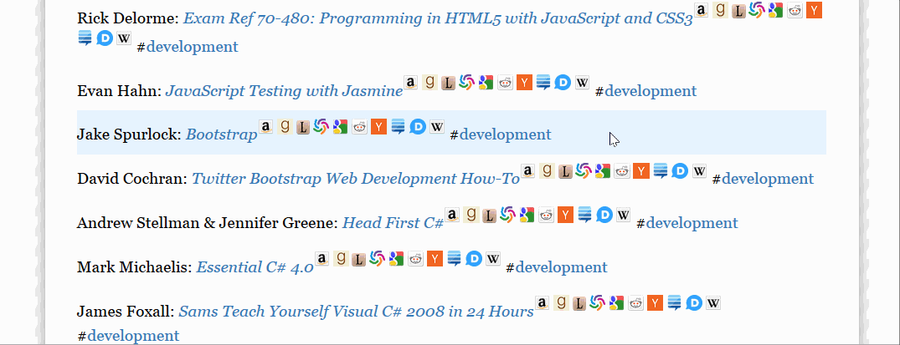

Reading list
============

> A [markdown-it](https://github.com/markdown-it/markdown-it) template
> for writing reading lists in
> [Markdown](http://daringfireball.net/projects/markdown/syntax).

Description
-----------

Book entries are linkified with references to the local
[Calibre](http://calibre-ebook.com/) library, as well as
[Amazon.com](http://www.amazon.com/),
[Goodreads](http://www.goodreads.com/),
[LibraryThing](http://www.librarything.com/),
[WorldCat](http://www.worldcat.org/),
[Google Books](http://books.google.com/),
[Reddit](http://www.reddit.com/),
[Hacker News](http://news.ycombinator.com/),
[Stack Exchange](http://stackexchange.com/),
[Medium](http://medium.com/) and
[Wikipedia](http://en.wikipedia.org/wiki/Main_Page).

Furthermore, #hashtags may be used to group books into sub-lists.

Usage
-----

Edit `list.txt` in a text editor and add or remove book entries.

Open `index.html` to view the result.

### Example

Reading list in Markdown:

    - Matthew MacDonald: *HTML5: The Missing Manual* #development
    - ~~Erich Gamma & Richard Helm & Ralph Johnson & John Vlissides: *Design Patterns*~~ #development
    - Steve Krug: *Don't Make Me Think!* #design
    - Garr Reynolds: *Presentation Zen* #presentation

How it is rendered as HTML:

### Configuration

[Calibre](http://calibre-ebook.com/)'s web server should be configured
to run on port 8080 (see the options
`$.fn.readingList.defaults.calibreHost` and
`$.fn.readingList.defaults.calibrePort` in `readinglist.js`).

To do
-----

Reading the contents of `list.txt` by using a hidden `iframe`
works well in Firefox and Internet Explorer, but not Chrome.
Chrome sets limitations on local file access and requires both
`index.html` and `list.txt` to be hosted on a server, for example
[http-server](https://www.npmjs.com/package/http-server):

    npm install -g http-server
    http-server -a localhost -p 80

This will host the files on <http://localhost/>.

Tested methods:
[iframe](http://stackoverflow.com/questions/1796619/how-to-access-the-content-of-an-iframe-with-jquery),
~~[$.load()](http://api.jquery.com/load/)~~,
~~[$.get()](https://api.jquery.com/jquery.get/)~~,
~~[XMLHttpRequest](http://stackoverflow.com/questions/14446447/javascript-read-local-text-file)~~.
The Markdown conversion is performed on-the-fly in the browser, and
the links are added with a bit of jQuery in `custom.js`. It might be
faster to preprocess the HTML document with
[jsdom](http://www.2ality.com/2012/02/jsdom.html).

License
-------

[![License][license-image]][license-url]

Released under the MIT License. See the [LICENSE](LICENSE) file
for details.

[license-image]: https://img.shields.io/npm/l/markdownlint.svg
[license-url]: http://opensource.org/licenses/MIT

Alternatives
------------

Websites:

-   [Amazon.com: Your Lists](http://www.amazon.com/gp/lists/homepage.html)
-   [Goodreads Listopia](http://www.goodreads.com/list)
-   [LibraryThing Lists](http://www.librarything.com/lists)

Apps:

-   [Stacks](https://itunes.apple.com/us/app/stacks-a-modern-reading-list/id734184669)
-   [Reading List](https://itunes.apple.com/us/app/reading-list-keep-track-your/id1050466668)

Calibre plugins:

-   [Goodreads Sync](http://www.mobileread.com/forums/showthread.php?t=123281)
-   [Reading List](http://www.mobileread.com/forums/showthread.php?t=134856)
