title: Virtuell arm for funksjonshemmede
abstract: Rapport om prototype til en tungestyrt musepeker for bevegelseshemmede.
footnotes-title: Fotnoter
hard_line_breaks: false
stylesheet: css/style.css
script: js/custom.js
mathjax: true
---

Rapport om prototype til en tungestyrt musepeker for bevegelseshemmede.
**[PDF-utgave](rapport.pdf)**.

---

Stian Rishaug, Bastian S. Solem, Aleksander Uthus og Vegard Øye.

Veileder: Herman Ranes.

Oppdragsgiver: SINTEF.

---

### Sammendrag

På oppdrag fra SINTEF er det laget en prototype til en *tungestyrt
musepeker* som kan brukes på Microsoft Windows via standard
HID-musegrensesnitt. Musepekeren aktiveres av forspente trykkfølsomme
resistanser av typen FSR-400 og FSR-402. Disse sensorene er svært
følsomme, og har en hysteresefunksjon ved kontinuerlig trykk. Det er
derfor laget en automatisk kalibreringsrutine som bruker av musen kan
aktivere manuelt i tilfellet musepekeren oppfører seg uønsket.

For plassering av sensorene er det laget en justerbar *hodebøyle*.
Hodebøylen er bygd av et noe svakt material, og måten sensorene er
festet på, bør forskes videre på. Ved videreutvikling av den valgte
designen kan hodebøylen bli meget bra.

Elektronikken som behandler data og «styrer» musepekeren, er
demokretsen *AT90USBKey* fra Atmel. Kretsen har innebygde ADC-er, som
benyttes til tolking av sensordata. Den gjør bruk av USB-grensesnittet
for overføring av data, så vel som energitilførsel. Det er integrert
en spenningsregulator som benyttes til å forspenne sensorene.
Regulatoren er sterk nok til å forsyne eventuelle tilleggskretser.

Programkoden er skrevet for å være fleksibel angående antall sensorer
og portene de kobles til, så vel som valg av mikrokontroller.
Programkoden foreligger som vedlegg til rapporten.

Bruk av musen fungerer slik: Brukeren starter en bevegelse og stopper
eller endrer retning ved ønsket plassering. Pekeren seg langsomt til å
begynne med for å gi god presisjon. Man kan snakke mens man beveger
musepekeren over skjermen, og det er mulig å be venstre museknapp være
aktiv mens man beveger musepekeren over skjermen. Det er også mulig å
sette musen i en «scroll»-modus som gjør surfing av nettsider og
lesing av dokumenter meget behagelig.

Utgiftene ved prosjektet var minimale, estimert til ca. 2000 NOK.

På bakgrunn av rapporten konkluderer prosjektgruppen med at *det er
mulig å lage en tungestyrt musepeker med de valgte sensorene*. Det
mekaniske og ergonomiske må imidlertid forbedres for å få et salgbart
produkt.

Forord
======

Rapporten er en avsluttende bacheloroppgave i elektro- og datateknikk:
fordypning i elektronikk ved Høyskolen i Sør-Trøndelag. Oppgaven er
definert i sammarbeid med SINTEF og veileder Herman Ranes fra HiST.
Arbeidet er utført i HiST sine lokaler og har hatt en varighet fra 26.
januar 2009 frem til 25. mai 2009. Rapporten er et resultat av drøye 4
måneders forskning og uttesting av en prototype for en tungestyrt
datamus som kan brukes i Microsoft Windows. Bakgrunnen for oppgaven er
å gi en konklusjon til SINTEF, om det er mulig bruke trykkresistive
følere av typen FSR-400 og FSR-402 for dette formålet. Det er ønsket å
kunne gi et svar på om denne teknologien er tilstrekkelig for å gi en
løsning på problemstillingen.

**Vi vil i denne anledning rette en takk til**

*Ansatte ved HiST*

-   Herman Ranes
-   Rolf Kristian Snilsberg

*Personer med tilknytning til rapporten*

-   Tone Berg
-   Mats Ekström

Trondheim, 24. mai 2009

1 Innledning
============

> Resultatet av prosjektet skal bli en prototype for tungestyrt
> musepeker som kan brukes på Microsoft Windows. Denne prototypen skal
> lages med trykkfølsomme resistanser. Ettersom det ikke finnes noe
> tilsvarende produkt på det norske markedet, kan et vellykket produkt
> dekke et viktig behov for funksjonshemmede som er ute av stand til å
> bruke en håndstyrt datamus.

1.1 Bakgrunn/tidligere løsninger
--------------------------------

Bacheloroppgave på oppdrag fra SINTEF: Det skal bygges et verktøy for
funksjonshemmede som lar datamusen styres med tungen. Prosjektet
fokuserer på å kartlegge hvor godt ideen med tungesensorer fungerer i
praksis. Overfor oppdragsgiver er det *toårig taushetsplikt*, siden
oppdragsgiver ønsker å kunne bruke resultatene av prosjektet til egne
formål. Prosjektgruppen består av fire studenter på tredje året
bachelor i elektro- og datateknikk: fordypning i elektronikk ved
Høyskolen i Sør-Trøndelag. Ved tidligere prosjekter er det gjort
forsøk med:

-   Induktive følere (reagerer på metall og er billige i innkjøp)
-   Touch (en form for kapasitiv føler)
-   IR (vanskelig metode for avlesning)
-   Kapasitive følere (svært dyre i innkjøp)

Det er ønskelig at gruppen starter prosjektet fra «scratch», for å se
om resultatet benytter seg av alternative metoder til dem som er brukt
tidligere.

1.2 Problemstilling {#sec-hovedproblemstilling}
-------------------

Ved endt prosjekt skal det legges frem en prototype som kan styre
musepekeren i Microsoft Windows ved bruk av tungen, og som har de
samme mulighetene som en ordinær mus. Prosjektgruppen har fått utdelt
trykksensorer (FSR-400 og FSR-402), produsert av Interlink Electronics
(sensorene [kapittel 2](#sec-sensorkap)). Prosjektet skal kunne svare
på om sensorene kan brukes til et ferdig produkt. Det skal kommes frem
til en konfigurasjon av sensorplassering, og algoritmer for behandling
av sensordata.

### 1.2.1 Hva skal gjøres og hvordan

-   Kartlegge hvordan de utdelte sensorene kan brukes
    ([kap. 2](#sec-sensorkap)).
-   Det skal lages en hodebøyle for enkel bruk av datamusen
    ([kap. 3](#sec-hodeboyle)).
-   Det skal lages en krets for signalbehandling, fortrinnsvis en
    mikrokontroller med ADC ([kap. 5](#sec-elektronikk)).
-   Overføringsgrensesnitt mot Microsoft Windows -- Bluetooth/USB
    ([kap. 5](#sec-elektronikk)).
-   Det skal tas standpunkt til hvor prosesseringen av data skal
    foregå, før eller etter signalet har kommet til datamaskinen
    ([kap. 5](#sec-elektronikk)).
-   Valg av sensorkonfigurasjon, antall og plassering,
    brukergrensesnitt ([kap. 6](#sec-funksjonalitet)).
-   Program for tolkning av avlest sensordata må skrives
    ([kap. 6](#sec-funksjonalitet)).

### 1.2.2 Overordnet spesifikasjon av konseptet {#sec-produktspes}

Bruken av funksjonene er beskrevet i
[kapittel 6](#sec-funksjonalitet), som tar for seg funksjonalitet og
brukergrensesnitt. Konseptet skal inneholde disse standard
musefunksjonene:

-   Bevegelse
    -   Horisontal
    -   Vertikal
    -   Diagonalt
    -   3 Hastigheter
-   Knapper
    -   Venstre museknapp
    -   Høyre museknapp
    -   Scroll

Festemekanismen beskrevet i [kapittel 3](#sec-hodeboyle) er en
hodebøyle med disse spesifikasjonene:

-   Behagelig å bruke, også over lengre tid (viktig at det ikke er for
    tungt).
-   Uproblematisk å ta utstyret av/på for en person som skal hjelpe
    brukeren.
-   Tilpassningsmulighet for flere brukere uansett hodestørrelse/form.
-   Det skal være et godt press på sensorene mot kinnet, slik at det
    er lett å bruke musen.

For hodebøylen er utseendemessig design nedprioritert. Av funksjoner
er ingen valgt bort.

2 Sensorene {#sec-sensorkap}
===========

> Tar for seg forspenningskretsen i teori og praksis. Teorien tilsier
> at sensorene bør forspennes med en motstand på 8--15 kΩ. Målingene
> viser hvordan sensorene oppfører seg under ulike omstendigheter.
> Sensorkarakteristikken setter krav til en dynamisk verdi for
> hendelsesaktivering, og kontinuerlig kalibrering.

2.1 Teori: forspenning av trykksensorene
----------------------------------------

> {#fig-trykksensorer}
>
> **Figur 2.1:** Resistive trykksensorer

Sensorene som brukes, er *resistive trykksensorer*
([fig. 2.1](#fig-trykksensorer)), eller trykkfølsomme motstander. De
består av av to deler: polymerbasert tykkfilm koblet til et resistivt
materiale, og polymerbasert tykkfilm koblet til elektroniske
kontakter. Polymer er en type bindingsmiddel som brukes på motstander
og ledere. Når dette presses sammen, gir det økt konduktivitans
(lederevne) gjennom kretsen [[Vedlegg 2](#ref-interlink)].

Dermed fungerer sensorene som en variabel motstand under trykk (jo
høyere trykk, jo lavere resistans), og som et brudd (uendelig
resistans) ellers.

> {#fig-sensortyper width=255}
>
> **Figur 2.2:** Sensor type FSR-400 (a), sensor type FSR-402 (b).
> Millimetermål er gitt i klammer.

Sensorene, som produseres av Interlink Electronics,[^1] kommer i to
typer ([fig. 2.2](#fig-sensortyper)): (a) en *liten* sensor med en
diameter på 8 mm (FSR-400), og (b) en *stor* sensor på 18 mm
(FSR-402). Det trykkfølsomme området er litt mindre og er på hhv. 5 mm
og 14 mm.

> 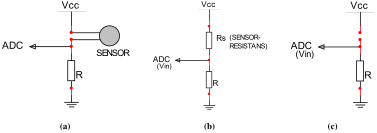{#fig-sensor width=569}
>
> **Figur 2.3:** Forspenning av trykksensor (a), spenningsdeling (b) og brudd (c)

For å få målbare trykkverdier, må sensorene *forspennes*
([fig. 2.3a](#fig-sensor)). Hver sensor kobles i serie med en motstand
$R$, som går til jord. I den andre enden påtrykkes en
tilførselsspenning $V_{CC}$ på 3,3 V. Dette oppsettet gir en
spenningsdeling mellom sensorresistansen, $R_S$, og $R$:

$$\begin{equation}\label{eq:spenningsdeling}
    V_{IN} = V_{CC} \cdot \frac{R}{R_S + R}
  \end{equation} $$

$V_{IN}$ sendes inn på analog-til-digital-omformeren på kortet
(ADC-en), og er altså verdien som programmet på mikrokontrolleren
«ser». Gjennom ADC-en får vi en overgang fra den *fysiske* størrelsen
$V_{IN}$ til den *digitale* 8-bit verdien `ADC_VARIABEL` i
programkoden:

$$\begin{equation}\label{eq:datablad}
    \text{ADC_VARIABEL} = \frac{V_{IN} \cdot 255}{V_{REF}}
  \end{equation} $$

$V_{REF}$ er *referansespenningen* og er lik $V_{CC}$. Den maksimale
verdien for `ADC_VARIABEL`, 255, svarer dermed til 3,3 V, og
`ADC_VARIABEL` er proporsjonal med $V_{IN}$.

For å velge en passende verdi for forspenningsmotstanden $R$, må vi se
hvordan den påvirker forholdet mellom trykk og spenning. Dette
forholdet kan brytes opp i to mindre: forholdet mellom trykk ($\rho$)
og sensorresistans ($R_S$), og forholdet mellom sensorresistans
($R_S$) og målt spenning ($V_{IN}$).

Målinger på $\rho$--$R_S$-forholdet er gitt i
[avsnitt 2.2](#sec-malinger), og kan i korte trekk oppsummeres slik:
for lette trykk er $R_S \approx 100$ kΩ, og for harde trykk går $R_S$
ned til 20 kΩ, med sterkt avtagende stigning
([fig. 2.10](#fig-litenok)). Forholdet er altså sterkt ulineært: $R_S$
er stor når $\rho$ er liten, og $R_S$ er liten når $\rho$ er stor.

Det samme gjelder for $R_S$--$V_{IN}$-forholdet, gitt i ligning
$\eqref{eq:spenningsdeling}$: når den ene går opp, går den andre ned.
Summen av disse to «inverse» forholdene er at $\rho$ og $V_{IN}$ øker
i takt: når trykket øker, så øker den målte spenningen, og når trykket
minker, så minker spenningen. Når $\rho = 0$, så er også $V_{IN} = 0$,
og i programkoden har `ADC_VARIABEL` verdien 0. Dette er det ideelle
*nullnivået*, verdien når sensoren ikke er i bruk. {#sec-nullnivaa}

> {#fig-vin width=620}
>
> **Figur 2.4:** $V_{IN}$ som funksjon av $R$ og $R_S$, ligning $\eqref{eq:spenningsdeling}$

Hvis 0 V er spenningen som måles for intet trykk, hva er da spenningen
for et lett trykk (når $R_S = 100$ kΩ)? Det er viktig at denne verdien
ikke er for lav, ellers vil den ikke reliabelt kunne skilles fra
nullnivået: $V_{IN\text{min}} > 0$ V. [Figur 2.4](#fig-vin) viser
hvordan forspenningsmotstanden $R$ innvirker på forholdet mellom $R_S$
og $V_{IN}$. Når sensoren tas i bruk, vil vi få et *sprang* på minst
minimumsverdien, $V_{IN\text{min}}$, som selvfølgelig ikke bør være så
lav at spranget ikke registreres. Men den bør heller ikke være for
høy, ellers får vi ikke utnyttet intervallet av $V_{IN}$-verdier
(verdiområdet) skikkelig.

Vi ser også at sammenhengen mellom $R_S$ og $V_{IN}$ blir *mer
ulineær* for lavere verdier av $R$. Ulinearitet er ikke nødvendigvis
negativt. Si at vi ønsker at pekerfarten skal være konstant for lette
trykk ($R_S = \text{40--100}$ kΩ), men at den skal øke for harde trykk
($R_S < 40$ kΩ). Da er det gunstig med *lav oppløsning* for «lette
trykk» og *høy oppløsning* for «harde trykk». Det vil si at vi bruker
en større del av intervallet av $V_{IN}$-verdier til å differensiere
mellom de «harde trykkene», mens de «lette trykkene» delegeres til et
snevrere utsnitt.

Veier vi disse hensynene opp mot hverandre, ser vi at en motstand på
8--15 kΩ kan være egnet. Dette gir
$V_{IN\text{min}} = \text{0,24--0,43}$ V, som svarer til
`ADC_VARIABEL` = 19--33: godt over det ideelle nullnivået, og god
utnyttelse av verdiområdet.

Men hvordan fungerer sensorene i praksis? Endres sensorresistansen
over tid? Er nullnivået alltid 0 V? For å få svar på disse
spørsmålene, må vi foreta noen målinger.

[^1]: Nettside: <http://www.interlinkelectronics.com/>.

2.2 Målinger {#sec-malinger}
------------

For å fastslå hvordan sensorene oppfører seg under ulike
omstendigheter, er det foretatt tre forskjellige typer målinger på
sensorene. Denne informasjonen er nødvendig for å avgjøre sensorenes
muligheter og begrensninger. Utstyret som er benyttet for disse
målingene er gitt i [tabell 2.1](#tab-utstyrliste).

> **Tabell 2.1:** Utstyrsliste {#tab-utstyrliste}
>
> |                    |                      |
> | ------------------ | -------------------- |
> | Instrument/maskin  | Type/data            |
> | Motstand           | 8,2 kΩ               |
> | Spenningsforsyning | 4,5 V                |
> | Vektenhet          | 4,35 g (kronestykke) |
> | Vektarm            | 18 g                 |
> | Multimeter         |                      |

For å øve et konstant trykk på sensorene, er det brukt en arm som det
blir lagt vektenheter på, [figur 2.6](#fig-malepinne). Hvor på
sensorens overflate trykket settes, innvirker på motstandsverdien, men
armen sørger for å holde kontaktflaten og trykkområdet tilnærmet
konstant, [figur 2.7](#fig-sensorpress). Uten vektenheter veier armen
18 g.

### 2.2.1 Motstandsverdi ved varierende trykk FSR-400 {#sec-litenvar}

Motstandsverdien til $R_S$ (i kΩ) måles som direkte følge av trykk på
overflaten til en sensor av typen FSR-400 (liten sensor). Målingene
foretas med 5 s mellomrom. Hensikten med denne målingen er å se
hvordan et konstant trykk påvirker $R_S$ over tid og hva som skjer når
trykket minker. Går $R_S$-verdien tilbake til utgangspunktet, eller er
den endret som følge av at sensoren har vært i bruk? Dette er et
viktig spørsmål hva [nullnivået](#sec-nullnivaa) angår.

Måleresultatene er gitt i [tabell 2.2](#tab-litenvar) og
[figur 2.5](#fig-litenvar).

#### 2.2.1.1 Drøfting av resultatene

Som man kan se av [tabell 2.2](#tab-litenvar) er resistansen i
sensoren ved 26,7 g (tilstand 0) lik uendelig -- sensoren leder ikke.
Når trykket så øker til 31,05 g (tilstand 1), leder sensoren. Deretter
lar man sensoren være i tilstand 1 i 20 s, og observerer at
resistansen minker, se [figur 2.5](#fig-litenvar). Men når man nå går
tilbake til tilstand 0, kan man se at sensoren *fortsatt leder*.

Sensorresistansen har altså en slags *hysteresefunksjon*. Over tid vil
denne hysteresen øke noe. Dette må det tas høyde for når sensorene
skal avleses: Man kan ikke sammenligne de avleste verdiene med et
fastsatt nullnivå på 0 V, men må i stedet sørge for å *kalibrere*
nullnivået med jevne mellomrom.

> **Tabell 2.2:** Liten sensor, varierende vekt {#tab-litenvar}
>
> | Vektenheter [stk.] | Tillegg til arm [g] | Total vekt [g] | $R_S$ [kΩ] |
> | ------------------ | ------------------- | -------------- | ---------- |
> | 0                  | 0,00                | 18,00          | --         |
> | 2                  | 8,70                | 26,70          | --         |
> | 3                  | 13,05               | 31,05          | 111        |
> | 3                  | 13,05               | 31,05          | 97         |
> | 3                  | 13,05               | 31,05          | 93         |
> | 3                  | 13,05               | 31,05          | 70         |
> | 2                  | 8,70                | 26,70          | 120        |
> | 3                  | 13,05               | 31,05          | 74         |
> | 2                  | 8,70                | 26,70          | 108        |
> | 3                  | 13,05               | 31,05          | 71         |
> | 3                  | 13,05               | 31,05          | 69         |
> | 3                  | 13,05               | 31,05          | 66         |
> | 2                  | 8,70                | 26,70          | 87         |

> 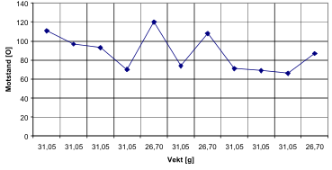{#fig-litenvar width=555}
>
> **Figur 2.5:** Liten sensor, varierende vekt ([tabell 2.2](#tab-litenvar))

### 2.2.2 Spenningsverdi ved økende trykk, vektene av mellom hver måling {#sec-okav}

Sensorene blir koblet opp som i [figur 2.3](#fig-sensor) og spenningen
over $R$ blir målt ved trykk på sensoren. Mellom hver måling tas
vektene av, og trykket blir 18 g.[^2] Målingene foretas 5 s etter at
vekten er lagt på. Spenningen som måles er spenningen ADC-en på kortet
ser, så hensikten er å måle hvordan spenningen stiger ved enkelttrykk.

[^2]: Lar målearmen ligge for å holde trykkområdet konstant. Vekten på
armen er så liten at sensorene påvirkes minimalt av denne, se
[kapittel 2.2.1](#sec-litenvar).

For målingene gjelder ligning $\eqref{eq:spenningsdeling}$, samt
sammenhengene

$$\begin{aligned}
  R_S &= \frac{V_{CC} - V_R}{I_R}\label{eq:resistans}\\
  I_R &= \frac{U_R}{R}\label{eq:strom}\end{aligned} $$

Målingene er foretatt med $V_{CC} = 4,5$ V og $R = 8,2$ kΩ. Valget av
verdier er basert på utstyret som var tilgjengelig da målingene ble
foretatt.

Resultatene for *liten sensor* (FSR-400) er gitt i
[tabell 2.3](#tab-litenokav) og [figur 2.8](#fig-litenokav), og
resultatene for *stor sensor* (FSR-402) er gitt i
[tabell 2.4](#tab-storokav) og [figur 2.9](#fig-storokav).

#### 2.2.2.1 Drøfting av resultatene

Av [figur 2.8](#fig-litenokav) og [2.11](#fig-storok), som viser
spenning og motstand mot trykk for hhv. liten og stor sensor, kan man
se at de to typene gir ganske like resultater. Den store sensoren har
en noe brattere kurve. Dette kan komme av den større overflaten, og at
buen på overflatemembranen minker resistansen over et større område
enn det som faktisk er i kontakt med armen, illustrert i
[figur 2.7](#fig-sensorpress).

Det kommer frem av resultatene i [figur 2.8a](#fig-litenokavspenning)
og [figur 2.9a](#fig-storokavspenning) at spenningens stigningsendring
er ganske jevnt fordelt over trykkområdet. Det er derimot ikke den
fallende endringen til sensorverdien som man kan se i
[figur 2.8b](#fig-litenokavmotstand) og
[figur 2.9b](#fig-storokavmotstand). Dette skyldes den ulineære
sammenhengen i ligning $\eqref{eq:spenningsdeling}$.

Spenningsstigningen har noen ujevnheter, dette kan være fordi
kontaktpunktet har en unøyaktighet på $\pm 1$ mm når vektene tas av.

> {#fig-malepinne}
>
> **Figur 2.6:** Arm for å legge vekt(er) på sensorene

> 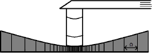{#fig-sensorpress}
>
> **Figur 2.7:** Sensor under trykk

> **Tabell 2.3:** Liten sensor, økende vekt, vektene av mellom hver måling {#tab-litenokav}
>
> | $V_R$ [V] | Vekt [g] | Vektenheter [stk.] | Utr. $I_R$ [µA] | Utr. $R_S$ [kΩ] |
> | --------- | -------- | ------------------ | --------------- | --------------- |
> | 0,20      | 18,00    | 0                  | 24,39           | 176,30          |
> | 0,38      | 22,35    | 1                  | 46,34           | 88,91           |
> | 0,72      | 26,70    | 2                  | 87,80           | 43,05           |
> | 1,02      | 31,05    | 3                  | 124,39          | 27,98           |
> | 1,13      | 35,40    | 4                  | 137,80          | 24,45           |
> | 1,28      | 39,75    | 5                  | 156,10          | 20,63           |
> | 1,29      | 44,10    | 6                  | 157,32          | 20,40           |
> | 1,56      | 48,45    | 7                  | 190,24          | 15,45           |
> | 1,60      | 52,80    | 8                  | 195,12          | 14,86           |
> | 1,70      | 57,15    | 9                  | 207,32          | 13,51           |
> | 1,67      | 61,50    | 10                 | 203,66          | 13,90           |
> | 1,75      | 65,85    | 11                 | 213,41          | 12,89           |
> | 1,90      | 70,20    | 12                 | 231,71          | 11,22           |
> | 1,96      | 74,55    | 13                 | 239,02          | 10,63           |
> | 2,01      | 78,90    | 14                 | 245,12          | 10,16           |
> | 2,07      | 83,25    | 15                 | 252,44          | 9,63            |
> | 2,12      | 87,60    | 16                 | 258,54          | 9,21            |
> | 2,18      | 91,95    | 17                 | 265,85          | 8,73            |
> | 2,20      | 96,30    | 18                 | 268,29          | 8,57            |

> **Tabell 2.4:** Stor sensor, økende vekt, vektene av mellom hver måling {#tab-storokav}
>
> | $V_R$ [V] | Vekt [g] | Vektenheter [stk.] | Utr. $I_R$ [µA] | Utr. $R_S$ [kΩ] |
> | --------- | -------- | ------------------ | --------------- | --------------- |
> | 0,27      | 18,00    | 0                  | 32,93           | 128,47          |
> | 0,63      | 22,35    | 1                  | 76,83           | 50,37           |
> | 0,96      | 26,70    | 2                  | 117,07          | 30,24           |
> | 1,25      | 31,05    | 3                  | 152,44          | 21,32           |
> | 1,35      | 35,40    | 4                  | 164,63          | 19,13           |
> | 1,54      | 39,75    | 5                  | 187,80          | 15,76           |
> | 1,65      | 44,10    | 6                  | 201,22          | 14,16           |
> | 1,65      | 48,45    | 7                  | 201,22          | 14,16           |
> | 1,67      | 52,80    | 8                  | 203,66          | 13,90           |
> | 1,80      | 57,15    | 9                  | 219,51          | 12,30           |
> | 1,90      | 61,50    | 10                 | 231,71          | 11,22           |
> | 1,94      | 65,85    | 11                 | 236,59          | 10,82           |
> | 2,08      | 70,20    | 12                 | 253,66          | 9,54            |

> {#fig-litenokavspenning width=548}
>
> (a) Spenning mot trykk
>
> {#fig-litenokavmotstand width=548}
>
> (b) Motstand mot trykk, utregnet fra (a)
>
> **Figur 2.8:** Liten sensor, økende vekt, vektene av mellom hver måling ([tabell 2.3](#tab-litenokav)) {#fig-litenokav}

> 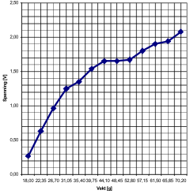{#fig-storokavspenning width=356}
>
> (a) Spenning mot trykk
>
> 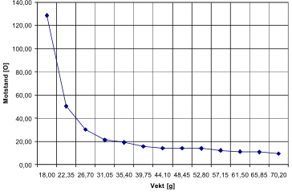{#fig-storokavmotstand width=544}
>
> (b) Motstand mot trykk, utregnet fra (a)
>
> **Figur 2.9:** Stor sensor, økende vekt, vektene av mellom hver måling
> ([tabell 2.4](#tab-storokav)) {#fig-storokav}

### 2.2.3 Spenningsverdi ved økende trykk, vektene ikke av

Som tidligere i [avsnitt 2.2.2](#sec-okav) måles spenningen over $R$,
men vektene blir nå *ikke* tatt av mellom hver måling. Dette er for å
minske muligheten for bevegelse på armen, og for å vise forventet
spenning/spenningsendring i tilfelle konstant trykk på sensoren. Her
venter man 15 s mellom målingene for å la verdien bli tilnærmet stabil
før vekten økes.

Resultatene for liten sensor er gitt i [tabell 2.5](#tab-litenok) og
[figur 2.10](#fig-litenok), og resultatene for stor sensor er gitt i
[tabell 2.6](#tab-storok) og [figur 2.11](#fig-storok).

#### 2.2.3.1 Drøfting av resultatene

Ved å sammenligne figurene [2.8](#fig-litenokav) og
[2.10](#fig-litenok) (for liten sensor) og [2.9](#fig-storokav) og
[2.11](#fig-storok) (for stor sensor), kan man se at de er ganske
like. Den første avlesningen gir imidlertid en mye høyere spenning enn
tidligere: Det er nå en differanse på ca. 0,25--0,50 V. Denne
differansen synker til ca. 0,00--0,15 V ved 70,20 g. Følgen er en
lavere stigning enn for enkelttrykkene.

Dette understreker viktigheten av kontinuerlig kalibrering av
nullnivået. Det de avleste sensorverdiene blir sammenlignet med for å
fastslå om de er i bruk, kan ikke være en konstant -- ellers vil man
kunne få hendelsesaktivering som følge av at hodebøylen presser mot
kinnet. Sensorene setter krav til en *dynamisk verdi* for
hendelsesaktivering.

> **Tabell 2.5:** Liten sensor, økende vekt, vektene ikke av mellom målingene {#tab-litenok}
>
> | $V_R$ [V] | Vekt [g] | Vektenheter [stk.] | Utr. $I_R$ [µA] | Utr. $R_S$ [kΩ] |
> | --------- | -------- | ------------------ | --------------- | --------------- |
> | 0,66      | 18,00    | 0                  | 80,49           | 47,71           |
> | 0,79      | 22,35    | 1                  | 96,34           | 38,51           |
> | 0,94      | 26,70    | 2                  | 114,63          | 31,06           |
> | 1,14      | 31,05    | 3                  | 139,02          | 24,17           |
> | 1,30      | 35,40    | 4                  | 158,54          | 20,18           |
> | 1,50      | 39,75    | 5                  | 182,93          | 16,40           |
> | 1,62      | 44,10    | 6                  | 197,56          | 14,58           |
> | 1,71      | 48,45    | 7                  | 208,54          | 13,38           |
> | 1,79      | 52,80    | 8                  | 218,29          | 12,41           |
> | 1,89      | 57,15    | 9                  | 230,49          | 11,32           |
> | 1,96      | 61,50    | 10                 | 239,02          | 10,63           |
> | 2,03      | 65,85    | 11                 | 247,56          | 9,98            |
> | 2,07      | 70,20    | 12                 | 252,44          | 9,63            |
> | 2,10      | 74,55    | 13                 | 256,10          | 9,37            |
> | 2,14      | 78,90    | 14                 | 260,98          | 9,04            |
> | 2,17      | 83,25    | 15                 | 264,63          | 8,80            |
> | 2,20      | 87,60    | 16                 | 268,29          | 8,57            |
> | 2,23      | 91,95    | 17                 | 271,95          | 8,35            |
> | 2,25      | 96,30    | 18                 | 274,39          | 8,20            |

> 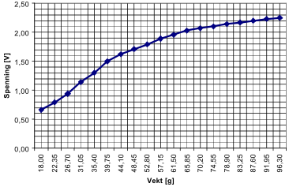{#fig-litenokspenning width=547}
>
> (a) Spenning mot trykk
>
> 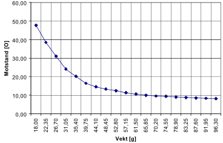{#fig-litenokmotstand width=547}
>
> (b) Motstand mot trykk, utregnet fra (a)
>
> **Figur 2.10:** Liten sensor, økende vekt, vektene ikke av mellom
> målingene ([tabell 2.5](#tab-litenok)) {#fig-litenok}

> **Tabell 2.6:** Stor sensor, økende vekt, vektene ikke av mellom målingene {#tab-storok}
>
> | $V_R$ [V] | Vekt [g] | Vektenheter [stk.] | Utr. $I_R$ [µA] | Utr. $R_S$ [kΩ] |
> | --------- | -------- | ------------------ | --------------- | --------------- |
> | 0,48      | 18,00    | 0                  | 58,54           | 68,68           |
> | 0,73      | 22,35    | 1                  | 89,02           | 42,35           |
> | 1,10      | 26,70    | 2                  | 134,15          | 25,35           |
> | 1,28      | 31,05    | 3                  | 156,10          | 20,63           |
> | 1,42      | 35,40    | 4                  | 173,17          | 17,79           |
> | 1,50      | 39,75    | 5                  | 182,93          | 16,40           |
> | 1,63      | 44,10    | 6                  | 198,78          | 14,44           |
> | 1,71      | 48,45    | 7                  | 208,54          | 13,38           |
> | 1,80      | 52,80    | 8                  | 219,51          | 12,30           |
> | 1,89      | 57,15    | 9                  | 230,49          | 11,32           |
> | 1,97      | 61,50    | 10                 | 240,24          | 10,53           |
> | 2,08      | 65,85    | 11                 | 253,66          | 9,54            |
> | 2,15      | 70,20    | 12                 | 262,20          | 8,96            |
> | 2,22      | 74,55    | 13                 | 270,73          | 8,42            |
> | 2,27      | 78,90    | 14                 | 276,83          | 8,06            |
> | 2,32      | 83,25    | 15                 | 282,93          | 7,71            |
> | 2,35      | 87,60    | 16                 | 286,59          | 7,50            |
> | 2,39      | 91,95    | 17                 | 291,46          | 7,24            |
> | 2,42      | 96,30    | 18                 | 295,12          | 7,05            |

> 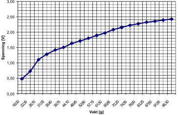{#fig-storokspenning width=545}
>
> (a) Spenning mot trykk
>
> {#fig-storokmotstand width=540}
>
> (b) Motstand mot trykk, utregnet fra (a)
>
> **Figur 2.11:** Stor sensor, økende vekt, vektene ikke av mellom målingene
> ([tabell 2.6](#tab-storok)) {#fig-storok}

3 Hodebøyle {#sec-hodeboyle}
===========

> Inneholder en oversikt over hvordan gruppen gikk frem og laget en
> prototype helt fra bunn. Den skal holde sensorene inntil kinnet og
> sende informasjon videre til kretskortet som behandler dataene.
> Prototypen som ble laget, oppfyller til en viss grad alle kravene
> satt i [produktspesifikasjonen](#sec-produktspes), men sensorene
> ligger litt dårlig mot kinnet og justeringsdelen er litt hard.

3.1 Problemstilling {#sec-hodeprob}
-------------------

> {#fig-gammelprototype}
>
> **Figur 3.1:** Skisse av prototype, laget i AutoCAD

For å benytte sensorene som tenkt, blir prosjektgruppen nødt til å
konstruere noe som holder sensorene på plass på utsiden av hvert kinn.
Siden ingen av gruppedeltagerne har noe erfaring fra lignende
prosjekter før, og det skal være en prototype, blir design
nedprioritert. Prototypen skal være behagelig å bruke, må kunne brukes
av flere brukere og være uproblematisk å ta av og på (se
[produktspesifikasjonen](#sec-produktspes)).

3.2 Gjennomføring
-----------------

Første tanke var å ta en allerede utviklet hodebøyle og sette på
sensorene. Problemet var at ingen hodebøyler til en rimelig pris var
mulig å ha helt ned til kinnet fra over hodet. Vi ble derfor nødt til
å lage det hele fra bunn av.

Ettersom utseendet ikke var så relevant, ble det i første omgang brukt
spikerbånd, som er ganske bøyelig og enkelt å arbeide med. Det ble
satt sammen med en skrue og en mutter på hver side av hodet. Det ene
båndet gikk over hodet, det andre bak ([fig. 3.2a](#fig-prototype)).
Dette fungerte, men det var uten muligheter til å justere og oppfylte
derfor ikke alle kravene i produktspesifikasjonen.

> 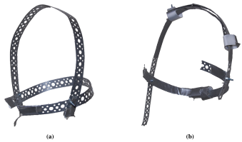{#fig-prototype width=506}
>
> **Figur 3.2:** Første (a) og andre (b) utkast av prototype for hodebøylen

Inspirasjon til videreutvikling ble hentet fra en Koss
PortaPro-hodebøyle, og det ble funnet en måte å justere hodebøylen på
([fig. 3.2b](#fig-prototype)). Kravet om å lage en justerbar prototype
som kunne tilpasses hver enkelt bruker, ble dermed oppfylt. Noe som
først ble ansett som en fordel for å holde hodebøylen godt på plass,
viste seg etter hvert å være en ulempe, for med ett bånd som gikk over
hodet, og ett som gikk bak hodet, ble det veldig problematiskt å ta
hodebøylen på og av hodet. Det ble altså nok en gang en konflikt
mellom kravene i produktspesifikasjonen og resultatet.

Etter flere forsøk med spikerbånd, ble det konkludert med at det ikke
var det best egnet metallet, siden det var svakt og knakk ofte ved mye
bøying. Det ble derfor behov for noe annet. Alternativet ble metallet
som blir brukt for å rense kloakkrør. Fordelen med dette metallet er
at det er veldig solid og meget slitesterkt, og hvis en bøyer det i
forkant, er det veldig stivt. Derfor er det mulighet til å få det
veldig stramt imellom kinn og sensor.

> {#fig-justeringsboks width=515}
>
> **Figur 3.3:** Justeringsboks med lokk (a) og uten lokk (b)

Med det nye «vidundermetallet» kunne det lages en helt ny måte å
justere hodebøylen på ut ifra inspirasjonen fra Koss PortaPro. Dette
er illustrert i [figur 3.3](#fig-justeringsboks) og
[3.4](#fig-prototype3). Hodebøylen ble laget med tre bånd på hver side
og koblet sammen med noen justeringsbokser på toppen av hodet. Det nye
justeringssystemet fungerte mye bedre enn det vi hadde fra før.
Hodebøylen var justerbart til flere brukere; å sette det av og på var
uproblematisk, og det var behagelig å ha på seg. Men kravet om at det
skulle legges press på sensorene mot kinnet, var fortsatt ikke
oppfylt.

Siden det hadde blitt bestemt at det ikke skulle være noe bak hodet
for å stramme opp, pga. praktiske årsaker, kom vi frem til at det
måtte legges et tykkere lag med metall litt lengre frem, som ble
festet til det punktet som sensorene på hodebøylen skulle festes. Ved
hjelp av dette oppfyltes alle kravene som hadde blitt satt. Det eneste
som manglet nå var å plassere sensorene og få det hele koblet til
kretskortet med mikroprosessoren. (Mer om sensorkonfigurasjon i
[kapittel 6](#sec-funksjonalitet).)

Det å få festet sensorene på hodebøylen ble gjort veldig enkelt: Først
ble det brukt to metallplater, en på hver side. Deretter ble de små
kretskortene som sensorene er koblet sammen på, festet på
metallplatene.

> {#fig-prototype3}
>
> **Figur 3.4:** Tegning av hodebøylens justeringsmuligheter

Det som nå ble vurdert, var om kretskortet som inneholder
mikroprosessoren, skulle plasseres på hodebøylen. Siden det i
utgangspunktet skulle være minst mulig på hodebøylen -- både fordi at
det skulle være så lett som mulig, og at det ikke skulle bli mye
elektronikk som en må ta hensyn til når en skal plassere hodebøylen på
brukeren -- måtte det finnes et annet alternativ. Det ble anskaffet en
større kabel med flere ledere i som ble festet på toppen av hodebøylen
og koblet til sensorene på hver sin side, slik at alle signalene fra
sensorene blir sendt samlet gjennom en kabel til prosessoren som skal
ta imot. På enden av kabelen ble det montert et motstykke til en
COM-port, dette for å gjøre det enkelt å koble hodebøylen til
«X-box»-en i [kapittel 4](#sec-xbox) ([fig. 3.5](#fig-signalkabel)).

> {#fig-signalkabel}
>
> **Figur 3.5:** Bilde av signalkabel

3.3 Resultat
------------

En prototype av en hodebøyle som oppfylte de kravene som hadde blitt
satt i forkant ([figur 3.6](#fig-ferdigprototype)). Det passer til
flere brukere ved hjelp av justeringsmulighetene, og det er lett å
koble opp og komme igang med. Det er to ulemper med den ferdige
prototypen. Den ene er at justeringsdelen er litt hard. Den andre er
at hodebøylen ikke har nok press mot kinnet hvor sensorene ligger.
(Begge disse problemene vil være enkelt å løse på en ev. ferdig
versjon ved hjelp av noen som har en bedre bakgrunn i mekanikk og ev.
annet utstyr som gruppen ikke hadde til rådighet.)

> {#fig-ferdigprototype}
>
> **Figur 3.6:** Ferdig prototype

4 X-box {#sec-xbox}
=======

> Inneholder en kort beskrivelse av hvordan «X-box»-en ble laget og
> hva den brukes til. Bakgrunnen til at «X-box»-en ble laget er gitt i
> [kapittel 3](#sec-hodeboyle). «X-box»-en skal inneholde
> elektronikken som behandler dataen fra hodebøylen, og sender den
> videre til PC-en.

4.1 Problemstilling
-------------------

> {#fig-xboxacad}
>
> **Figur 4.1:** Skisse av «X-box», laget i AutoCAD

Det var et behov for et mellomledd mellom selve musen (hodebøylen,
[kap. 3](#sec-hodeboyle)) og datamaskinen. Dette bindingspunktet måtte
enkelt kunne kobles til hodebøylen via COM-port og samtidig kunne
kobles videre via USB til PC-en. Det måtte inneholde kretskortet til
mikroprosessoren.

4.2 Gjennomføring
-----------------

Prosjektgruppen fant ut at det skulle lages en boks som skulle ha to
kontakter: En COM-port som skulle kobles til hodebøylen, den andre
kontakten skulle være USB for å kommunisere videre inn til
datamaskinen. Inne i boksen skulle det også være plass til
kretskortet, samt til å sette på testutstyr for å resette/justere
koden underveis. Det ble brukt en metalplate som bøydes 90° på hver
side. Dette utgjorde underlaget til boksen og 2 «vegger». Kretskortet
ble festet inne i boksen ved hjelp av gaffateip, og plasseringen av
kortet var så nær den ene kanten uten «vegg» slik at den lett kan
kobles til USB-kabelen (som en kan se på [fig. 4.2](#fig-xboxtopp)).
Siden det skulle være COM-kontakt mot hodebøylen, ble det laget et
hull i den ene siden hvor COM-porten ble satt inn. Det ble strukket
ledninger som på den ene siden var loddet fast til kretskortet, den
andre enden til COM-porten. Nå var det altså bare å koble i headsettet
på den ene siden, og maskinen med USB på den andre. «That's Plug 'n'
Play!»

> {#fig-xboxtopp}
>
> **Figur 4.2:** Bilde av «X-box» fra toppen

4.3 Resultat
------------

En boks som skal være et bindeledd mellom PC-en og musen
([figur 4.3](#fig-xboxferdig)). Den har en COM-port som var gruppens
løsning for å på en enkel måte koble til hodebøylen. Videre går data
fra hodebøylen inn til kretskortet, og videre til maskinen som utfører
ønskede operasjoner.

> {#fig-xboxferdig}
>
> **Figur 4.3:** Bilde av ferdig «X-box»

5 Elektronikk {#sec-elektronikk}
=============

> Dette kapittelet tar for seg valg av krets for tolking og
> digitalisering av sensordata og begrunnelse for valget. Det
> omhandler også litt om den innebygde spenningsregulatoren som bruker
> strøm fra USB eller batteri. Kapittelet avrundes med en begrunnelse
> for valg av PC-grensesnitt. AT90USBkey har de funksjonene vi lette
> etter. Den kommuniserer og får strøm via USB-porten, og har en
> innebygd spenningsregulator som blir brukt til forspenning av de
> trykkfølsome motstandene.

5.1 Problemstilling
-------------------

Det skal lages en krets for kommunikasjon med PC og Microsoft Windows.
Prosjektgruppen fokuserer på de to grensesnittene Bluetooth og USB.
Bluetooth er et trådløst grensesnitt som de fleste moderne PC-er enten
allerede har mottager for eller mulighet for å installere. USB er det
mest brukte grensesnittet mot PC i dag. Det er også standard
grensesnitt for PC-mus.

Det skal tas stilling til hvor behandlingen av data skal foregå. Skal
data behandles i et bakgrunnsprogram på Microsoft Windows, eller skal
all prosessering av data foregå før oversending til PC?

Kretsen skal ikke sette krav til brukerens tekniske kunnskaper.
Kretsen må kunne lese analoge data og digitalisere den å sende den
videre (analog-til-digital-omformer, ADC). Den skal også være den
billigste mulige løsningen som kan tilfredsstille alle
[spesifikasjonene](#sec-produktspes).

5.2 Valg av krets
-----------------

Prosjektgruppen velger å bruke AT90USBKey, som er en demokrets fra
Atmel [[Vedlegg 3](#ref-usbkey)].[^3] Kretsen inneholder
mikrokontrolleren AT90USB1287 [[Vedlegg 4](#ref-uk)].

[^3]: <http://www.atmel.com/dyn/products/tools_card.asp?tool_id=3879>.

Denne kretsen ble valgt på grunnlag av at den inneholder
USB-brukergrensesnitt mot PC, og er tidsbesparende siden
prosjektgruppen slipper å designe en egen krets. Mikrokontrolleren har
en krystall på 8 MHz og 128 kB minne. Den har også en åtte-ports ADC.

Siden kretsen er ment som en demonstrasjonskrets, bruker den to av
ADC-portene til temperaturavlesning (PF0 og PF3). Dette er ikke et
problem for prototypen, som bare bruker seks ADC-porter. Men ønsker
man å bruke portene PF0 og PF3, kan kretsen endres ved å fysisk fjerne
tilkoblingen til temperaturavlesningen.

> {#fig-at90usbkey}
>
> **Figur 5.1:** AT90USBKey

Atmel har laget et USB Human Interface Device (HID)-kompatibelt
musegrensesnitt for mikrokontrolleren.[^4] Ved å bruke dette sparer
prosjektgruppen ytterligere med arbeidstid, men dette betyr at avlest
data må behandles av mikrokontrolleren før den sendes til PC (for
databehandling, se [kapittel 6](#sec-funksjonalitet)).

[^4]: Lisensen for den medfølgende programvaren til Atmel er gitt i
`LICENSE.TXT` i [[Vedlegg 1](#ref-program)].

Alternativet til denne kretsen var å designe en egen krets med
Bluetooth/USB-grensesnitt mot PC for bruker, og et
programmeringsgrensesnitt for utvikling. Denne kretsen ville også
blitt bygd rundt en mikrokontroller fra Atmel, grunnet faglig
kompetanse hos HiST. Mer om hva som kan gjøres videre er gitt i
[kapittel 10](#sec-veienvidere) -- design av kretsen(e) er utenfor
prosjektgruppens [hovedproblemstilling](#sec-hovedproblemstilling).

5.3 Strømforsyning {#sec-stromforsyning}
------------------

Den innebygde spenningskretsen på AT90USBKey gjør det mulig å bruke
strøm direkte fra USB-porten eller fra et eksternt batteri (se
[kapittel 10](#sec-veienvidere) for bruk av batteri). I vårt tilfelle
bruker vi 5 V spenningen fra USB-kontakten for å forsyne kretsen. Se
[figur 5.2](#fig-powerkrets-usb) for skjemategning over
strømforsyningen fra USB. Fordelene med dette er at kretsen blir
billigere og mindre komplisert. Spenningen blir gjort om til ca. 3,3 V
ved hjelp av en lineær CMOS-spenningsregulator. Den nøyaktige
utspenningen fra denne kan beregnes fra formelen

$$V_{CC3} = 1,25 \cdot \left(1 + \frac{R_{15}+R_{18}}{R_{19}}\right)$$

Dette gir en utspenning på $V_{CC3} = 3,266$ V. Denne spenningen blir
også benyttet av sensorene som er koblet til.

> {#fig-powerkrets-usb}
>
> **Figur 5.2:** AT90USBKey-powerkrets

USB-grensesnitt
---------------

USB-teknologien har mange fordeler fremfor f.eks. PS2, RS232, LPT1
mfl. Siden USB er det mest brukte PC-grensesnittet i dag, er alle nye
datamaskiner og maskiner fra tilbake til begynnelsen av 2000-tallet
utrustet og klargjort for dette. Enheter kan bli koblet til og fra
uten å måtte restarte systemet. Drivere blir automatisk lastet inn og
enheten blir dermed gjenkjent og gjort klar til bruk («Plug 'n'
Play»). En USB-inngang kan tilkobles så mange som 127 enheter og kan
levere totalt opp til en halv ampere strøm til periferiutstyr.[^5]

[^5]: Standard 100 mA, maksimalt 500 mA etter forespørsel.

6 Funksjonalitet {#sec-funksjonalitet}
================

> Sensorene plasseres utenpå kinnene, to store knappsensorer og fire
> små bevegelsessensorer. Avlesningen av sensorverdiene er
> selvkalibrerende, og kan også kalibreres manuelt. I utgangspunktet
> måtte man presse kontinuerlig på bevegelsessensorene for å flytte
> pekeren, men dette gjorde tungemuskelen fort sliten. På bakgrunn av
> dette er sensorplasseringen justert lengst mulig frem på kinnet, og
> «ett-trykk-funksjonalitet» gjør det mulig å styre pekeren med lette
> trykk. Scroll og mulighet for å «dra» pekeren realiseres gjennom
> moduser, som aktiveres og deaktiveres ved å presse på
> knappsensorene.

6.1 Problemstilling
-------------------

Plug 'n' Play USB-musegrensesnittet mot PC, valgt i
[kapittel 5](#sec-elektronikk), begrenser funksjonaliteten til
*standard musefunksjoner*: horisontal, vertikal og diagonal bevegelse,
venstre- og høyre museknapp, og scroll.[^6] Den videre
problemstillingen er hvordan disse funksjonene skal aktiveres ved å
bruke sensorene.

[^6]: Se [produktspesifikasjonen](#sec-produktspes).

Den fysiske plasseringen av sensorene må være enkel og intuitiv.
Implementeringen av musefunksjonene må gjøres på bakgrunn av antall
sensorer og plassering.

Det må også tas stilling til hvordan hver enkelt sensor avleses.
Avleste verdier må nødvendigvis sammenlignes med et *nullnivå* for å
avgjøre om de er i bruk. Målingene i [kapittel 2](#sec-sensorkap)
tilsier at dette nullnivået bør oppdateres med jevne mellomrom --
mikrokontrolleren bør ta høyde for at sensorene kan henge seg opp, og
kalibrere deretter.

6.2 Plassering av sensorene
---------------------------

> {#fig-trebevsensorer width=574}
>
> **Figur 6.1:** Sensorplate med tre bevegelsessensorer i linje (a) og trekant (b)

For at tungen skal kunne ha noen innvirkning på sensorene uten å være
i direkte kontakt, må sensorene festes utenpå kinnet. Dermed unngår
man også spørsmål rundt hygiene ved brukerbytte.

Sensorene kan festes på kinnet på flere måter. Det er valgt å bruke en
hodebøyle (se [kap. 3](#sec-hodeboyle)) med plater som sensorene
festes på.[^7] Platene må ha riktig antall sensorer, som igjen må ha
riktig plassering mellom hverandre for å gi en god brukerfølelse. For
å gjøre det intuitivt, er knapp- og bevegelsessensorene plassert på
hvert sitt kinn.

[^7]: Festemekanismen kan videreutvikles, se
[kapittel 10](#sec-veienvidere).

De *fire hovedretningene* regner vi som oppover, nedover, til venstre
og til høyre. Dersom *diagonal bevegelse* (kombinasjoner av
hovedretningene) også er et krav, må det plasseres minst tre sensorer
på «bevegelseskinnet».[^8] Disse må kunne aktiveres samtidig, og det
må tas hensyn til hvilken sensor som er mest aktiv.

[^8]: Man *kan* klare seg med færre dersom man bruker ulikt trykk for
ulike retninger, men [kapittel 2](#sec-sensorkap) antyder at dette
blir vanskelig.

Som vi ser av [figur 6.1](#fig-trebevsensorer), krever minst én av
hovedretningene at man trykker på to av de tre sensorene samtidig.
Dette blir veldig vanskelig å skille fra diagonal bevegelse, og derfor
forkaster vi disse konfigurasjonene. *Hovedretningene er viktigere enn
diagonalretningene.* Ved å bruke fire sensorer for bevegelse, får hver
hovedretning sin egen sensor, og diagonal bevegelse fås ved å aktivere
to sensorer samtidig. Det er dette oppsettet vi bruker i vår *første
tilnærming*.

6.3 Første tilnærming {#sec-forstetilnerming}
---------------------

> {#fig-sensorknapper1 width=500}
>
> **Figur 6.2:** Første tilnærming: knapper på venstre kinn (a)
> og bevegelse på høyre kinn (b)

Den første tilnærmingen anvender fire *små* sensorer (type FSR-400)
for bevegelse på venstre kinn og to *store* sensorer (type FSR-402)
for knapper på høyre kinn ([fig. 6.2](#fig-sensorknapper1)).
Bevegelsessensorene er plassert i «stjerne» og svarer til
himmelretningene på et kompass -- ved å presse på den øverste
sensoren, går pekeren oppover, osv. Når trykket forsvinner, slutter
bevegelsen.

> {#fig-retninger width=244}
>
> **Figur 6.3:** Retninger i intervallet 0--90°.
> Tallene på aksene ganges med basishastigheten.

Diagonal bevegelse fås ved å trykke på to nærliggende sensorer
samtidig. Dersom man presser ekstra hardt, beveger pekeren seg opptil
fem ganger raskere. Dette gir teoretisk 72 flere retninger dersom man
øver ulikt trykk på to nærliggende sensorer ([fig.
6.3](#fig-retninger)), dvs. en gjennomsnittlig oppløsning på 4,5°. (I
praksis er bare de fire første hastighetene oppnåelige, noe som gir 40
ekstra retninger og 7,5° gjennomsnittlig oppløsning.)

Knappsensorene er plassert side om side og svarer til henholdsvis
venstre og høyre museknapp. Et enkelt trykk gir et enkelt klikk. For å
dobbeltklikke, kan man presse kontinuerlig slik at to klikk produseres
i rask rekkefølge.

Hvis en sensor kommer under uønsket press, kan brukeren *rekalibrere*
den ved å trykke på motsatt kinn. Da tas den gjeldende sensorverdien
som nullnivå, og fremtidige sensorverdier sammenlignes med denne.
Ellers kalibreres sensorene automatisk når de ikke er i bruk.

*Manglende funksjoner* er scroll og å «dra» musepekeren, dvs. holde
venstre museknapp inne mens pekeren beveges.

### Avlesning av én sensor

Hver sensor er forspent og koblet til en egen
analog-til-digital-omformer (ADC) som beskrevet i
[kapittel 2](#sec-sensorkap). ADC-ene avleses kontinuerlig -- opptil
125 ganger i sekundet -- og verdiene analyseres for å fastslå om en
sensor er i bruk.

For å finne ut om en sensor er aktiv, må den avleste verdien
sammenlignes med en verdi for når sensoren *ikke* er i bruk,
nullnivået. Hvis den avleste verdien er større enn nullnivået med en
viss margin -- *spranget* -- er sensoren aktiv:

$$\begin{equation}\label{eq:sprang}
  \text{avlest verdi} > \text{nullnivå} + \text{sprang}
  \end{equation} $$

Når dette er oppfylt, sier vi at vi «har et sprang». Marginen er
fastsatt på forhånd, og er litt større for de store sensorene på
knappkinnet enn de små sensorene på bevegelseskinnet.

> 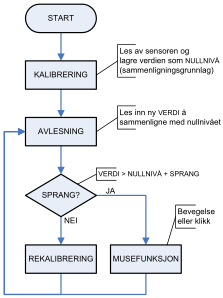{#fig-kalibrering}
>
> **Figur 6.4:** Selvkalibrering og avlesning av sensor

Ideelt sett er nullnivået 0 V. Men det er alltid en fare for at en av
sensorene kommer i klem, og dermed gir en høyere verdi. Derfor bør
ikke nullnivået fastsettes på forhånd, men i stedet *kalibreres*
automatisk med utgangspunkt i de avleste verdiene.

[Figur 6.4](#fig-kalibrering) viser avlesing og kalibrering av én
enkelt sensor. Den første avlesningen av sensoren etablerer
nullnivået, som videre avlesninger sammenlignes med. Deretter avleses
sensoren kontinuerlig og sammenlignes med nullnivået. Hvis differansen
er stor nok, betraktes sensoren som aktiv, og en musefunksjon utføres.
Hvis differansen ikke er stor nok, derimot, blir nullnivået
*rekalibrert*: nullnivået settes til den avleste verdien.

Rekalibreringen begrenset til hver 250. gjennomgang i programmet
[[Vedlegg 1](#ref-program)], slik at bare 250 påfølgende avlesninger
uten «sprang» gir rekalibrering. Dette medfører at dersom sensoren
gradvis kommer under press (eller presset gradvis opphører), vil
nullnivået oppdateres, mens hvis sensoren plutselig tas i bruk, vil en
musefunksjon utføres.

Det kan tenkes at en sensor plutselig kommer under varig press selv om
den ikke er i bruk, f.eks. ved å flytte på hodebøylen. I slike
tilfeller kan det være nødvendig å kalibrere manuelt, noe som gjøres
ved å aktivere en sensor på motsatt kinn. Hvis begge kinnene er
«aktive», sett fra programmets synspunkt, settes nullnivået på nytt.

### 6.3.2 Avlesning av flere sensorer

Programmet lagrer de siste avleste verdiene til de seks sensorene i én
tabell, og de seks nullnivåene, som disse sammenlignes med, i en
annen. Det går så igjennom tabellene parvis og sjekker dem opp mot
ligning (6.1) -- på leting etter en aktiv sensor.

> 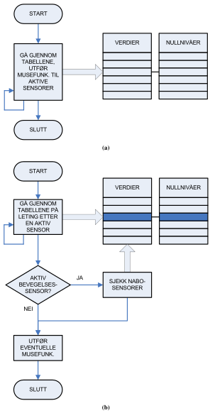{#fig-sensortab width=450}
>
> **Figur 6.5:** Avlesningsløkker: enkel (a) og avansert (b)

Når en aktiv sensor er funnet, er det to muligheter
([fig. 6.5](#fig-sensortab)). Skal (a) resten av sensorene også
undersøkes, eller (b) søket avsluttes og den aktive sensoren
returneres? Hvis vi bare returnerer den første aktive sensoren, må vi
legge inn en ekstra «nabosjekk» av nærliggende sensorer for å oppdage
om to bevegelsessensor brukes samtidig (diagonal bevegelse).[^9] Hvis
vi søker gjennom hele tabellen, derimot, vil alle aktive sensorer gi
musefunksjoner (noe som håndterer diagonal bevegelse automatisk), men
kan gi uønskede eller ingen musebevegelse ved noen
sensorkombinasjoner.

[^9]: Dette gjøres ved å slå opp i en matrise som inneholder
informasjon om hvilke sensorer som er i nærheten av hverandre. Hvis
sensoren for bevegelse oppover er i bruk, for eksempel, ønsker vi bare
å undersøke sensorene for bevegelse til venstre og høyre, ikke
sensoren for bevegelse nedover.

Fordelen med å gjøre det på den andre og mer «tungvinte» måten i
[figur 6.5b](#fig-sensortabtung), hvor vi stanser søket når en aktiv
sensor er funnet og sjekker om denne sensoren har en aktiv
«nabosensor», er er at den er mer fleksibel. Det er lettere å
«gardere» mot aktive sensorer på begge kinn, som er signalet for
manuell rekalibrering. Dessuten kan funksjonen som returnerer den
første aktive sensoren, lett skrives om til å returnere den *mest*
aktive sensoren dersom det viser seg vesentlig å skille mellom flere
sensortrykk.[^10] I vår første tilnærming returneres bare den første
aktive sensoren, men forholdene ligger til rette for en omskrivning.

[^10]: Dette gjør vi i [andre tilnærming](#sec-andretilnerming).

For å produsere ett klikk av gangen, er det bygd inn en forsinkelse
som overser aktive knappsensorer etter at de er funnet aktive første
gang. Dette forhindrer hundrevis av klikk mens sensoren er i bruk.
Forsinkelsen er innstilt slik at brukeren kan dobbeltklikke ved å
presse kontinuerlig.

### 6.3.3 Drøfting {#sec-forstedrofting}

Tilnærmingen er utførlig testet i [kapittel 7](#sec-testingmedtungen).
De viktigste funnene er at tungemuskelen fort blir sliten av å
kontinuerlig presse på sensorene, og at det er tyngre dess lengre bak
på kinnet man kommer. Med venstre og høyre knappsensor plassert side
om side, kommer venstre knappsensor langt bak på kinnet
([fig. 6.2a](#fig-sensorknapper1)). Det samme gjelder høyre
bevegelsessensor, som er plassert i «stjerne» med de andre
bevegelsessensorene ([fig. 6.2b](#fig-sensorknapper1)).

Det er også et problem at det ikke er mulig å «dra» musepekeren.
Ettersom tungen ikke kan presse på begge kinnene samtidig, kan dette
bare implementeres ved å aktivere en egen *modus* hvor museknappen
holdes nede. Støtte for moduser vil også gjøre det mulig å
implementere scroll.

I vår *andre tilnærming* roterer vi sensorplasseringen slik at den
blir mer vertikal med hensyn til munnen, og vi skriver om programmet
til å «huske» en oppgave over flere sensoravlesninger. Resultatet er
mer omfattende, men også mer komfortabelt.

6.4 Andre tilnærming {#sec-andretilnerming}
--------------------

> 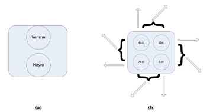{#fig-sensorknapper2 width=500}
>
> **Figur 6.6:** Andre tilnærming: knapper (a) og bevegelse (b).

I andre tilnærming plasserer vi bevegelsessensorene i «firkant»
istedenfor «stjerne» for å få dem lengre frem på kinnet
([fig. 6.6](#fig-sensorknapper2)). Knappsensorene er plassert ovenfor
hverandre istedenfor side om side.

Programmet tar nå utgangspunkt i den *mest* aktive sensoren, ikke bare
den første.

Sensorenes funksjoner avhenger av hvilken *modus* programmet befinner
seg i. I utgangspunktet befinner programmet seg i *normalmodus*, hvor
knappsensorene produserer klikk og bevegelsessensorene styrer pekeren.
Den viktigste forskjellen er måten pekeren styres på.

### 6.4.1 Normalmodus {#sec-normmodus}

> {#fig-normalmodus width=500}
>
> **Figur 6.7:** Normalmodus: klikk (a) og bevegelse (b)

Dette er programmets utgangspunkt ([fig. 6.7](#fig-normalmodus)). Hvis
brukeren trykker lett på en knappsensor, produseres et klikk. Hvis
brukeren trykker lett på en bevegelsessensor, beveger pekeren seg i
sensorens retning, og *fortsetter å bevege seg* selv om brukeren ikke
presser kontinuerlig. Pekeren styres med lette trykk istedenfor
kontinuerlig pressing, noe som er mer behagelig for tungen.

Når pekeren beveger seg, kan brukeren skifte retning ved å trykke på
en annen bevegelsessensor, og få bevegelsen til å opphøre ved å trykke
på samme sensor en gang til. Pekeren beveger seg langsomt til å
begynne med, for presisjonens skyld, og så raskere dersom brukeren
ikke har skiftet retning etter et par sekunder. Dette gjør det lettere
å bruke menyer og andre små områder på skjermen, uten at pekeren er
like treg når den skal flyttes over større områder.

Det er mulig å bevege pekeren enda raskere ved å presse kontinuerlig
på en bevegelsessensor istedenfor å bruke
«ett-trykk-funksjonaliteten». Da vil pekeren bevege seg raskere dess
hardere man presser, og slutte å bevege seg når trykket opphører,
akkurat som i første tilnærming. Dette er praktisk for å bevege seg
over store deler av skjermen effektivt.

For presisjonens skyld er diagonal bevegelse *deaktivert* når pekeren
beveges med lette trykk. Det er bare mulig å bevege seg diagonalt ved
å presse kontinuerlig på sensorene.

> {#fig-dramodus}
>
> **Figur 6.8:** «Dra»-modus

> {#fig-scrollmodus}
>
> **Figur 6.9:** «Scroll»-modus

### 6.4.2 «Dra»-modus

Ved å presse kontinuerlig på knappsensorene istedenfor å bare trykke,
bytter man fra normalmodus til andre moduser. Venstre knappsensor
bytter til «dra»-modus ([fig. 6.8](#fig-dramodus)), slik at venstre
museknapp holdes nede også når sensoren slippes. Dermed kan tungen
flyttes over på bevegelseskinnet for å «dra» pekeren.

«Dra»-modus fungerer ellers som normalmodus; pekeren styres på akkurat
samme måte. For å gå tilbake til normalmodus, er det bare å berøre
knappsensoren en gang til.

### 6.4.3 «Scroll»-modus

Høyre knappsensor bytter til «scroll»-modus
([fig. 6.9](#fig-scrollmodus)). Man scroller oppover ved å presse på
øvre bevegelsessensor, og nedover ved å presse på nedre
bevegelsessensor. For å gå tilbake til normalmodus, trykker man på en
av knappsensorene.

### 6.4.4 Drøfting {#sec-andredrofting}

Andre tilnærming er utførlig testet i
[kapittel 7](#sec-testingmedtungen). Den viktigste forskjellen fra
første tilnærming er «ett-trykk-funksjonaliteten», som hindrer at
tungen slites ut selv etter langvarig bruk. Den forbedrede
sensorplasseringen motvirker også dette.

Presisjonen er betraktelig bedre takket være den langsommere
pekerhastigheten til å begynne med. Disse funksjonene kan kombineres:
Ved å trykke fort to ganger, kan man bevege pekeren i små, presise
«steg», f.eks. fra ett menyelement til et annet.

«Ett-trykk-funksjonaliteten» gjør det dessuten mulig å snakke mens man
bruker musen.

Høyere presisjon er viktig når man har behov for å «dra» pekeren,
f.eks. for å flytte vinduer. Å innføre moduser for slik funksjonalitet
hever brukerterskelen, men det viser seg enkelt å aktivere og
deaktivere «dra»- og «scroll»-modusene. Scrolling er en stor fordel
når man surfer på nettet, samt i alle sammenhenger hvor man har behov
for å rulle tekst. Disse to modusene gjør funksjonaliteten komplett.

Den største utfordringen er å lære opp tungen til å huske sensorenes
plassering på kinnet. Dette blir bedre over tid, men krever litt
tålmodighet og innsats.

7 Testing med tungen {#sec-testingmedtungen}
====================

> Inneholder en grundig test -- med resultater -- av funksjonaliteten
> og brukervennlighet til de to tilnærmingene i
> [kapittel 6](#sec-funksjonalitet). Viser at andre tilnærming er en
> god forbedring av den første. Videre drøfting er gitt i forrige
> kapittel, [avsnitt 6.3.3](#sec-forstedrofting) og
> [6.4.4](#sec-andredrofting).

7.1 Problemstilling
-------------------

Det er et behov for å teste om datamusen kan brukes til en dagligdags
dataøkt. Testen gjennomføres etter endringer i programmet som påvirker
brukerfunksjonaliteten. Testen brukes også for å finne optimal
plassering av sensorene på sensorplatene.

7.2 Tester
----------

Når man skal bruke en datamus, har man enkelte krav. Den skal være
lett å styre, og den skal være nøyaktig. En økt frran datamaskinen tar
gjerne litt tid, så hvor lenge kan man sitte før tungen blir sliten?
Hvor god følelse av kontroll oppnår brukeren -- oppleves frustrasjon
over datamusen under bruk? For å kunne teste dette, er det laget noen
enkle tester med stigende vanskelighetsgrad.

**Metode:**

1.  **Åpne en snarvei fra skrivebordet:** velg en snarvei, før
    musepekeren over den og dobbeltklikk/åpne.
2.  **Åpne en snarvei fra startmenyen:** åpne «Start»-menyen og
    «Programmer». Åpne nå en forhåndsbestemt snarvei fra denne menyen.
3.  **Bruke nettleseren:** Åpne Mozilla, gå til en avisside fra
    «Favoritter» eller hurtigmeny (f.eks. <http://www.vg.no/>), bla ned
    på siden og åpne en artikkel.
4.  **Bruk over tid:** åpne Microsoft Paint og prøv å tegne en kopi av
    [figur 7.1a](#fig-brukertest1). Etter 15 minutter avsluttes
    testen, og resultatet sammenlignes med originalen. Er resultatet
    bra, og er tungen sliten? Utfør testen to ganger for å se om det
    er en liten tilvenningskurve fra brukersiden.

Testen er utført med hodebøylen, men testeren har lagt ekstra trykk
bak sensorplatene med hendene. Med en bedre hodebøyle vil dette være
unødvendig (se [kapittel 10](#sec-veienvidere)).

### 7.2.1 Resultater første tilnærming

> 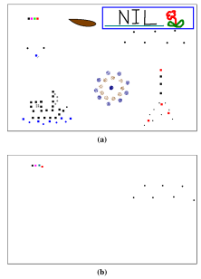{#fig-forstebrukertest width=321}
>
> **Figur 7.1:** Testtegning for bruk over tid (a), resultat i første
> tilnærming (b), første og eneste forsøk

Se [avsnitt 6.3](#sec-forstetilnerming) for detaljer om første
tilnærming.

1.  **Åpne en snarvei fra skrivebordet:** Musepekeren danser litt over
    skjermen, men med litt godvilje blir pekeren plassert over den
    forhåndsvalgte snarveien (Papirkurven). Musebevegelsen går litt for
    fort, noe som gjør det vanskelig å treffe ikonet. Det føles også
    litt tungt å holde sensoren inne for å bevege pekeren over
    skjermen. Holder venstre muspeker inne for å dobbeltklikke.
2.  **Åpne en snarvei fra startmenyen:** Merker at det krever mer
    presisjon og konsentrasjon å gå inn i «Programmer»-menyen.
    Musepekeren beveger seg litt for fort, noe som fører til at
    «Start»-meny-grenen til tider lukker seg. Det kommer frem at musen
    trenger en ny måte å prioritere mellom sensoren(e) som er i bruk
    på. Det hender musepekeren bytter retning uten at man vil det, og
    dette føltes ikke behagelig.
3.  **Bruke nettleseren:** Velger å åpne nettsiden fra hurtigmenyen,
    blar nedover ved å trykke nederst på rullefeltet. Det er noe
    vanskelig å treffe det, savner en scrollfunksjon. Følelsen av
    kontroll over bevegelsen er også her litt dårlig, men knappene
    (høyre/venstre) er lette å bruke. Litt tungt å bevege musepekeren
    rundt på skjermen.
4.  **Bruk over tid:** Ga opp etter syv minutter. Ble utrolig hemmet av
    at pekeren beveget seg for fort, og ble veldig sliten. Resultatet
    er gitt i [figur 7.1b](#fig-brukertestresultat1a).

For drøfting av resultatene, se [avsnitt 6.3.3](#sec-forstedrofting).

### 7.2.2 Resultater andre tilnærming

> {#fig-andrebrukertest width=321}
>
> **Figur 7.2:** Testtegning for bruk over tid (a), resultat i andre
> tilnærming første forsøk (b), andre forsøk (c)

Se [avsnitt 6.4](#sec-andretilnerming) for detaljer om andre
tilnærming.

1.  **Åpne en snarvei fra skrivebordet:** Litt vansker med å treffe
    rett sensor gjør at pekeren til tider beveger seg feil vei. Trykker
    to ganger på venstre musetast for å åpne den forhåndsvalgte
    snarveien.
2.  **Åpne en snarvei fra startmenyen:** Bruker
    «ett-trykk-funksjonaliteten» for å bevege pekeren. Ingen problemer.
3.  **Bruke nettleseren:** Glimrende. Gjorde speielt mye bruk av
    «ett-trykk-funksjonaliteten» og scrollfunksjonen, svært behagelig i
    bruk.
4.  **Bruk over tid:** Den delen av tegningen som krever høyest
    presisjon, blomsten med blad og den dråpeformede figuren, er litt
    vanskelig. Men av fremskrittet fra
    [figur 7.2b](#fig-brukertestresultat2a) til
    [figur 7.2c](#fig-brukertestresultat2b) ser man at dette kan bli
    meget bra med litt øvelse.

For drøfting av resultatene, se [avsnitt 6.4.4](#sec-andredrofting).

8 Prisestimering
================

> Kapittelet inneholder en tilnærming over prosjektets kostnad. Det er
> også eksempler på pris for egenproduksjon av krets. Prosjektets
> tilnærmede utgifter er drøyt 2000 NOK.

8.1 Utviklingskostnader
-----------------------

Prosjektet er en bacheloroppgave på HiST. Studentene får ikke lønn
under arbeidet, så utgiftene er konsentrert rundt materialkostnadene i
[tabell 8.1](#tab-utviklingskostnader). Sensorene ble kjøpt inn av
SINTEF, og AT90USBKey ble kjøpt inn av HiST. Tabellen lister opp
antatte kostnader for disse. Prosjektets tilnærmede utgifter er 1949
NOK i materialkostnader. Siden dette er de eneste utgiftene, kan man
konkludere med at prosjektet har vært særdeles billig for
oppdragsgiver.

Forslag til løskomponenter består av en liste som inneholder overslag
over priser en eventuell egenproduksjon av kretsen vil koste. For 100
enheter vil de løse materialene til kretskortet tilnærme en kostnad på
13 518 NOK. Siden kretsen ikke er designet, kan denne prisen avvike
noe. Det er ikke laget noen liste for materialpris til produksjon av
hodebøylen. Det forventes at designen og materialvalget på denne må
utvikles videre (se [kapittel 10](#sec-veienvidere)).

> **Tabell 8.1:** Materialkostnader uten frakt {#tab-utviklingskostnader}
>
> | Produktnavn         | Produsent                 | Type                       | Antall | Enhetspris [NOK] | Total pris [NOK] | Firma                 |
> | ------------------- | --------------------------| -------------------------- | ------ | ----------       | ----------       | --------------------- |
> | AT90USBKey          | Atmel                     | Demokrets[^11]             | 2      | 229              | 458              | Mouser electronics    |
> | FSR-400             | Interlink                 | Trykkfølsom resistans[^11] | 25     | 23               | 575              | Interlink Electronics |
> | FSR-402             | Interlink                 | Trykkfølsom resistans[^11] | 25     | 26               | 650              | Interlink Electronics |
> | Veroboard           |                           | Koblingsbrett              | 1      | 59               | 59               | Clas Ohlson           |
> | Teip                |                           | Gaffateip                  | 1      | 79               | 79               | Clas Ohlson           |
> | Metall 1            |                           | Stakepinne                 | 7,6 m  | 39               | 39               | Jula                  |
> | Metall 2            |                           | Spikerbånd 20 × 1 mm       | 10 m   | 89               | 89               | Clas Ohlson           |
> |                     |                           | Koblingsenheter[^12]       | 1      | --               | --               | HiST                  |
> |                     |                           |                            |        |                  |                  |                       |
> |                     |                           | Forslag til løskomponenter |        |                  |                  |                       |
> |                     |                           |                            |        |                  |                  |                       |
> | AT90USB1287         | Atmel                     | Mikrokontroller            | 1      | 87               | 87               | Mouser electronics    |
> | AT90USB1287         |                           |                            | 25     | 68               | 1700             |                       |
> | AT90USB1287         |                           |                            | 100    | 61,182           | 6118             |                       |
> | LP3982IMM-ADJ       | National Semiconductor    | Spenningsregulator         | 10     | 14,65            | 146,5            | Arrow Electronics     |
> | LP3982IMM-ADJ       |                           |                            | 100    | 5,15             | 515              |                       |
> | LP3982IMM-ADJ       |                           |                            | 1000   | 4,25             | 4250             |                       |
> | 774-MXO45HS-3C-8.0  | CTS Electronic Components | Crystal Oscillators 8 MHz  | 1      | 19,50            | 19,50            | Mouser electronics    |
> | 774-MXO45HS-3C-8.0  |                           |                            | 100    | 15,24            | 1524             |                       |
> | 774-MXO45HS-3C-8. 0 |                           |                            | 1000   | 9,966            | 9996             |                       |
> | 500075-1517         | Molex                     | USB Mini-B vert            | 1      | 51               | 51               | Mouser electronics    |
> | 500075-1517         |                           |                            | 100    | 29,43            | 2943             |                       |
> | 500075-1517         |                           |                            | 1000   | 24,09            | 24090            |                       |
> | Motstander          |                           | Laveffektmotstander[^11]   | 1000   | 0,0594           | 59,4             |                       |
> | Kretskort           |                           | To-lags PCB[^11]           | 100    | 21,4             | 2140 + 278       | Microcirtec           |
> | Kretskort           |                           |                            | 1000   | 3,219            | 3219 + 730       |                       |
>
> Tabellen benytter seg av omregningene € = 8,7 NOK og $ = 6,6 NOK.

[^11]: Tilnærmede priser.

[^12]: Skruer/muttrer/ledninger og lignende.

9 Konklusjon
============

Prototypen som er laget, kan utføre alle standard musefunksjoner i
Microsoft Windows, så vel som alle andre operativsystemer.

For kontrollering av musepekeren er det laget en
«ett-trykk-funksjonalitet», som hindrer at tungen slites ut etter
langvarig bruk. Brukeren starter en bevegelse og stopper eller endrer
retning ved ønsket plassering. Under denne funksjonen beveger pekeren
seg langsomt til å begynne med for å gi god presisjon.

Man kan snakke mens man beveger musepekeren over skjermen, og det er
mulig å be venstre museknapp være aktiv mens man beveger musepekeren
over skjermen. Det er også mulig å sette musen i en «scroll»-modus som
gjør surfing av nettsider og lesing av dokumenter meget behagelig.

Den største utfordringen er å lære opp tungen til å huske sensorenes
plassering på kinnet. Dette blir bedre over tid, men krever litt
tålmodighet og innsats.

De utdelte sensorene (FSR-400 og FSR-402) er veldig følsomme, men det
kan være vanskelig å få utslag med tungen. Forskning på hvordan
sensorene er i kontakt med kinnet kan forbedre dette.

Det ble laget en hodebøyle for å gi riktig plassering av sensorene på
kinnet. På grunn av lite bakgrunnskunskap og utstyr, oppfyller ikke
hodebøylen alle kravene i produktspesifikasjonen. Sensorene er
plassert utenpå kinnene -- to store knappsensorer på venstre og fire
små bevegelsessensorer på høyre. Prototypen har et problem med at
sensorene ligger litt dårlig mot kinnet.

Ved bruk av sensorene er det erfart at det må være et godt press mot
kinnet, og de må ligge lengst mulig fram mot munnen for at sensortypen
skal kunne brukes i et endelig produkt. Justeringsdelen er også litt
vanskelig, men designet har potensial for videreutvikling.

Elektronikken som ble valgt for tolkning av sensordata, er demokretsen
AT90USBKey fra Atmel. Denne er basert på mikrokontrolleren AT90USB1287
og fungerte bra til utvikling av en prototype. Kretsen har innebygd
åtte ADC-er, hvorav seks blir benyttet til tolking av sensordata.
Kretsen gjør bruk av USB-grensesnittet for overføring av data, så vel
som energitilførsel. Det er integrert en spenningsregulator som
benyttes til å forspenne sensorene. Denne er sterk nok til å forsyne
eventuelle tilleggskretser.

Det er laget en boks som omkapsler AT90USBKey («X-box»), fordi
demokretsen er for stor til å festes på hodebøylen.

Programkoden er skrevet for å være fleksibel angående antall sensorer
og portene de kobles til, så vel som valg av mikrokontroller. Teorien
og målingene tilsier at sensorene setter krav til en dynamisk verdi
for hendelsesaktivering, og kontinuerlig kalibrering. Dette problemet
er løst med programvare.

Programmeringsmessig er det lite som kan videreutvikles, ettersom
programmet implementerer alle funksjonene i HID-standarden. Flere
funksjoner kan bare implementeres på toppen av det gjeldende
grensesnittet, ved å skrive et program eller driver på PC-siden som
håndterer signalene på en egen måte. Fordelen med å begrense seg til
HID-standarden er at musen ikke krever en egen driver og kan dermed
brukes overalt, også på Mac og Linux.

Utgiftene ved prosjektet var minimale, estimert til ca. 2000 NOK.

På bakgrunn av rapporten, konkluderer prosjektgruppen med at det er
mulig å lage en tungestyrt musepeker som anvist. Det mekaniske og
ergonomiske må imidlertid forbedres for å få et salgbart produkt.

10 Veien videre {#sec-veienvidere}
===============

> Inneholder en oversikt over hva prosjektgruppen mener kan
> vidreutvikles for enten å forbedre noe som allerede er implementert,
> eller forslag til hva som kan implementeres.

10.1 Hodebøylen {#sec-vvidere-hodeboyle}
---------------

Hvis man designer et eget kretskort, kan kortets størrelse minskes
betraktelig, slik at det kan gjøres plass til det på hodebøylen. Dette
vil være mer praktisk framfor å ha et mellomledd som
«[X-box](#sec-xbox)». Den eneste kabelen fra hodebøylen vil da være
USB-kabelen, som settes rett i PC-en. Denne kabelen vil også kunne tas
helt av i andre enden. Det vil da være enklere å sette hodebøylen på
bruker, og feste USB-kabelen etter at alt av utstyr er på plass.

Det neste vil være å forme platene brukt til justeringsboksen eller
ev. hele justeringsboksen. Det vil være ønskelig å kunne sette en
«styrke» som skal til for å justere hodebøylen ved behov. Slik som
prototypen er nå, er justeringen hard og ikke så brukervennlig. Dette
vil være noe som en person med litt bakgrunnskunnskaper om
mekanikk/design kan utføre.

Det vil være en forbedring å skjule ledningene som går fra sensorene
som er plassert nede på hver side. Disse er på dagens prototype
synlige, og veldig sårbare. Et lite rykk i en av disse kan føre til at
kabelen mister kontakt med sensor, og musen vil være ubrukelig (noe
som for øvrig skjedde under det ene møtet mellom SINTEF og
prosjektgruppen).

Det er også et behov å se på metallet som er brukt og alternativer til
dette, for å få bedre trykk mot kinnet. Samme metall, men en tykkere
utgave kan være en god forbedring.

Sensorplatene til prototypen består av to kretskort som sensorene er
teipet til. Dette har vist seg lite slitesterkt, man bør finne en
alternativ løsning. Det kan være ønskelig for den enkelte bruker å
rotere platene 180--360°, for optimal brukervennlighet. Videre kan det
hende at en buet eller fleksibel plate kan fungere bedre som
festepunkt til sensorene. Dette kan skape et mer nøyaktig bilde av
hvor tungen trykker, og en bedre brukeropplevelse. Det kan være
ønskelig med et «mellomlegg» mellom kinnet og sensorene for å
kontrolere treffpunktet.

10.2 Elektronikk {#sec-vvidere-krets}
----------------

Det vil være nødvendig å designe en egen krets rundt
AT90USB1287-mikrokontrolleren for eventuell produksjon. Når man først
er i gang med dette, kan man se på mulighetene for
Bluetooth-implementering i tillegg til USB. Ved å bruke et
litium-batteri med laderkrets mot USB, kan produktet lades når det
ikke er i bruk, og det vil ikke være nødvendig med batteribytte eller
ekstern lader. Om batteriet ikke får ladet lenge nok, bør det være
mulig å bruke USB-grensesnittet.

### 10.2.1 Bruk av batteri som strømforsyning {#sec-bbstrom}

Den innebygde spenningskretsen på AT90USBKey gjør at den kan forsynes
med batterispenninger mellom 8--15 V (DC). Ved normal bruk blir det
målt at kretsen trekker mellom 7,5--10 mA med et 9 V batteri
tilkoblet. I tilegg kommer Bluetooth-adapteren, som også får
spenningsforsyningen fra AT90USBKey. Ved opperasjon vil denne øke
forbruket med 18,3 mA, slik at totalforbruket blir ca. 28 mA.

En oversikt over brukertid med ulike batterier tilkoblet kretsen er
gitt i [tabell 10.1](#tab-batteri). Det er også mulig å legge en
funksjon inn i programkoden som gjør at Bluetooth-modulen går i
hvilemodus ved inaktivitet. Funksjoner som ikke er i bruk, vil slås
av, og strømforbruket vil falle betraktelig.

Som man kan se av [tabell 10.1](#tab-batteri), gir litiumbatterier
overlegen kapasitet fremfor standard NiMh-batterier
(nikkel-metalhydrid). For å få samme kapasitet fra NiMh-batterier, vil
vekten og størrelsen disse krever gjøre det vanskelig å integrere
kretsen på hodebøylen. Ulempen med litiumbatterier er at de krever en
dedikert lader, og at de kan eksplodere ved overoppheting/belastning.

En liten innebygd krets hindrer at batteriet blir utladet under en
gitt spenning, og ved ladning fungerer den samme kretsen slik at
batteriet ikke skal overlades. Uten denne ville batteriet ha blitt
ødelagt.

> **Tabell 10.1:** Teoretisk operasjonstid med ulike batterityper {#tab-batteri}
>
> | Batteritype         | Spenning [V] | Kapasitet [mAh] | Belastningsstrøm [mA] | Operasjonstid [h] | Vekt [g]   |
> | ------------------- | ------------ | --------------- | --------------------- | ----------------- | ---------- |
> | HR6F22 Ni-MH        | 8,4          | 200             | 30,0                  | 6,7               | 39         |
> | 6F22 Litium[^13]    | 9,0          | 500             | 28,0                  | 17,9              | 28         |
> | U9VLJ10 Litium[^13] | 9,0          | 1200            | 28,0                  | 42,9              | 38         |
> | AAA Ni-MH 8x serie  | 8 × 1,2      | 1000            | 26,3                  | 38,0              | 8 × 16     |
> | AA Ni-MH 8x serie   | 8 × 1,2      | 2700            | 26,3                  | 102,7             | 8 × 30     |

[^13]: Tilpasset lader må anvendes for lading av litiumbatterier.

### 10.2.2 Bluetooth

For eventuell trådløs dataoverføring kan det benyttes Bluetooth som
overføringsprotokoll. Dette vil f.eks. gjøre det enklere for brukeren
å koble seg til en annen datamaskin når dette først er konfigurert.
Datamaskinen vil da automatisk kjenne igjen den virtuelle armen og vil
av den kunne vekkes fra en eventuell dvalemodus.

Teknologien benytter seg av radiofrekvensbåndets 2,4 GHz-område og har
en rekkevidde på ca. 10 m. Overføringshastigheten ligger på ca. 1,0
Mb/s. Da det benyttes radiobølger, vil brukeren ikke hindres av at
objekter i veien hindrer signalet. For å øke båndbredden og
sikkerheten, benytter Bluetooth seg av frekvens-hopping (Frequency
Hopping Spread Spectrum, FHSS). Dette fungerer ved at sender og
mottager «hopper» fra frekvens til frekvens hele tiden etter et
bestemt mønster, i frekvensområdet 2,402 GHz til 2,480 GHz
[[Bluetooth](#ref-bluetooth)]. En ulempe ved bruk av denne teknologien
som brukergrensesnitt, er at det kan oppstå forsinkelse hvis
datamaskinen belastes med parallelle oppgaver. Siden kretsen ikke
lenger vil være tilkoblet USB, må den få strømtilførsel fra et batteri
eller annen ekstern strømforsyning, som beskrevet i
[kapittel 5](#sec-elektronikk) og [kapittel 10.2.1](#sec-bbstrom).

Bibliografi
===========

[Bluetooth] <http://www.bluetooth.com/Bluetooth/Technology/Works/>.
{#ref-bluetooth}

[Vedlegg 1] Programkode, dokumentert. {#ref-program}

[Vedlegg 2] Datablad for Interlink-sensorer. {#ref-interlink}

[Vedlegg 3] Datablad for AT90USBKey. {#ref-usbkey}

[Vedlegg 4] Datablad for mikrokontrolleren. {#ref-uk}

Bilag: CD {#sec-cd}
=========

Vedlegg 1--4 foreligger på
[CD](https://github.com/epsil/tunge/tree/master/cd), organisert som
følger:

Vedlegg 1: Programkode
----------------------

Plassert i mappen `/Program`. Lisens for Atmel-kode har plasseringen
`/Program/at90usb128/demo/series6-hidmouse/LICENSE.txt`.

Vedlegg 2: Datablad for Interlink-sensorer
------------------------------------------

Plassert i mappen `/Datablader/Trykksensorer`.

Vedlegg 3: Datablad for AT90USBKey
----------------------------------

Plassert i mappen `/Datablader/Kretskort`.

Vedlegg 4: Datablad for mikrokontrolleren
-----------------------------------------

Plassert i mappen `/Datablader/Mikrokontroller`.
